# PR #7382 리뷰 — 분할 표와 저장 각주 경계

## 최종 판정

**머지 보류.** 보정30–41로 주요 원본의 그림·표·캡션·각주 배치와 후속 내용 소유를 복원했다. 보정42의 실제 TABLE 셀 편집은 수정 전 HWPX 본문39px 초과에서 수정 후 전체 내용/물리 경계 검사와 확대247PASS로 개선됐다. 원본 HWP/HWPX215쪽 tree는 모두 유지했다. 실제 래퍼 분할·이월, #6782의76/78쪽, 원본 수동/실문서의 남은 시각 차이 및 정확한 검증 head `96c4e4777`의 전체 nextest는10,327PASS/43FAIL/50SKIP이며 기대값 적절성도 재검토 중이다. lint·Skia·fresh WASM 빌드는 통과했고 전수 Native/fresh WASM 시각 비교는 실행 중이다. 완료 전 통합 PR 생성·승인을 보류한다.

## 접수와 provenance

- 원 PR: [#7382](https://github.com/edwardkim/rhwp/pull/7382), planet6897. 원 head `81a402179dc556cce781d844d4b9252be36ba8af`.
- 최신 base `eb9142dd7c73297d555383d7d8434a470bdef26e`, 검토 branch `review/planet6897-7382-20260926`. 기존 reviewer jangster77 확인.
- 원 기능 `8e0f0249460a5243e38162340bc1c49d061ae72a` → `-x 5b2cc61cd`; 원 이미지 `fcba72b18483053c436388a8d88c64b81d67c2c0` → `-x a57d6430a`. source devel merge 81a는 체리픽하지 않았다.
- 관련 이슈 [#7379](https://github.com/edwardkim/rhwp/issues/7379). 부분 개선으로 전체 이슈를 종료하지 않는다.

## 독립 입력과 기대값

- [원본 HWPX](../../../samples/정책연구용역사업%20중간진도보고서%28살아있는%20간장%20기증자의%20의학적%20선별기준%20연구%29.hwpx), [한컴 2024 기준 PDF](../../../pdf/정책연구용역사업%20중간진도보고서%28살아있는%20간장%20기증자의%20의학적%20선별기준%20연구%29-hwpx-2024.pdf), 215쪽. 이미 저장소에 있는 동일 입력·기준을 사용한다.
- 기준 66쪽은 문단728 표의 머리행+본문4행(원 행0..4), 67쪽은 나머지2행(5..6). 원본 개체 높이11645HU는 첫5행의 저장 높이 합과 정확히 같다.
- 각주77은 앞 두 줄이66쪽, `Part 482(CONDITIONS...)`와 출처인 꼬리는67쪽이다. 원본 첫 각주 문단의 저장 vpos `0,1172,0`과 다음 문단의1172가 이 경계를 지시한다. 번호77은 꼬리에서 반복하지 않는다.
- 동일 보고서 HWP 대조군은 현재 제품 코드에서215쪽이며, 표728도66쪽0..5/67쪽5..7(exclusive)으로 나뉜다. 이 대조군을 HWPX 최종 시각 검증의 대용으로 쓰지 않는다.

## 원 변경의 재검토 결과

| 실행 | 결과 | 의미 |
| --- | --- | --- |
| base 제품+원 회귀2개 | 1PASS/1FAIL, exit100 | 66쪽에 표 없음으로 의도한 실패; 각주 없는 표는 정상 대조군 |
| 원 변경 적용 후 원 회귀2개 | 2PASS, exit0 | 표 존재·대략적인 높이만 검증 |
| 원 변경 후 실제 출력 | 217쪽 / PDF215쪽 | 부분 개선이며 전체 쪽수 계약 불충족 |
| 새 행·각주 소유 검사, 원 변경에서 실행 | 1FAIL, exit100 | 실제 첫 행 집합{0,1,2,3}, PDF 기대{0,1,2,3,4} |
| 원 변경 Native Visual Sweep66/67 | 82.17683% / 61.0948%, exit1 | 표 마지막 행 이월·각주77 누락, 재검토 gate. 글꼴 예외 없음 |

원 `register_body_footnote` 설명과 실제 표 셀 각주 경로가 다르다. 통째 배치 뒤에는 `controls/paragraph_flow.rs` → `notes::register_unqueued_table_cells` → `table::register_unqueued_table_footnote`가 모든 셀 각주를 등록한다. 진입에서 전체 각주 예약을 제거하면 통째 배치의 사전 fit도 바뀐다. 원본 높이 합 검사만으로 행 누락·중복이나 각주 분할을 입증할 수 없다.

## 메인터너 보정 1: 저장된 각주 경계를 분할 큐에 연결

사전 분석 → 코드/회귀 수정 → 실행 결과보고 → 개별 커밋 순서로 진행한다. 전체 수정이 준비되기 전에는 원 PR과 통합 후보 모두 보류다.

1. `entry.rs`는 base의 전체 각주 예약을 복원해 통째 fit 계약을 유지한다.
2. HWPX 파서는0에서 시작한 각주의 양수→0 재시작을 보존한다. 기존2344→0 연속줄 보정·all-zero HWP5 및 미주 경로는 대조군으로 확인한다.
3. `table.rs`의 유효 저장 줄/composer 일대일 각주 경계 판정을 미편집 HWPX에도 연결한다. split 실패 뒤 `prepare.rs`에서 비TAC·RowBreak·rowspan 없는 다행 표의 저장 각주 경계를 fragment queue가 소비한다.
4. `fragment/emit.rs`가 확정한 행·컷과 물리 높이를 먼저 예약하고 `table/footnotes.rs`가 marker를 가진 중간 조각에prefix, 다음 조각에tail을 등록한다. 숫자상 전체 각주가 fit해도 저장된 물리 경계를 지우지 않는다. fresh page 큐 소진·terminal·intra-row 및 marker가 없는 조각의 기존 계약은 유지한다.
5. [정식 회귀](../../../tests/cases/issue_7379_rowbreak_table_footnote_reservation.rs)는 최종 render tree에서 행 소유·각주77 앞뒤 내용·번호 중복·표/각주 비충돌을 직접 검사한다.

파서/큐 연결만 수행한 중간 후보는2PASS/1FAIL이었다. 행은4+2로 개선됐으나77번 꼬리도66쪽에 표시되어 새 검사로 실패했다. 이는 완료로 보고하지 않고 같은 범위에서 각주 등록 경로를 추가 보정했다. 첫 보정 후 집중3/3 PASS(0.176s), 정상 대조군9/9 PASS(0.565s), exit0을 확인했다. 대조군은2344→0 보정, all-zero 보존, #6495/#6545 미주 및 HWP→HWPX 왕복215쪽, #1937 표 각주를 포함한다. Native review/standalone overlay66·67쪽을 직접 판독했다. 행·각주 앞뒤 소유는 개선됐지만 표의 원점·본문/캡션 간격·각주 줄 위치가 다르고 실루엣88.1603%/73.99603%, exit1이다. 현재 출력219/PDF215쪽이며 승인하지 않는다. 전체 회귀·lint·fresh WASM은 아직 실행 완료로 보고하지 않는다. [단계1 검증](../assets/pr7382_20260926/stage1_validation.json)과 [Native manifest](../assets/pr7382_20260926/stage1_native_run_manifest.json)는 imported head+단계1 worktree diff의 진단 증거다. 최종 code head에서는 새로 캡처한다. 원 source의 issue_7379 PNG5개도 과거 증적이며 현재 수용 근거로 재사용하지 않는다.

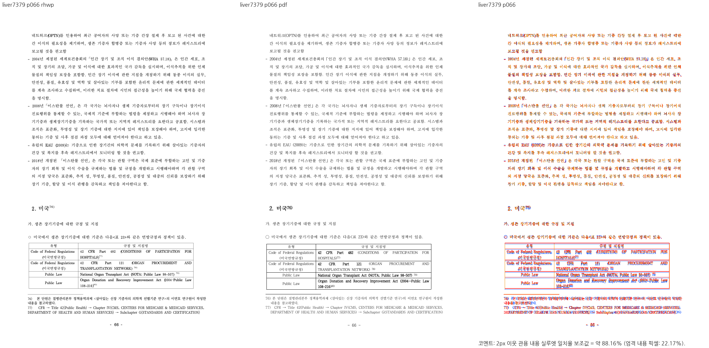

첫 추가 쪽은 HWPX의77쪽 TAC 그림/캡션 표876이78쪽으로 밀리는 경계에서 발생한다. 이어885 대형 표의 셀 각주,1822 대형 단일 셀과 이후 경계가 남는다. 이를 글꼴이나 기존 차이로 면제하지 않고 한 경계씩 사전 분석·수정·전후 검사한다.

## 메인터너 보정 2: 표 원점과 캡션 종료 간격

단계1 `483cfb4f8`의 표 상단796.9/83.2px와 캡션166.1px, 뒤 본문206.1px는 PDF799.925/86.945/156.434/200.261px와 달랐다. 새 최종 좌표 회귀는 수정 전 첫 표 원점으로 FAIL(exit100)했고, 위 여백·캡션만 연결한 중간 후보는 뒤 본문196.533px로 FAIL했다. 측정에서 예약한 끝 바깥여백이 paint의 반환 높이에 빠진 경로도 같은 범위에서 보정했다.

- `host_spacing → fragment/budget → table_partial`의 위 바깥여백 조건을 공통 query로 연결했다. 열수는 바깥여백의 근거가 아니므로 기존 1열 한정을 제거했다. 중첩 frame과 이미 해결된 저장 원점의 중복 inset 방지는 유지한다.
- 저장된 단일 zero-width 줄이 단일 비TAC 표만 소유한 앵커일 때, 호스트 줄간격을 캡션 gap에 추가하지 않는다. `prepare`의 요구 높이와 `table_partial`의 실제 캡션 위치가 같은 결과를 소비한다. 보이지 않는 줄이라는 이유로 줄 상자를 제거하는 처리가 아니다.
- 아래 캡션이 끝난 뒤의 바깥여백을 예산·흐름 전진·paint 반환 높이에 함께 연결했다. 중간 컷의 행 예산에서 이 종료 간격을 미리 차감하지 않는다.
- 집중5/5 PASS(0.794s), 정상 대조군·PrEP·공통 앵커51/51 PASS(0.901s), exit0. 여백/캡션 간격 IR 변형3종도 행 소유·캡션 한 번·각주 lane 비충돌을 확인했으나 수정 전에도 통과하는 대조 검사다. 진단 trace상 세 변형은 terminal 수용 예산 안에 들어갔으므로 **공간 부족 후 재분할 분기의 실행 증거로 인정하지 않는다**. 그 분기는 미검증으로 남기고 다음 경계 검사에서 확인한다. 합성 IR은 한컴 출력의 대용이 아니다.
- 새 CLI의 전체 출력은219/PDF215쪽으로 불충족이다. Native66/67의 2px 실루엣은98.24785%/93.58939%, 선택 페이지 gate passed(exit0), 글꼴 예외 없음. 대표 review와 standalone overlay 두 쪽을 직접 판독해 행·각주 소유, 괘선·캡션·뒤 본문 위치를 확인했다. 각주 가로 공백·글자 폭과 얇은 괘선 차이는 남으며 pixel-perfect 일치라고 보고하지 않는다.

[단계2 검증](../assets/pr7382_20260926/stage2_validation.json)과 [Native manifest](../assets/pr7382_20260926/stage2_native_run_manifest.json)는 `483cfb4f8`+단계2 worktree diff의 진단 증거다. 최종 head의 fresh WASM·전체 회귀/lint는 아직 완료하지 않았다. 전체 쪽수가 다르므로 선택 페이지 통과에도 PR 생성·승인은 보류한다. 첫 추가 쪽 앞 표866의 행 내부 컷과 뒤 그림876의 여유 공간을 HWP 대조군/PDF와 연결해 다음 보정을 준비한다.

## 메인터너 보정 3: 저장 셀 내부 컷과 그림51의 물리 페이지

보정2 뒤 전체219쪽의 첫 추가 쪽을 역추적했다. 표866의 원본 row4 첫 셀은 `vpos=0,1620,3240,0` / `textpos=0,17,35,53`으로 첫 세 줄과 `투석을 시작하게 된 경우` 꼬리를 다른 물리 쪽에 저장한다. PDF76/77 및 HWP 대조군의 실제 컷 `[3,1,1]`이 같은 소유를 뒷받침한다. HWP 대조군215쪽을 HWPX 좌표·시각 일치의 대용으로 쓰지 않는다.

`existing footnote43.4px → entry available → prepare table_available → fragment/budget → row_cut → PartialTable → table_partial/FootnoteArea`를 대조했다. 기존 HWP5 예산324.4px와 달리 HWPX는40px 안전 여백을 더 빼284.4px만 주고, 행4의 첫 한 줄 후보가 고아 줄 검사에서 기각됐다. 파서에서 저장 reset을 삭제한 문제가 아니었다. 새 최종 tree 회귀는 수정 전 행4가 없는 것으로1FAIL(exit100,0.234s)했다.

- 기존 각주만 있고 자체 각주가 없는 비TAC T&B RowBreak 표에서, HWPX의 **한 셀 문단 안** 유효한0→양수→0 저장 경계에도 실제 각주 경계를 사용한다. 편집/reflow와 rowspan은 새 적용에서 제외한다. 문단마다 시작하는 local0만으로는 이 계약을 열지 않으며 일반40px 여백·고아 줄 임계값을 전역으로 완화하지 않았다.
- 첫 후보는 prefix/tail과 그림51의77쪽 소유를 복원했으나 캡션908.973/PDF913.379px로5PASS/1FAIL이었다. 표tail 위86.933/아래257.546px는 PDF86.945/257.799px와 가까웠다. Top 외부 캡션 표의 끝 바깥여백283HU=3.773px가 뒤 빈 문단 흐름에 빠진 것이므로, 세로 캡션 개체 종료의 예산·flow·paint 반환을 같은 query로 연결했다. 중간 컷·가로 캡션·외부 캡션 없는 표의 기존 계약은 유지한다.
- 최종 집중6/6 PASS(0.889s), 추가 좌표 검사와 정상 대조군을 함께 실행한75/75 PASS(1.742s), exit0. 대조군은 기존51개에 셀 단위 원자 분할/왕복, profile 독립 source frame, #6761의 확인된 저장 경계와 무효/다른 컷 반례를 더했다. 표866 앞 세 줄/꼬리의 내용·행 소유, 표tail 상·하단, 뒤 본문288.289px와 그림51 캡션913.379px, 표/각주 비충돌을 최종 tree에서 검사한다.
- 새 release-test CLI의 전체 출력은**218/PDF215쪽**이다. 표866은76쪽0..5+cut[3,1,1] /77쪽4..7+startCut[3,1,1], 그림876은77쪽으로 바뀌었다. Native76/77은96.49182%/98.35446%, 선택 gate passed(exit0), 글꼴 예외 없음. review와 standalone overlay 두 쪽을 직접 판독했다. 첫 표 조각의 얇은 괘선·셀 글자 위치, 각주 링크 색/폭 차이는 남으며 완전한 픽셀 일치를 주장하지 않는다.

[단계3 검증](../assets/pr7382_20260926/stage3_validation.json)과 [Native manifest](../assets/pr7382_20260926/stage3_native_run_manifest.json)는 `22d23872c`+단계3 worktree diff의 진단 증거다. 첫 추가 쪽을 해소했지만 표885의 대량 셀 각주, 표1822의 단일 셀 분할 및 이후 경계가 남는다. 전체 쪽수·최종 head full Rust/lint/Skia/fresh WASM·terminal 캡션 예산 부족 경계는 미해결/미검증이며 PR 생성·승인 보류다.

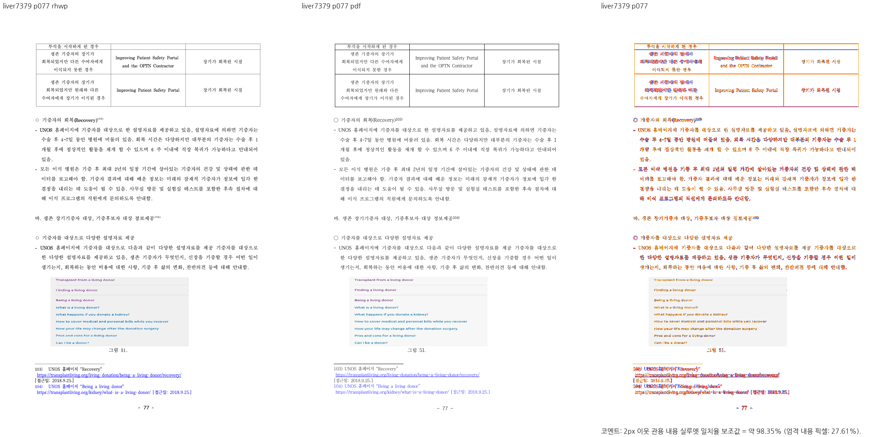

## 메인터너 보정 4: 다행 표의 셀 각주 큐와 확정된 표시 소유

보정3 뒤 표885의 셀 각주18개를 표 시작 전에 모두 예약해 표가79쪽으로 밀렸다. 독립 PDF78은 행0..3의 앞 조각과 기존각주105/106, 79는 행3 꼬리와 끝2행 및각주107~111, 80은 남은각주112~124와 뒤 본문이다. 새 최종 tree 검사는 수정 전78쪽 표 부재로 FAIL(exit100,0.176s)했다.

- 미편집/reflow 없는 direct HWPX 다행·비TAC T&B RowBreak·rowspan 없는 원표에도 셀 각주 큐를 연결했다. 각주 자체의 저장 reset은 prefix/tail 분할의 근거이며 보통 각주의 큐 참여를 제한하는 근거가 아니다. 통째 fit의 전체 각주 예약과 기존 Native/단일행 경로는 유지한다. 빈1×1 래퍼의 내부 행 컷을 바깥 각주 소유로 혼동하지 않는다.
- 추가 반례에서 아직 다음 조각 row6에 있는82번이 앞쪽66에 등록돼 FAIL(exit100,0.253s)했다. 행만 제한한 후보도 같은 행의 미소비 줄에 있는116번을 앞쪽에 등록해 FAIL(exit100,0.257s)했다. 실제 확정 `end_row/end_cut → 같은 폭·방향의 composed 줄 → cached CellUnit ordinal → col순 셀 컷`을 등록 상한으로 사용한다. 앞 조각에서 표시를 이미 소비한 밀린 각주는 허용한다. 두 합성 IR은 원래 저장 줄/표를 유지하고 각주 몸통 또는 주석 종류만 바꿔 용량과 소유를 분리했으며, 한컴 출력의 대용이 아니다. 최종 marker/footer 누락·중복과 물리 소유를 검사한다.
- 최종 집중·정상 대조군 **78/78 PASS(exit0,2.008s)**. 실제 표885 행/각주 소유, 앞서 보정한 표728/866과 그림51, 저장 reset 반례, 원자 컷·왕복·공통 앵커·PrEP를 함께 확인했다. 새 CLI 전체 출력은 **217/PDF215쪽**이다.
- Native78/79/80은 **87.97988% / 96.21953% / 95.66118%**(2px 실루엣; 원 JSON 참조), sweep exit1/re_review_required, 글꼴 예외 없음. 세 review와 standalone overlay를 직접 판독했다.78쪽 표 앞 조각의 아래선은960.947/PDF970.937px이고 셀 줄 위치도 다르다.79쪽 표 끝은 근접하지만 각주 가로 폭/색·일부 줄 위치 차이가 남는다.80쪽 본문과 각주 소유는 맞지만 링크 폭·색/일부 줄 위치 차이가 있다. 이 결과를 시각 개선 완료로 승격하지 않는다.

각주 개수>=8에 따른 기존 첫 조각 지연 및 terminal guard 예외도 새 HWPX 큐에 따라 들어왔다. 이를 일반 정책의 근거로 인정하지 않는다. 개수 예외를 배제한 후보는8PASS/1FAIL이었다. 표 끝960.947px에 각주 영역945.007px가 겹쳤다. fit에서 빈 footer band를 회수하지만 실제 각주 영역은 본문 하단에 고정하며, 기존 Body각주105의 빠른 추정이 내부 줄간격을 빠뜨리는 차이가 연결된다. `caption_extra` 누락도 코드 우려로 발견했지만 표885는 해당 값0이므로 이 표의 원인으로 보고하지 않는다. 실패 후보는 회수했고 **용량 계산·물리 끝점·기존 개수 예외의 일반화는 다음 개별 보정의 미해결 사항**으로 남긴다. 현재 커밋은 소유 보정의 독립 중간 결과이며 PR 수용 후보가 아니다.

[단계4 검증](../assets/pr7382_20260926/stage4_validation.json), [Native manifest](../assets/pr7382_20260926/stage4_native_run_manifest.json), [Native summary](../assets/pr7382_20260926/stage4_native_summary.json)는 `cd2203a07`+단계4 Rust diff를 고정한 진단 증거다. 최종 head full Rust/lint/Skia/fresh WASM은 아직 완료하지 않았다.

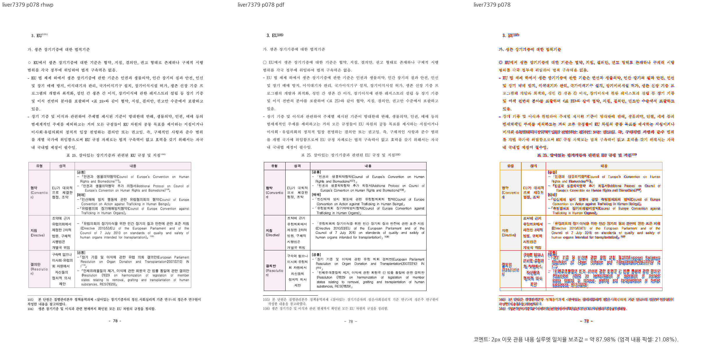

## 남은 필수 게이트

- 전체 페이지 수215, 추가/누락 쪽의 첫 경계와 앞뒤 내용을 재검토한다. 선택66/67쪽의 통과만으로 이 조건을 면제하지 않는다.
- 최종 code head의 Native/fresh WASM Visual Sweep·대표 review/standalone overlay 직접 확인 및90% gate, 적용/비적용 경계 검사.
- cargo nextest threads8 전체 회귀, 모든Rust lint/WASM32/workspace all-target Clippy, workspace build, 고정base 정책 검사와 필요한 Skia/fresh WASM 검증.
- source-number review·오늘할일·대표 시각 증적을 같은 통합 PR에 포함하고 정확한 최신head CI/MERGEABLE/CLEAN 확인. 통합 owner reviewer 자동 지정 없음.
- 정상 merge 후 duration provenance·source supersede/범위에 맞는 issue 처리·devel 동기화·소유 output 정리. 로그는 ignored `output/pr-review/planet6897-7382-20260926/logs/`에만 저장하며 커밋하지 않는다.

## 메인터너 보정 5: 첫 저장 프레임의 빈 밴드와 셀 정렬

보정4 `45f40cf44`의78쪽 표25 끝960.947px는 PDF970.937px와 달랐다. 원본 HWPX table.sz.height33323HU=444.307px는 PDF 첫 프레임443.833px와 대응하나 내용 컷만 그린433.32px 상자는 빈 하단 밴드를 잃었다. HWP 대조군의 셀/줄 원본 메트릭은 같지만 그 현재 출력도 geometry가 달라 독립 좌표 기준으로 승격하지 않았다. 새 끝점 검사는 수정 전 FAIL(exit100); 같은 실행의 raw-source 진단 PASS는 결함 검출 검사로 세지 않는다.

- `saved_multirow_opening_frame_height → emit partial_height/end_row_height_override → table_partial row_heights/partial_table_height → 실제 셀/표 bbox`가 같은 원본 프레임을 소비한다. 미편집·reflow 없는 stored 비TAC T&B RowBreak, rowspan 없는 다행 표의 첫 빈 start_cut과 유효한 plain-text 문단 재시작 end_cut을 요구한다. emit은 객체전용 저장 앵커·래퍼 아님·기존 override 없음·실제 남은 예산 fit도 확인한다. 프레임 빈 밴드는 소비 유닛이 아니므로 다음 내용 tail에서 빼지 않는다. 본문보다 큰 수동1000px 프레임을 강제 수용하지 않는 정식 거부 대조군도 PASS했다.
- 첫 프레임 후보는80PASS였지만 Native78 직접 판독에서 셀 row3/col2가 Top으로 강제되는 차이를 발견했다. 원본 Center, 처음 세 문단8개 저장 줄의125.013px, 원본 padding 및 최종 cell bbox로 정한 기대839.427px에 실제833.813px가 FAIL(exit100,0.169s)했다. 같은 페이지 PDF 첫 prefix839.52px도 독립 확인했다.
- paint는 동일 query의 높이와 실제 partial_table_height가 일치하는 root 첫 프레임에만 원래 세로 정렬을 적용한다. 소비한 line_ranges의 높이로 계산하며 뒤 내용 전체를 중앙에 배치하지 않는다. 일반 예산 컷·continuation·rowspan·slice를 넘는 중첩 다중열 내용은 기존 계약을 유지한다. 첫 정렬 후보는 Top-only lazy composition 가정과 충돌해7PASS/5FAIL했다. 유한 프레임에서 Center/Bottom에 필요한 내용 높이는 전체 paint와 cursor probe 모두 계산하도록 수정하고 재검증했다.
- 최종 집중/정상 대조군81/81 PASS(exit0,2.951s). fresh CLI build exit0(1m54s), Native78/79/80의2px 실루엣97.8181%/96.21953%/95.66118%, 선택 gate passed(exit0), 글꼴 예외 없음. 세 review와 standalone overlay를 직접 확인했다. 표 하단·첫 셀 글줄과 후속 페이지 소유는 개선됐으나 얇은 괘선·본문 글자 및 각주 URL 폭 차이가 남으며 pixel-perfect라고 보고하지 않는다.

[단계5 검증](../assets/pr7382_20260926/stage5_validation.json)과 [Native manifest](../assets/pr7382_20260926/stage5_native_run_manifest.json)는45f40cf44+단계5 Rust/test diff를 고정한다. 전체217/PDF215쪽 차이로 재검토 상태이며 PR을 만들지 않는다. 각주 수 기반 예외/실제 footer 용량,174·175쪽 단일 셀1822의3쪽 분할, 뒤 추가 페이지, terminal caption 예산 실패 및 최종 전체 Rust/Skia/lint/fresh WASM은 남았다. 단계5를 먼저 독립 커밋하고 다음 경계 보정을 수행한다.

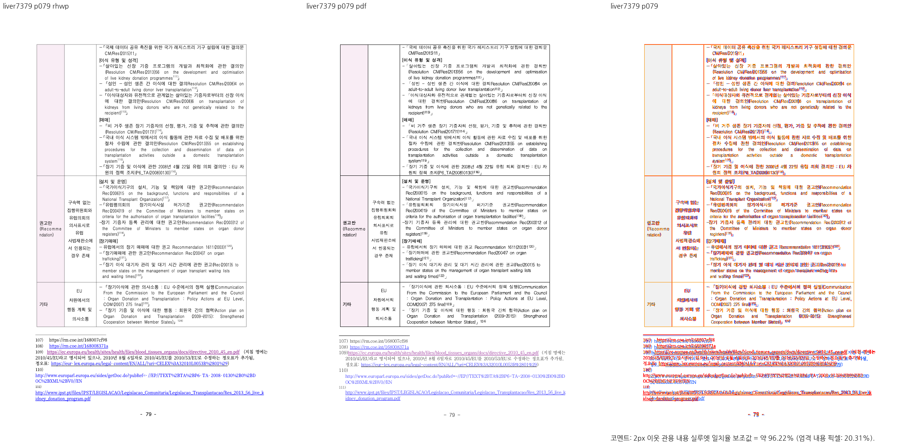

## 메인터너 보정 6: 각주 큐와 실제 paint 영역의 용량 공유

`913a04326`에서 각주107·108만 남기고 다른 marker 슬롯을 빈 Endnote로 보존한 합성 IR은 수정 전 FAIL(exit100,0.296s)했다. 78쪽 표끝972.173px / 실제 각주위945.007px로 충돌했다. 이 반례는 각주 개수8개 임계값의 가정을 깨는 계약 검사이며 한컴 출력 일치 근거로 승격하지 않는다.

- `확정 body fragment/end_cut → 후보 FootnoteRef 목록 → estimate_footnote_area_height_with_metrics → body-bottom 물리 예산 → 수용 목록/동일 높이 예약 → layout_footnote_area`를 연결한다. 기존 Body 각주도 후보 목록에 포함해 실제 composed 줄간격·선·각주간 간격을 함께 측정한다. shape 기반 최종 paint 측정은 같은 helper를 호출하며 일반 출력의 기존 산식은 유지한다.
- 단일단 direct HWPX 큐는 빈 footer 밴드를 실제 paint보다 아래로 회수하지 않는다. 수용 뒤 정확한 영역 높이와 body-bottom 예약 상태를 현재 page에 기록하고 페이지 전환 시 초기화한다. 다음 본문의 available_height와 추가 각주 fit도 이 상태를 소비한다. 그림에서 이월된 note body의 별도 상태를 재사용하지 않아 저장 vpos 경로를 바꾸지 않는다.
- 새 HWPX 경로의 첫 조각 지연·terminal 수용은 각주 개수/선언 비율과 분리했다. 기존 native의 개수/guard 정책은 별도 근거 없이 바꾸지 않았다. 확대된 HWPX 큐는 단일단만 적용한다. 다단의 body-wide footnote 계약은 이번 신규 경로에서 비해당이며 그 검증을 완료했다고 보고하지 않는다. synchronous source와 resumed source는 같은 section 문단 목록을 전달한다. 현재 resumable 진입은 편집 상태를 요구하고 새 stored HWPX 큐는 편집/reflow를 제외하므로 해당 신규 큐의 resumed 실행을 주장하지 않는다.
- 집중13/13 PASS(exit0,1.502s), terminal 뒤 실제 본문 비충돌까지 추가한 최종 집중/정상 대조군85/85 PASS(exit0,3.023s). 기존 #1937/#4882/#6495/#6545 및 row-cut/앵커/PrEP 대조에 각주 줄높이 #5708·영역 폭 #6034를 포함했다.
- fresh CLI build exit0(1m52s), Native66/67/78/79/80 선택 gate passed(exit0),2px 실루엣98.24785%/93.58939%/97.8181%/96.21953%/95.66118%, 글꼴 예외 없음. 다섯 review 및 standalone overlay를 직접 판독했다. 표/각주 소유와 위치는 유지됐으며 얇은 괘선·각주 glyph/URL 폭 차이는 남는다.

[단계6 검증](../assets/pr7382_20260926/stage6_validation.json)과 [Native manifest](../assets/pr7382_20260926/stage6_native_run_manifest.json)는913a04326+단계6 Rust/test diff의 증거다. 전체217/PDF215쪽으로 PR 생성·승인은 계속 보류한다. 이 보정을 독립 커밋한 뒤 단일 셀1822의174~176쪽 분할과 이후 추가 페이지, terminal caption 예산 실패를 각각 해결한다. 최종 전체 회귀·lint·Skia·fresh WASM은 아직 완료하지 않았다.

## 메인터너 보정 7: 단일 셀 첫 프레임·표시 소유·호스트 종료 간격

보정6 뒤 단일 셀 표1822는174/175/176의 세 조각으로 나뉘었다. 원본 마지막 줄43311+1000+padding282=44593HU와 다음 셀 문단의 vpos0은 첫 프레임의 정확한 컷13을 증언한다. 독립 PDF174에는그림66과224번 표시를 가진 끝 문장이,175에는나머지표·각주223..231·뒤제목이 있다. 소유 회귀는 수정 전174쪽그림66 부재로 FAIL(exit100)했다.

- `saved_single_cell_opening_frame_cut/height → queue preparation → row scan exact end_cut/physical demand → partial-table paint`가 같은 컷/프레임을 사용한다. 정상 padding과 저장 프레임의 유효성은 다른 계약이므로 malformed-padding 조건을 프레임 근거로 대신하지 않는다. 경계의 inline Footnote/Endnote marker는 원래 글줄에 속하며 block control은 허용하지 않는다. 직접 저장 HWPX·미편집/reflow 없음·비TAC RowBreak·1×1·정확한 저장 끝점과 reset·실제 예산 fit 조건을 유지한다. 임의 각주 개수/선언 비율로 이 경로를 선택하지 않는다.
- HorzColumn T&B RowBreak의 바깥 상단 여백은 단일/다행에 동일하게 적용한다. resolved 원점·중첩/다른 위치의 continuation은 기존 호출자 조건으로 중복 여백을 막는다. 첫 geometry 검사는429.827/PDF433.127px로 FAIL했다. 수정 후 네 표 끝점은통과했지만 뒤제목624.027/PDF641.061px로14PASS/1FAIL했다.
- 추적에서 terminal 뒤 호스트 trailing spacing1000HU와 바깥 아래283HU가 빠졌다. 같은 helper의17.107px를 pagination 종료와 실제 partial paint 종료에서 한 번 소비하고 bbox에는 더하지 않는다. 첫 후보는86PASS/1FAIL: 폭0인 PrEP 객체전용 앵커에도 밴드를 더해40쪽본문238.6/PDF220.864px가 됐다. 기존 `object_only_saved_table_anchor` 계약을 공유해 그 앵커에는 글줄 전진을 더하지 않도록 수정했다. 이는 문서ID/각주수 예외가 아니다.
- 최종 집중/정상 대조군87/87 PASS(exit0,3.257s), fresh CLI build exit0. 전체216/PDF215쪽으로 한 추가 쪽을 해소했다. Native174/175/176은99.85942%/92.46177%/79.50902%, selected sweep exit1/re_review_required, 글꼴 예외 없음. 세 review와 standalone overlay를 직접 확인했다.174의그림·첫표하단 및175의꼬리·뒤제목이 맞지만176의표위치·각주234 저장 경계가 다르다. 각주 glyph/폭과 얇은 괘선의 차이도 남는다.

[단계7 검증](../assets/pr7382_20260926/stage7_validation.json), [Native manifest](../assets/pr7382_20260926/stage7_native_run_manifest.json)는8786be62b+단계7 Rust/test diff를 고정한다. 이 단계는 독립 중간 보정이며 PR 생성/승인을 계속 보류한다.176/177 각주234,182쪽뒤문단1913의 추가 쪽,terminal caption 예산 실패,최종 full Rust/lint/Skia/fresh WASM을 다음 개별 단계에서 해결한다. 테스트 작성의 소수점 표기·Rust 이동 소유 컴파일 오류는 수정했으며 결함의 수정 전 FAIL 증거로 세지 않는다.

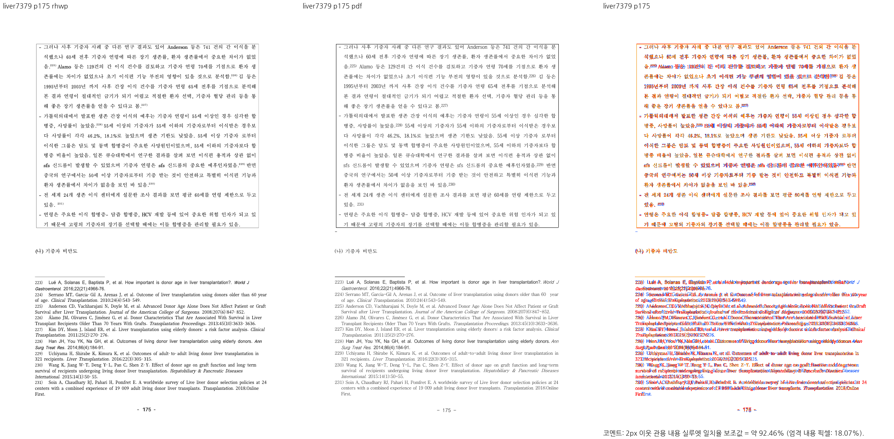

## 메인터너 보정 8: 큐 없는 셀 각주의 저장 페이지 경계

원본 각주234의 두 저장 줄은 vpos0/0, flags393216/1441792다. 독립 PDF176은 번호와 첫 줄,177은 번호 없는 꼬리를 소유한다. 보정7의 최종 tree에서 꼬리가176쪽에 남아 새 회귀가 FAIL(exit100,0.191s)했다. 합성 TAG를 붙인 대조군은 같은 실행에서 PASS이며 결함 검출 증거가 아니다.

- `원본 stored/composed 줄 일대일 → 기존 reset query → register_unqueued_table_footnote_with_content_height → prefix/suffix FootnoteRef → 최종 FootnoteArea/TextLine`을 연결했다. table.rs의 셀 각주 수집은 이미 미편집 direct HWPX를 허용하지만 whole 표의 큐 없는 등록은 Native만 허용해 fragment 정보를 잃었다. 같은 저장 경계 판정을 큐 없는 등록에도 적용한다. 미편집 HWPX만 확대하며 합성/일대일이 깨진 줄은 기존 query가 거부하고 다단은 기존 조건으로 제외한다. Body30/240은 별도 등록 경로이므로 이번 수정의 해결 범위로 보고하지 않는다.
- 실제 prefix/꼬리의 페이지 소유·번호 누락/중복·뒤 각주235와 각주 첫 줄 좌표(PDF176949.169px/177996.209px)를 검사했다. 수동 합성0/0은 페이지 이월을 강제하지 않는 반례도 PASS했다. 집중17/17 PASS(exit0,1.773s), 관련 각주/왕복/PrEP 정상 대조를 포함한46/46 PASS(exit0,3.070s), fresh CLI build exit0(1m53s).
- Native176/177은85.24789%/90.47055%, sweep exit1/re_review_required, 글꼴 예외 없음. 두 review와 standalone overlay를 직접 확인했다.234 꼬리의 이월과 footer 위치가 개선됐지만176의 표1832 상단483.2/PDF486.508px 및177 표1843의 같은 여백 차이가 남는다. glyph/각주 폭 차이도 있으며 시각 통과로 승격하지 않는다.

[단계8 검증](../assets/pr7382_20260926/stage8_validation.json)과 [Native manifest](../assets/pr7382_20260926/stage8_native_run_manifest.json)는0c35e4458+단계8 Rust/test diff의 중간 증거다. 전체216/PDF215로 PR은 계속 보류한다. 그림67 뒤의 guide 중복 점유와 그림/캡션 위치는 HWP 대조군에서도 독립 PDF와 차이가 있어 HWP 쪽수215를 geometry 정답지로 삼지 않는다. 단일 셀 whole 표의 바깥여백·마지막 추가 페이지·terminal caption 예산 실패와 최종 필수 검증을 이어 해결한다.

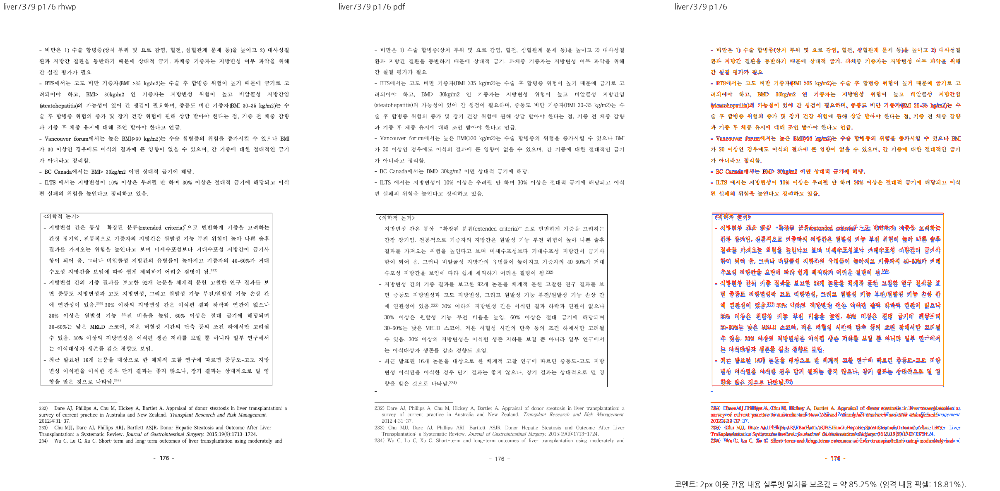
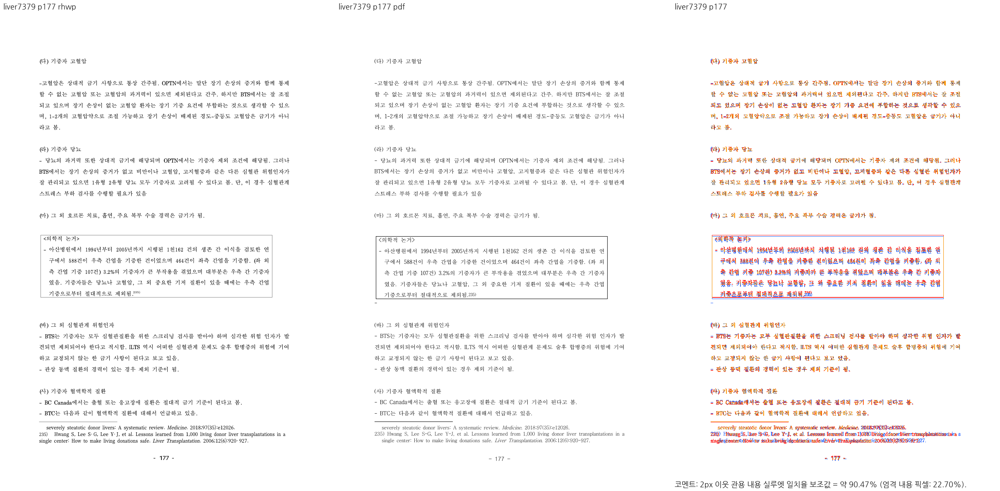

## 메인터너 보정 9: 단일 셀 통째 표의 바깥 상단 여백

PDF176/177의 실제 괘선은 각각486.508~903.012px/539.729~689.965px다. 원본 표1832/1843은 같은 비TAC T&B HorzColumn·Left RowBreak, 양의 사방 균등 여백과 오프셋0을 가진다. `original_hwpx_column_rowbreak_equal_outer_margin_hu → fragment_outer_top_px → raw_top/lane_top → 최종 table bbox`에서 행 개수 조건이 단일 셀을 잘못 제외했다. 수정 전 좌표 회귀는483.16/PDF486.508px로 FAIL(exit100,0.170s)했다.

- 빈/무효 행은 제외하되 단일 셀도 기존 저장 바깥 상자 규칙을 소비한다. 다른 원점·오프셋·비균등 여백의 적용 조건을 이번 근거 없이 확대하지 않는다. partial 조각은 단계7부터 같은 행 개수에 관계없는 상단 여백을 소비하며, 이 단계는 whole 경로를 보정한다. 가로 여백의 일반성만으로 모든 세로 앵커를 바꾸지 않는다.
- 두 원본 표의 실제 상·하단과 기존 #6378 다행 표, #7063 가로 여백, PrEP 및 공통 앵커 대조군64/64 PASS(exit0,2.699s). fresh CLI build exit0. Native176/177은96.81055%/98.67443%, 선택 gate passed(exit0), 글꼴 예외 없음. 두 review 및 standalone overlay를 직접 확인했다. 표 외곽과 본문 위치가 개선됐으며 얇은 괘선·각주 glyph/폭 차이는 남는다.

[단계9 검증](../assets/pr7382_20260926/stage9_validation.json)과 [Native manifest](../assets/pr7382_20260926/stage9_native_run_manifest.json)는7f3b0ee8b+단계9 Rust/test diff의 증거다. 전체216/PDF215로 PR 생성·승인은 계속 보류한다. 다음은 그림67의 원본 저장 종료 사다리를 사용한 원점/flow/guide 공통 결과와 마지막 추가 페이지이며, terminal caption 예산 실패 및 최종 full Rust/lint/Skia/fresh WASM도 남는다.

## 메인터너 보정 10: 이월된 그림 표의 닫힌 저장 프레임

그림67 표1904의 높이50256HU와 바깥 위·아래 여백283HU를 합하면50822HU이며, 같은 PS의 빈 guide 사다리 뒤 일반 문단1910의 저장 vpos가 정확히50822로 다시 시작한다. 원본 저장본·한컴 PDF182의 표 상단86.945px, 캡션741.701px, 뒤 매독/기생충 본문787.461/894.021px, PDF183의 그림68이 독립 근거다. HWP 대조군도215쪽이지만 그림67의 원점은 잘못되어 그 출력으로 HWPX 좌표 기대값을 정하지 않았다.

- 수정 전 대상 좌표는123.4533px로 FAIL(exit100, 대상0.186s); 종료 사다리50822→51822HU를 바꾼 반례는 PASS다. 좌표 겹침만으로 guide 소유를 수용하지 않는다.
- `stored_table_frame_with_guides → query_closed_source_frame_placement → whole entry / prepare의 clean-deferral 후 실제 frame → fragment budget → emit commit → layout raw_top/최종 lane flow → section guide`를 연결했다. 미편집·미reflow 저장본, 단일 단의 새 fragment, 문단 상대 양수 offset, 유효한 단일 host/guide 사다리와 닫힌 외곽 상자, 실제 측정 높이와 선언 높이 일치, 실제 예산 fit일 때 같은 원점/점유 끝을 소비한다. guide는 실제 수용된 배치 결과가 존재할 때만 그 상자의 일부로 처리한다.
- 첫 후보는 normal whole entry에만 연결하여19/20 PASS였다. 실제 경로는 whole-fit 실패 후 split prepare에서 새 쪽으로 이월하고 scanner가 전체 행을 수용해 `PageItem::Table`을 방출했다. 이 경로의 prepared placement와 frame도 함께 갱신하여 후속 예산·paint가 옛 anchor를 다시 적용하지 않도록 했다. 실패 후보를 완료 증거로 사용하지 않는다.
- 최종 관련 앵커·바깥여백·빈 host 줄 간격 및 기존 대상 회귀71/71 PASS(exit0,2.650s), fresh CLI build exit0. 원본 전체215/PDF215쪽, 그림67 뒤 본문의 중복·이월 없음과183쪽 그림68을 검사했다. Native182/183의 선택 gate passed(exit0),99.87143%/99.91466%, 글꼴 예외 없음. 네 review/standalone overlay를 직접 확인했으며 그림 외곽·캡션·본문 배치는 맞고 얇은 선/glyph 차이는 남는다.

[단계10 검증](../assets/pr7382_20260926/stage10_validation.json)과 [Native manifest](../assets/pr7382_20260926/stage10_native_run_manifest.json)는9b0e7cece+단계10 Rust/test diff의 증거다. 전체 페이지 수 보류 사유는 해소했으나 캡션 예산 실패 경계, Body 각주30/240, 최종 full Rust/lint/Skia/fresh WASM과 전체 Native를 완료하기 전에는 PR 생성·승인하지 않는다.

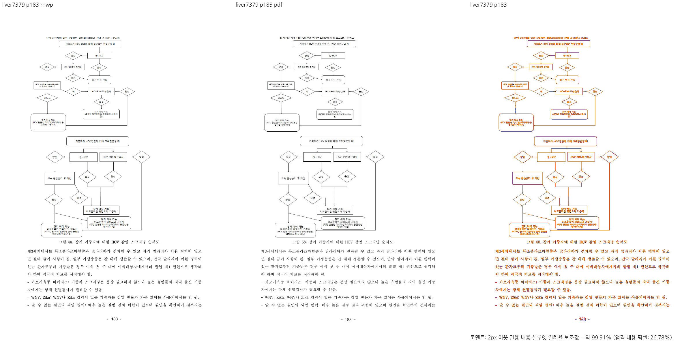

## 메인터너 보정 11: 캡션 종료 예산과 실제 행 소유의 재스캔

이전 여백/간격3종은 끝 캡션이 새 페이지 예산 안에 들어가 실패 분기를 실행하지 않았다. 양쪽i16 속성의 유효 상한32700HU와 본문 높이20px 감소로 만든 반례에서 수정 전 예약100.7733px / 실제 중간 조각81.48px가 FAIL(exit100,summary1.871s)했다. 끝행만 뒤로 물리는 기존 emit은 `end_row`만 바꾸고 그 행 높이·컷을 그대로 예약했다. 마지막2행을 rowspan 소유 유닛으로 합치고 각주를 제거해 새 페이지에 들어가는 독립 IR 반례도 FAIL했고, 두 반례 실행은0PASS/2FAIL(exit100,1.990s)이었다. 과도한 캡션과 원본6개 각주가 함께 새 페이지에 들어가지 않는 초기 입력 및 작성 오류/컴파일 실패는 결함 검출 증거로 세지 않는다. 이 입력들은 알고리즘 계약이며 한컴 출력의 대용이 아니다.

- `RowBlockQuery의 마지막 소유 유닛 → 실제 caption/terminal margin 예산 → 동일 scan_block_table_split_rows의 prefix 재스캔 → consumed/end_row/양쪽 컷/override 일괄 반영 → emit/실제 bbox`를 연결했다. 마지막 행 숫자만 감소시키는 emit 분기를 제거했다. 앞 유닛이 없고 현재 페이지에 앞선 항목이 있으며 전체 유닛이 새 페이지에 들어가면, cursor·각주·내용을 소비하지 않고 다음 frame에서 재시도한다. 저장 양수 원점만 있는 빈 frame을 반복 이월하지 않는다. 새 페이지에도 들어가지 않는 객체의 기존 진행 fallback을 이번 검증의 해결 주장으로 바꾸지 않는다.
- 단일 마지막 행의 통째 진입은 선언19.5px만 믿고 캡션을 빠뜨리던 우회였다(수정 전 FAIL,summary0.481s; table top796.92/body83.16px). forward 문단 Top/Inside·객체전용 저장 앵커의 캡션 상자를 공통 배치 계획으로 만들고 whole fit, clean defer 이후 scanner, whole/partial paint가 같은 원점과 occupied bottom을 소비한다. 중간 조각은 중간 여백만, 마지막 조각은 종료 여백을 예약한다. 초기 공유 후보는42개 중4개 FAIL했으며, 중간 조각에 끝 여백을 미리 차감/등록한 오류를 같은 범위에서 수정했다.
- 위 캡션은 첫 예산에서 이미 차감한다. 첫 행 강제 수용이0px 예산을 우회한 새 반례가 FAIL(exit100,0.658s)했고, 동일 종료 검사에서 위 캡션을 이중 차감하지 않고 새 frame으로 이월하도록 고쳤다. 양수2250HU 오프셋 반례도86.9333/기대116.9333px로 FAIL(2PASS/1FAIL,exit100,0.690s)했다. 첫 유닛이 통째로 이월돼도 공통 계획을 다시 질의해 오프셋을 보존하며, 진짜 continuation이 소비한 앵커와 구분한다. 기존 `para_offset_consumed_by_page_break` 계약도 같이 소비한다. 절대 기준·중앙/하단 정렬·후향 앵커는 이 forward 문단 원점으로 해석할 수 없으므로 기존 위치 해석의 비대상 경로다. 해당 조합 전부의 한컴 출력 검증을 주장하지 않는다.
- 정식 반례는 모든 행을 한 번씩, 끝 rowspan을 함께, 캡션을 한 번, 실제 예약/paint 끝점을 확인한다. 단일 행의 위/아래 캡션 및30px 오프셋은 뒤 본문의 소유와 같은 페이지에서의 종료 후 비충돌도 검사한다. 별도로 기존 nested no-caption3개가 보정2의 비대상 인덱싱으로 panic한 것을 발견했다. HWPX top-level 캡션 여백 조건을 통과한 뒤에만 source paragraph를 읽도록 수정해 정상 nested 경로를 재검증했다.
- 최종 집중/정상 **44/44 PASS(exit0,3.597s,threads8)**. source7379 전체24개와 #6756/#6803 rowspan 컷, #7288 원자 행, #6024 continuation, #6837 nested row, #6599 nested caption, #5136/#6284 caption, #7390 PrEP와 #1937을 포함한다. fresh CLI build exit0(2m20s), 전체 **215/PDF215쪽**. Native66/67은 **98.24785% / 93.58939%**, 선택 gate passed(exit0), 글꼴 예외 없음. 두 review와 standalone overlay를 새 코드에서 직접 판독해 행·각주77 소유, 표 원점·캡션·뒤 본문 위치를 확인했다. 얇은 괘선·glyph/URL 폭·링크 색 차이는 남으며 완전 픽셀 일치로 보고하지 않는다.

동일 원본 HWPX의 저장 제품13.0.0.3901을 확인하고 engine2024/timeout1800으로 다시 변환했다. 새 PDF도215쪽이며 **215쪽 전체의 텍스트 줄/좌표가 기존 PDF와 정확히 같았다**.10쪽 BMP 배경224/235/255와 한컴 PDF JPEG234/242/255의 색 차이도 재현됐다. 변환 색상 원인은 미확정이며 renderer gamma나90% gate를 바꾸지 않았다. 기존 기준 PDF와 실패 증거를 유지한다. [같은 입력 PDF 좌표 대조](../assets/pr7382_20260926/stage11_same_input_pdf_geometry.json)는 재변환 hash/engine/job과 전쪽 좌표 결과를 남긴다.

[단계11 검증](../assets/pr7382_20260926/stage11_validation.json), [Native manifest](../assets/pr7382_20260926/stage11_native_manifest.json), [run manifest](../assets/pr7382_20260926/stage11_native_run_manifest.json)는 `015985403`+최종 단계11 Rust/test diff의 증거다. 다음 보정 전에 이 결과를 별도 커밋한다. 전체 Native 진단에서31/32·108·121 등 본문 tail과 각주 소유가 다른 경계를 확인했으며, Body각주30/240 및 그 외 낮은 페이지를 하나씩 처리한다. 최종 전체 회귀·Rust lint·정책·Skia·fresh WASM과 전체 시각 gate는 아직 완료하지 않았으며 PR을 만들지 않는다.

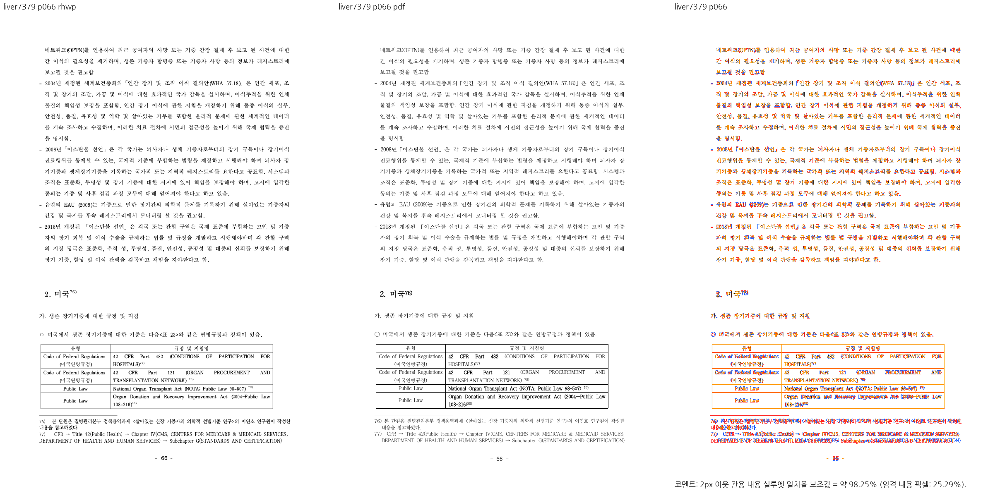

## 메인터너 보정 12: 본문 각주의 반복 페이지 시작 보존

### 사전 분석과 실제 소비 경로

원본 본문1865의 각주240은 `0/0/1172`를 저장한다. 독립 한컴2024 PDF178에는 번호와 첫 줄,179에는 `HTLV-1` 및 출처 꼬리 두 줄과 뒤 각주241/242가 있다. [원본 줄과 PDF 좌표](../assets/pr7382_20260926/stage12_independent_geometry.json)로 기대값을 고정했다. 파서가 두 번째0을1172로 덮고 Body 등록이 HWP5 경로에서만 저장 각주 reset을 소비하는 두 원인을 확인했다.

`section.rs::normalize_hwpx_note_line_vpos` → 동일 stored/composed 줄 대응을 확인하는 `native_hwp5_footnote_reset_fragments` → `body.rs::register_body_footnote`의 현재 prefix 예약/물리 page 전환/다음 suffix 예약 → 실제 `FootnoteArea` 배치로 연결한다. 편집하지 않은 HWPX도 표와 같은 저장 각주 경계를 사용한다. 합성 줄·저장 줄 부재는 physical split의 근거로 쓰지 않는다. 양수로 시작한2344/0의 연속줄 복원과 미주는 기존 계약을 유지한다. 본문 자체의 저장 reset과 충돌 경계는 이번 단계에서 변경하지 않았다.

### 수정 전후 실행과 판정

검증 producer는 `ec8a37a84` + Rust/test diff SHA256 `f3f0d1dc8da845d278f436bec045c5202fbdca8862abe638799ad5227a2544d9`다. [실행 증거](../assets/pr7382_20260926/stage12_validation.json)에 연결한다.

| 검사 | 결과 | 판정 |
| --- | --- | --- |
| 원본 parser/실제 각주 소유 수정 전 | 2FAIL, exit100,0.247s | `[0,1172,1172]`와178쪽 꼬리 조기 소비를 실제 검출 |
| 관련 원본·대조군 수정 후 | 35PASS, exit0,4.820s | 기존 표/각주·HWP5 왕복·미주·정규화 및 합성/저장줄 부재 반례 통과 |
| 새 CLI | build exit0,2m11s; 215/PDF215 | 중간 후보의 쪽수 계약 충족 |
| Native178/179 직접 비교 | 94.31041% /97.53225% | 번호/앞줄178, 꼬리179, 뒤 본문·각주 보존. glyph폭·URL색·일부 양쪽정렬 차이가 남아 픽셀 완전 일치를 주장하지 않음 |
| Native31/32 직접 비교 | 45.37615% /34.68853%, sweep 전체 exit1 | 각주30의 prefix/tail은 개선했으나 앞 본문407/421 소유·표/그림 원점 및32쪽 각주 구분선 차이가 남아 보류 |
| 전체 중간 Native audit | 215개 완료,50개90%미만, exit1 | [보정10 중간 보류 목록](../assets/pr7382_20260926/stage10_full_native_hold_inventory.json). 최종 head acceptance가 아님 |

추가 반례의 첫 작성에서 저장 줄 하나를 제거하면 composer 줄 수도 함께 줄어 실제 count mismatch가 아니었다(34PASS/1FAIL). 이를 회귀 검출로 세지 않고 저장 줄 부재 반례로 정정하여 재실행했다. 일반 저장/구성 줄 수 불일치 guard 자체를 이번 반례로 검증했다고 확대하지 않는다.

[Native manifest](../assets/pr7382_20260926/stage12_native_manifest.json)·[summary](../assets/pr7382_20260926/stage12_native_summary.json)·[metrics](../assets/pr7382_20260926/stage12_native_overlay_metrics.json). review178/179 및 standalone overlay178/179, review31/32를 직접 판독했다. 전체/fresh WASM/lint/최종 필수 검증은 아직 남았으며 PR 생성·승인은 보류다.

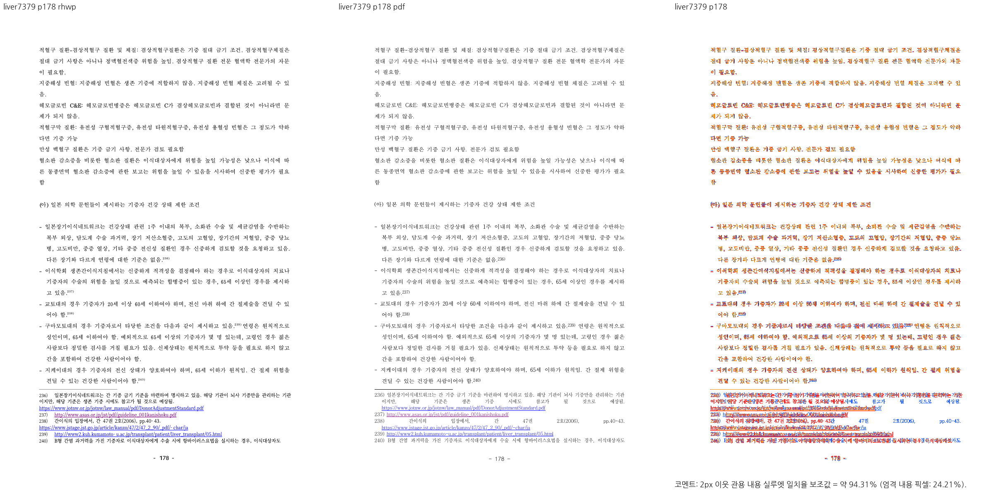

## 메인터너 보정 13: 실제 각주 예약과 본문 저장 경계 공유

### 사전 분석·소비 경로

보정12 뒤에도 본문407/421은 통째 항목으로 남아 저장 reset 뒤 줄을 앞쪽에 소비했다. [독립 PDF 줄 좌표](../assets/pr7382_20260926/stage13_independent_geometry.json)는407 꼬리 두 줄이31쪽83.141/109.861px,421 꼬리가32쪽83.141px에 있음을 입증한다. 단순 writer 좌표 되감김을 모두 물리 경계로 취급하지 않고, 미편집 단일 단 HWPX에 기존 nonsynthetic 경계/marker/실제 각주 예약 query를 연결한다.

`boundary.rs::native_hwp5_first_footnote_overlap_break_line`의 source 줄/marker·실제 FootnoteArea 투영 → `section/flow.rs`의 marker 등록 route 및 `paragraph.rs`의 강제 경계 선택 → 실제 `PartialParagraph` 컷 → `native_hwp5_body_footnote_tail_reset` 및 `body.rs`의 완료 prefix/현재 tail 등록 → 실제 본문과 뒤 표/그림 배치. 저장 각주 자체도 같은 경계를 입증한 경우, 기존 각주가 없는 marker 쪽이어도 첫 각주 collision route가 입증한 완료 prefix owner를 사용할 수 있게 했다. 기존 multi-note/native 및 일반 reset 경로를 일괄 확장하지 않았다.

### 실행 결과

Producer `4001f5b0c` + Rust/test diff SHA256 `ccca0de8ec46961ba9473f98e3e756a7cc25cd4dfbc9273730d285a5832205de`; [실행·실제 컷 증거](../assets/pr7382_20260926/stage13_validation.json).

| 검사 | 결과 | 의미 |
| --- | --- | --- |
| 수정 전 원본 본문2개 | 2FAIL, exit100,0.162s | 두 꼬리가 앞쪽에서 소비되는 의도한 원인으로 실패 |
| 수정 후 원본·대조군 | 38PASS, exit0,3.437s | 두 꼬리 좌표·앞 각주 번호·뒤 소유 보존 및 합성 되감김 비적용 |
| 실제 dump cuts | 407:30쪽0..3/31쪽3..5;421:31쪽0..4/32쪽4..5 | 저장 경계 뒤 내용의 누락/중복 없는 실제 항목 보존 |
| 새 CLI/쪽수 | build exit0,2m14s;215/PDF215 | 중간 쪽수 계약 충족 |
| Native30/31 직접 review/overlay | 96.40652% /97.33830% | 앞 본문 꼬리·제목·표 원점 복원. 글꼴/그림색/얇은 괘선 차이는 잔여 |
| Native32 직접 review/overlay | 81.60723%, sweep exit1 | 꼬리와 그림/표 원점은 개선; 뒤 문단 높이·이월 각주 구분선 차이가 남아 보류 |
| Native178/179 재캡처 | 94.31041% /97.53225% | 앞 단계 각주240 무회귀; 이 단계에서 직접 재판독을 반복했다고 확대하지 않음 |

첫 pre-run의421 문구는 제가 옮긴 `35%`가 원문 `<그림35>`와 달랐다. 작성 오류를 결함 증거로 세지 않고 동일 수정 전 코드에서 실제 뒤 문구로 정정하여 실패를 다시 확인했다.

[manifest](../assets/pr7382_20260926/stage13_native_manifest.json)·[summary](../assets/pr7382_20260926/stage13_native_summary.json)·[metrics](../assets/pr7382_20260926/stage13_native_overlay_metrics.json). 30/31/32의 review와 standalone overlay6개를 직접 판독했다.32쪽 구분선은 같은 보고서 HWP·HWPX 기준 PDF 모두 y1018.725px에서 확인되며 별도 후속 보정 대상으로 남긴다. 전체 최종/fresh WASM/lint는 미완료여서 PR 생성·승인 보류다.

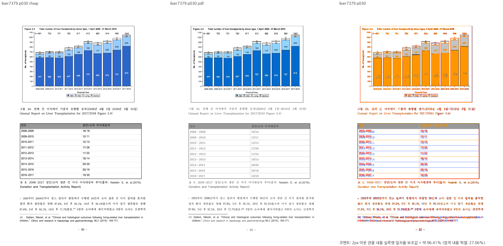

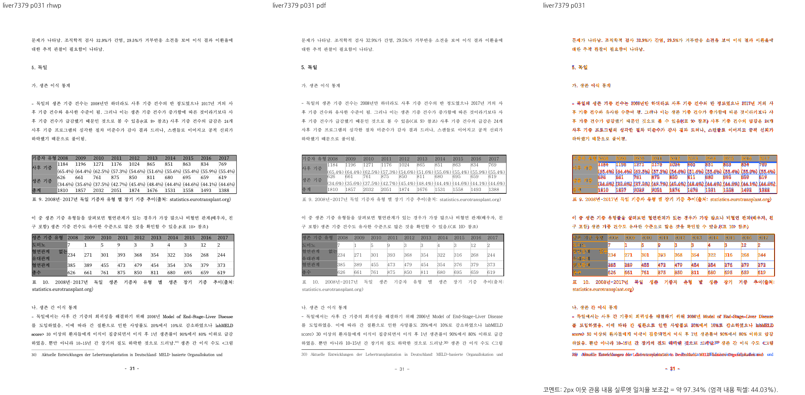

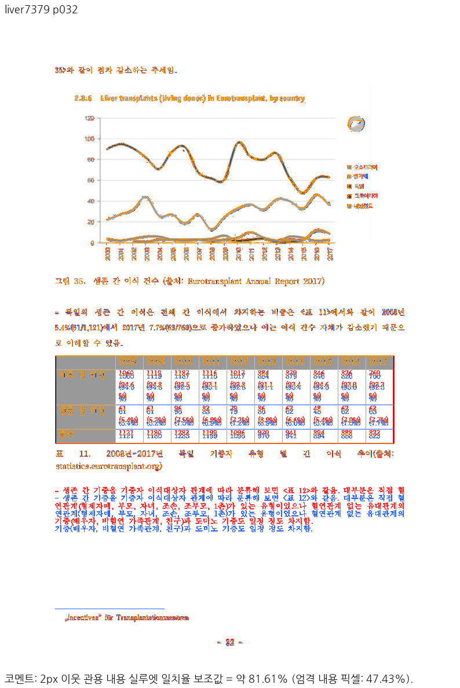

## 사용자 요청: 추가한 영어 주석 전체 한글화

사전 범위는 이번 통합 branch의 base 대비 추가 설명 주석 전체다. 코드·회귀 검사20개 파일의 영어108줄을 한글로 바꿨다. 변경 전후 주석을 제외한 파일 내용이 바이트 단위로 같음을 검사했고, base 대비 추가 영어 설명 주석 잔여0개, `cargo fmt --all -- --check`·`git diff --check` exit0을 확인했다. [파일별 검증](../assets/pr7382_20260926/comment_translation_validation.json). 이는 설명 주석 변경이며 새 렌더링 검증 통과를 주장하지 않는다. 최종 head의 필수 검증은 후속 기능 보정 뒤 실행한다.

## 메인터너 보정 14: 이월 각주의 물리 쪽 구분선 보존

같은 원본 보고서의 HWP/HWPX 한컴2024 PDF32는 번호 없는30 꼬리 위에 `x94.509..283.528/y1018.725px` 구분선을 표시한다. [두 기준 출력의 선 좌표와 해시](../assets/pr7382_20260926/stage14_independent_geometry.json)로 독립 기대값을 정했다. 기존 조각 조회와 문서가 구분선·번호를 모두 첫 조각에만 표시한다고 가정한 원인을 수정했다.

`boundary.rs`의 두 줄/저장 reset 조각 플래그 생산 → `state/notes.rs`의 실제 예약·투영·영역 동기화 → `picture_footnote.rs`의 동일 `any(draw_separator)` 높이와 선 배치로 이어진다. 각 물리 쪽에서 구분선은 한 번만 예약·배치하며 번호는 앞 조각만 표시한다. 명시적으로 구분선을 생략하는 기존 플래그의 소비 계약은 유지하고, 실제 물리 각주 경계 query가 올바른 표시 값을 생산하게 했다. 본문 위치와 그림색 차이를 이 변경으로 해결했다고 확대하지 않는다.

Producer `477c9aeb8` + Rust/test diff SHA256 `3d707ab6f3dd52af178be2ab424c21a52c7e65d8ac71df1148058479b57662f7`; [전후 검사](../assets/pr7382_20260926/stage14_validation.json).

| 검사 | 결과 | 의미 |
| --- | --- | --- |
| 같은 HWP/HWPX 실제 꼬리, 수정 전 | 2FAIL, exit100,0.247s |32쪽 구분선 수0/기대1로 실제 누락 검출 |
| 수정 후 관련·정상 대조군 | 40PASS, exit0,3.443s | 구분선 좌표·꼬리 위치·번호 무반복, 꼬리+정상 각주에서 선1개, 기존 표/각주/미주/왕복 보존 |
| 새 CLI/쪽수 | build exit0,1m46s;215/PDF215 | 중간 쪽수 유지 |
| Native32 review/overlay 직접 판독 |81.85013%, sweep 전체 exit1 | 구분선 복원; 뒤 문단 위치·그림색 등 잔여로 보류 |
| Native179 review/overlay 직접 판독 |97.53225% | 꼬리와 뒤 정상 각주의 구분선 중복 없음, 앞 단계 무회귀 |
| Native31/178 재캡처 |97.33830% /94.31041% | 선택 지표 무회귀; 이 단계에서 직접 판독을 반복했다고 확대하지 않음 |

[manifest](../assets/pr7382_20260926/stage14_native_manifest.json)·[summary](../assets/pr7382_20260926/stage14_native_summary.json)·[metrics](../assets/pr7382_20260926/stage14_native_overlay_metrics.json). 전체/fresh WASM/최종 필수 검증은 미완료이며 PR 생성·승인 보류다. 추가·수정한 설명 주석은 한글로 작성했다.

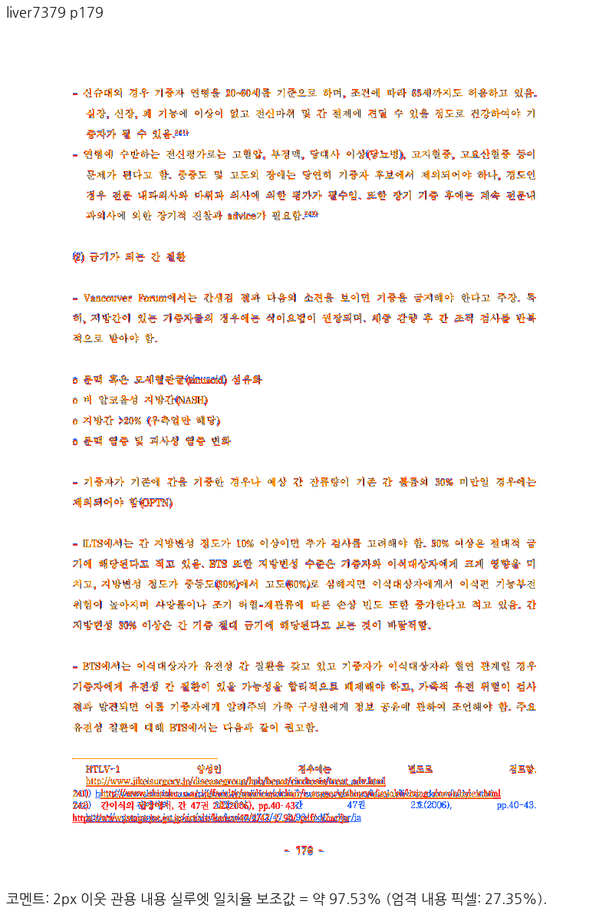

## 메인터너 보정 15: 실제 본문 앞 빈 줄의 점유 보존

동일 입력 PDF32의 뒤 본문 세 줄은821.061/847.621/874.341px다. 원본 빈 문단426의 저장53340→다음 본문55340HU는1000HU 줄높이+1000HU 간격,26.666px 점유를 입증한다. [독립 좌표](../assets/pr7382_20260926/stage15_independent_geometry.json). 측정과 줄 메트릭 생산은 정상이었으며, 구역 꼬리 흡수 경로가 다음 본문을 제목으로 추정해 그 뒤 문단의 쪽 경계를 앞당겨 적용한 것이 원인이었다.

`absorb_section_tail`의 경계 판단 → `hidden_empty_paras` 및 높이0 항목 → `layout.rs`의 숨김 반환 → 뒤 본문 최종 원점을 추적했다. 글이 있는 문단을 건너뛰는 잘못된 가정을 제거하고 빈 문단들 바로 뒤 첫 본문에서 관측한 reset만 안내 줄 흡수 근거로 유지했다. 문서 ID/숫자 조건을 추가하거나 줄 높이를 임의 보정하지 않았다.

Producer `00e210b06` + Rust/test diff SHA256 `bc7038e0bb950733809b6a8f63109dce27fd792f847fbec299a4c1bfc80ff9d8`; [명령·결과·소스 해시](../assets/pr7382_20260926/stage15_validation.json).

| 검사 | 결과 | 의미 |
| --- | --- | --- |
| 수정 전 실제 본문 좌표 |1FAIL, exit100,0.173s |807.693px vs PDF821.061px, 의도한13.333px 앞당김 검출 |
| 최종 소스 관련·정상 대조군 |43PASS, exit0,3.912s | 세 줄의 실제 위치, 앞선 표/각주/원본215쪽 왕복 및 국제고속선 HWP/HWPX242쪽·원본 reset 소유 보존 |
| 페이지 끝 빈 줄·표 조각 unit |4PASS, exit0,0.012s | 실제 끝 안내 줄 흡수와 prepared-state 생명주기 유지 |
| unit 정책·fmt |exit0 | 정책은 고정 base `eb9142dd7` 비교 |
| CLI·쪽수 |build exit0,1m56s;215/PDF215 | 최신 소스 출력,33쪽 첫 본문428 보존 |
| Native31/32/178/179 |97.33830/94.52341/94.31041/97.53225%, exit0 | 네 쪽 gate 통과, 글꼴 예외 없음 |

빈 줄 unit 첫 실행은 앞 보정에서 바꾼 필드의 옛 이름이 기존 테스트 초기화에 남아 테스트 전 빌드 실패(exit101)했다. 내 누락으로 기록하고 같은0.0 값의 올바른 필드로 고쳤다. 이를 빈 줄 결함 검출 증거로 세지 않으며 수정 후 unit4개와 최종 관련43개를 다시 통과시켰다. 추가·수정 설명 주석은 한글이며 통합 branch의 추가 영어 설명 주석 잔여0개다.

네 쪽의 review·standalone overlay8개를 직접 판독했다. 32쪽은 뒤 본문 위치가 복원되고 구분선·꼬리 각주가 남으며31/178/179의 기존 배치도 유지된다. 그림색·얇은 선·일부 글리프 잔차를 완전 일치로 보고하지 않는다. [manifest](../assets/pr7382_20260926/stage15_native_manifest.json)·[summary](../assets/pr7382_20260926/stage15_native_summary.json)·[metrics](../assets/pr7382_20260926/stage15_native_overlay_metrics.json). **선택 네 쪽 통과이며 전체/fresh WASM/최종 필수 검증 미완료, 다른 보류 페이지 해결 전 PR 생성 보류**다.

## 메인터너 보정 16: 저장 되감김 표의 온전한 행과 바깥 상자 공유

독립 한컴 PDF106의 표29는0..2행,107은3..7행이다. 앞 표 괘선670.947..986.121px, 뒤 표85.027..517.833px, 끝 캡션529.714px 및 뒤 본문592.901px를 [같은 원본 HWP/HWPX 두 출력](../assets/pr7382_20260926/stage16_independent_geometry.json)에서 확인했다. 내용 컷 높이가 실제 온전한 행보다 행마다11.733px 작게 예약돼 뒤 행까지 수용한 원인이다.

기존 HWP 계약과 같은 원본 되감김·일반 행·행 병합/셀 각주 없음 형상의 미편집 단단 HWPX에도 실제 온전한 행 높이를 연결했다. `whole_fit` 생산 → `prepare` 행 높이 → `RowBlockQuery` fit/소비 → 이어받기 plan → `budget/emit` → `table_partial` 실제 원점·점유 끝이 같은 결과를 사용한다. 새 물리 프레임에서 시작하는 온전한 이어받기 행은 바깥 위·아래 여백도 같은 plan으로 다시 연다. 행 내부 컷과 쪽 중간 원점은 이미 소유한 좌표를 유지한다. 문서 ID/새 수치 특례나 golden 완화를 추가하지 않았다. 기존 footer-local4px 값은 변경하지 않았다.

Producer `415b4b046` + Rust/test diff SHA256 `2ca3b8cc2b49496dd93d46d04e808aa35176f28dc6c9b422b6b783f4dd21dead`; [명령·결과·소스 해시](../assets/pr7382_20260926/stage16_validation.json).

| 검사 | 결과 | 의미 |
| --- | --- | --- |
| 수정 전 실제 두 회귀 |2FAIL, exit100,0.171s | 앞 행0..4/기대0..2,38.8px 표 초과 및 뒤 본문 조기 소비 |
| 첫 후보 |61PASS/1FAIL, exit100,3.206s | 행 소유와 꼬리 개선, 캡션1.88px·뒤 본문3.76px 차이 검출; 허용치 유지 후 공통 상자 보정 |
| 최종 관련·정상 대조군 |66PASS, exit0,4.009s | 행·괘선·캡션·뒤 본문·108꼬리 실제 검사, 패딩/원본 프레임/행 병합/중첩/원자 행과 앞 보정 무회귀 |
| 기존 Native·경계 unit |6PASS, exit0,0.227s | 원본 HWP 표 행 경계/그림 캡션, 빈 줄·조각 생명주기 보존 |
| unit 정책·fmt |exit0 | 고정 base `eb9142dd7` 비교 |
| CLI·쪽수 |build exit0,2m04s;215/PDF215 | 앞 표[0,3), 뒤[3,8), 본문1144[0,3)/[3,6) |
| Native106/107/108 |80.27049/85.40785/99.94123%, exit1 |108 개선,106/107 셀 글줄 잔여로 보류 |
| Native94/95 재캡처 수치 |98.91562/94.55592% | 같은 행 계약의 추가 수치; 이 단계에서 직접 판독했다고 확대하지 않음 |

첫 after 빌드는 계약명 변경 중 전달 구조체 한 곳을 빠뜨려 테스트 전 exit101로 실패했다. 내 오류를 바로잡고 전체 참조를 확인했으며 결함 검출 증거로 세지 않았다. 최종 source의6unit/66integration을 실행했다. 편집/텍스트 재조판 제외의 실제 편집 counter는 이번 단계에서 직접 실행하지 않았으며, 코드 보호 조건과 정상 대조군 통과를 실제 편집 검증으로 확대하지 않는다. 추가 설명 주석은 한글이고 추가 영어 설명 주석 잔여0개다.

106/107/108의 review·standalone overlay6개를 직접 판독했다. 표 외곽·캡션·뒤 본문 소유는 개선됐으나106/107 셀 안 글줄이 기준과 다른 위치에 있어 **gate는 보류**다. 글꼴 예외로 분류하지 않고 후속 셀 배치 보정에서 확인한다. [manifest](../assets/pr7382_20260926/stage16_native_manifest.json)·[summary](../assets/pr7382_20260926/stage16_native_summary.json)·[metrics](../assets/pr7382_20260926/stage16_native_overlay_metrics.json). 전체/fresh WASM/최종 필수 검증 미완료이며 PR 생성 보류다.

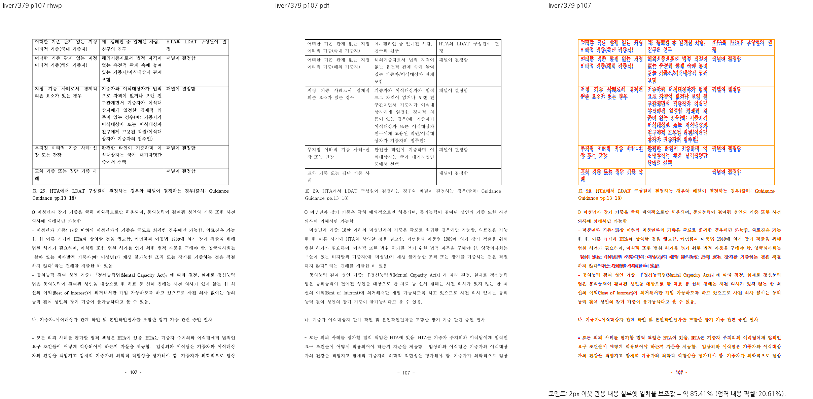

## 메인터너 보정 17: 온전한 행의 실제 높이와 안 여백 공유

원본 표29의 셀 최소 높이는282HU지만 실제 첫 행은90.933px이며, 저장 안 여백은 위·아래 각각510HU(6.8px)다. 기존 배치가 최소 셀 높이로 다시 판단해 위 여백을0.933px로 축소했고, 첫 조각에서 예산에 예약한141HU 위 여백도 배치 원점에 전달되지 않았다. [동일 입력/PDF의 독립 글줄 좌표](../assets/pr7382_20260926/stage17_independent_geometry.json)는106쪽678.514px,107쪽91.794px다.

온전한 단일 행의 측정 높이 생산 → `table_partial` 실제 셀 상자 높이 → 공통 `resolve_cell_padding_at_height`의 축 선택·이상값 방어 → 실제 글줄 원점으로 연결했다. 행 내부 컷·높이 덮어쓰기·병합 셀 및 측정 높이를 사용하지 않는 중첩 경로는 기존 컷 계약을 유지한다. 첫 되감김 조각은 기존 `host_before_overhead + vert_offset_overhead`를 공통 배치 plan에 전달하고, 예산·확정·배치가 같은 원점과 아래 여백을 소비한다. 새 수치 특례나 허용치 완화는 없다. 이전 #7406의 관련 영어 설명 주석9줄도 한글로 변경했다.

Producer `bacbabc9e` + Rust/test diff SHA256 `d1abcad092e275a6d3bce3c8f8da9f05056f9e379f474feae37dd7c55bbc6627`; [실행·소스·잔여 범위](../assets/pr7382_20260926/stage17_validation.json).

| 검사 | 결과 | 의미 |
| --- | --- | --- |
| 수정 전 실제 좌표 회귀 |1FAIL, exit100,0.166s |106쪽 글줄670.767/기대678.514로 조기 배치 검출 |
| 수정 후 관련·정상 대조군 |76PASS, exit0,3.319s | 실제 셀 안 여백·독립 글줄 좌표, 조밀 표/음수·쓰레기 여백/중첩/병합/행 내부 컷 보존 |
| 라이브러리 대조군 |6PASS, exit0,0.225s | Native 저장 되감김 표·그림 캡션·빈 문단·조각 생명주기 보존 |
| CLI·쪽수 |build exit0,1m57s;215/PDF215 | 필수 페이지 수 일치 |
| Native106/107 |99.94111/99.02564% | 기존80.27049/85.40785%에서 개선, 셀 글줄과 표 경계를 함께 직접 판독 |
| Native94/95/108 |98.91562/94.55592/99.94123% | 선택 gate exit0, 글꼴 예외 없음; 모든 review/overlay 직접 판독 |
| fmt·추가 설명 주석 |exit0 / 영어0개 | 이 단계에서 추가·수정한 설명 주석은 한글 |

[manifest](../assets/pr7382_20260926/stage17_native_manifest.json)·[summary](../assets/pr7382_20260926/stage17_native_summary.json)·[metrics](../assets/pr7382_20260926/stage17_native_overlay_metrics.json). 선택5쪽의 review/standalone overlay10개를 직접 확인했다. 표 행·캡션·뒤 본문과108쪽 꼬리/그림의 누락·겹침은 보이지 않는다. 일부 글자 실루엣·획·간격과 그림 색은 남아 있으므로 완전 픽셀 일치를 주장하지 않는다. 전체 최종/fresh WASM/lint는 미완료여서 PR 생성·승인 보류다.

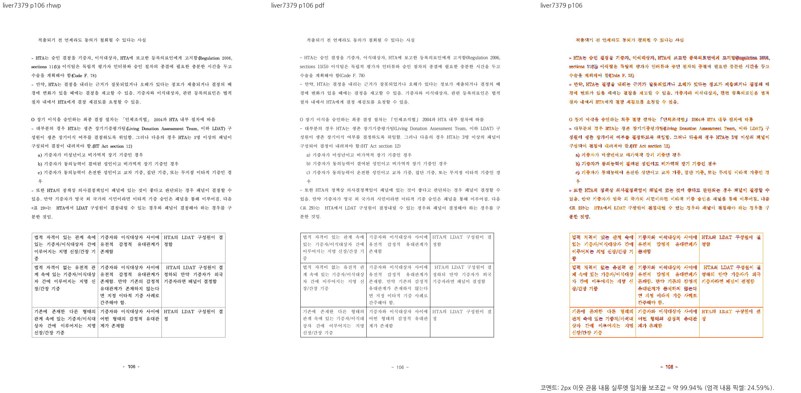
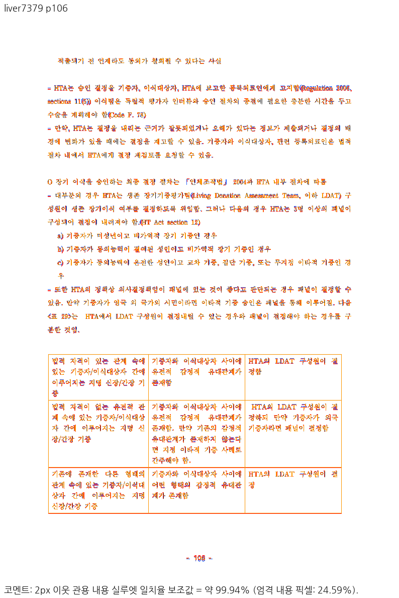
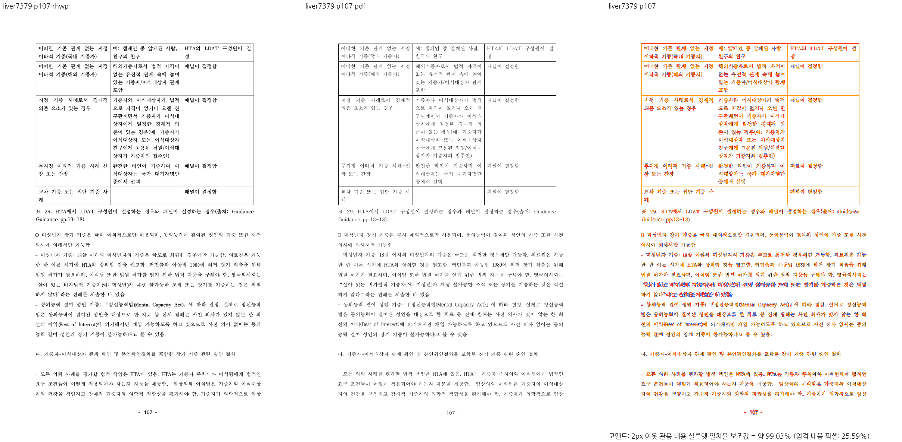

## 사용자 요청 추가 반영: 이전 통합의 영어 설명 주석 한글화

이번 통합의108줄뿐 아니라 앞 #7406/#7366 통합이 시작된 `c80a8370a` 이후 추가 설명 주석도 다시 확인했다. 보정17에서 번역한 모델 설명9줄 외에13개 파일의21문단86줄을 한글로 바꿨다. [파일별 검증](../assets/pr7382_20260926/prior_comment_translation_validation.json)에서 주석을 제외한 파일 바이트가 전후 동일하며, 이 시작 base부터 현재 branch까지 추가 영어 설명 주석은0개다. 식별자와 코드 울타리 언어 표시는 유지했다. 주석만 바뀐 범위는 새 기능 검증 통과로 확대하지 않으며, 최종 기능 head의 필수 검증은 계속 진행한다.

## 메인터너 보정 18: 저장 앵커로 입증한 낮은 시작 본문 경계

원본 문단512의44000/46000/48000/0,516의62711..70711/0은 [한컴 PDF44/45의 첫 꼬리](../assets/pr7382_20260926/stage18_independent_geometry.json)와 대응한다. 문단512는 본문 높이의 약61%에서 시작해 기존70% 후보 조건에 막혔지만, 실제 저장 앵커와 현재 흐름은 일치했다. 이 비율이 물리 쪽 소유의 증거를 대신한 것이 원인이다.

`prepare_forced_page_boundary`는 HWPX의 소스·구성 줄 수 일치와 기존 세션 편집 플래그를 확인하고, 공통 `hwpx_saved_reset_fragment_matches_current_flow`에서 단단/일반 본문/비합성 저장 줄/단조 앞 조각/정확한0 reset/현재 앵커 일치를 입증한 경계를 생산한다. 이 결과를 기존 forced boundary → scan/whole-fit/split → 확정·실제 글줄 배치가 소비한다. Native HWP/HWP3의 기존 비율 조건을 광역 완화하지 않았다. 무효 앵커와 합성 줄은 새 경계로 승격하지 않는다.

세션 편집 플래그는 Native HWP5용이므로 HWPX 전역 편집 제외의 증거로 확대하지 않는다. 실제 HWPX 본문 편집은 원래 줄 태그를 보존하지만 내부0 reset을 연속 위치로 재조판한다. 처음에는 모든 줄이 구현 태그라고 잘못 가정해 내 대조 assertion이 실패했고, 실제 생성 계약과 꼬리 무중복으로 바로잡아 통과했다. 새 경계 결함 검출로 세지 않으며 편집 후 한컴 출력 일치로도 확대하지 않는다.

Producer `1216114cb` + 최종 Rust/test diff SHA256 `93502ea7a03e1dd4a3dbf9f6052074cfa2f17da90cb602818a914fd9d54f967c`; [실행·명령·주석 외 코드 동일성·잔여](../assets/pr7382_20260926/stage18_validation.json).87개 검사 뒤 함수의 설명 두 줄만 수정했으며, 당시 실제 diff로 소스를 복원해 현재 함수의 주석 외 바이트가 같음을 확인했다. 별도 추가한 실제 편집 대조군은 최종 코드에서 실행했다.

| 검사 | 결과 | 의미 |
| --- | --- | --- |
| 수정 전 실제 꼬리 회귀 |1FAIL, exit100,0.167s |44쪽 첫 꼬리 누락 검출 |
| 관련·정상 대조군 |87PASS, exit0,12.902s |44/45 실제 꼬리·뒤 표 원점, 합성/불일치 앵커 거절, #6761의315쪽/부분 되감김, Native/HWP3/각주/표 보존 |
| 실제 HWPX 편집 대조 |1PASS, exit0,0.215s | 연속 재조판 위치, 원본 컷 무재사용과 꼬리 무중복 |
| 라이브러리 대조군 |6PASS, exit0,0.196s | 저장 표·그림 캡션·빈 문단·조각 생명주기 |
| CLI·쪽수 |build exit0,1m49s;215/PDF215 | 페이지 수 일치 |
| Native44/45 |71.92862/98.61863% |55.45553/50.97961%에서 개선.44 표 위치는 보류 |
| Native43/46/106/107 |91.32182/97.24002/99.94111/99.02564% | 직접 판독, 앞 보정의 큰 배치 무회귀 |
| Native121/122 |98.11430/98.01917% | 본문 개선. 직접 판독에서 각주160 소유가 여전히 틀림을 확인하여 의미 검증 보류 |
| fmt·영어 주석 |exit0 / 추가 설명0개 | 한글 설명 준수 |

선택8쪽의 review/standalone overlay16개를 직접 확인했다. 자동 선택 gate는44쪽으로 `re_review_required`, sweep exit1이며 글꼴 예외는 없다.121의 각주는 PDF159/160,122는161인데 현재160이122로 이월된다. 자동98%도 이 소유 결함을 해소하지 않는다.43 각주의 일부 줄바꿈/간격 차이도 남는다.44 표 위치와 각주 소유는 다음 개별 보정 대상으로 분리하고, 전체 최종/fresh WASM/lint 미완료로 PR 생성·승인 보류를 유지한다.

[manifest](../assets/pr7382_20260926/stage18_native_manifest.json)·[summary](../assets/pr7382_20260926/stage18_native_summary.json)·[metrics](../assets/pr7382_20260926/stage18_native_overlay_metrics.json).

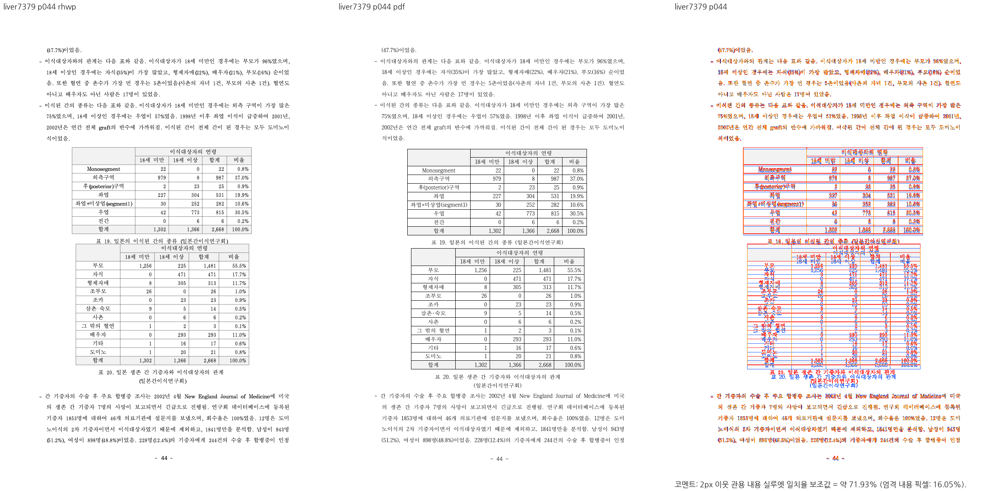

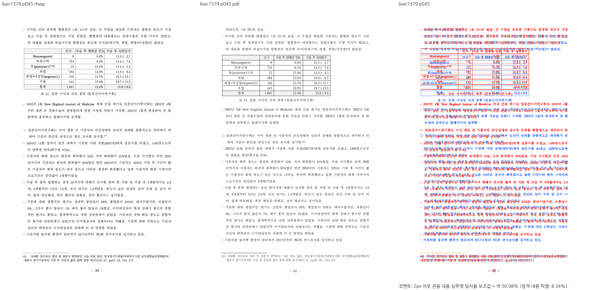

## 메인터너 보정 19: 빈 호스트 형제 표의 바깥 상자 공유

문단515의 두 ParaTop/TopAndBottom 표에는 각각283HU 바깥 여백이 있다. [동일 원본 PDF44의 괘선·캡션 좌표](../assets/pr7382_20260926/stage19_independent_geometry.json)로 기대값을 고정했다. `host_spacing::resolve`는 이 여백을 계산하지만 `empty_float::prepare`가 위여백을 쓰지 않고, 아래여백도 마지막 fit 면제와 함께 예약에서 빠뜨렸다. 첫 표와 둘째 표의 위치 차이가 누적된 원인이다. 음수 저장 offset을 화면에 맞춘 수치로 덮어쓰지 않았다.

HWPX 빈 호스트의 복수 자리차지 표 중 문단 상단/안쪽 정렬 경로에서 수평 lane 충돌 결과와 host spacing으로 `ParagraphFloatPlacement.table_top/occupied_bottom`을 생산한다. fit은 마지막 아래여백 면제를 유지하되, lane과 다음 표는 실제 점유 하단을 사용한다. `commit_empty_float_table`가 계획을 column metadata에 남기고 layout의 표 원점·실제 paint·후속 흐름은 그 동일 결과를 소비한다. 기존 단일 저장 앵커, Square 형제, 가시 호스트, 가운데·아래 정렬과 Native 경로의 계약은 유지한다. 다른 문서에 맞춘 수치·허용치 변경은 없다.

Producer `369b17e2b` + Rust/test diff SHA256 `5720b4e171e66ca36855cf155f5198a4623e7da629f389eff106db8e3affb04b`; [명령·정확한 전후 결과·잔여](../assets/pr7382_20260926/stage19_validation.json).

| 검사 | 결과 | 의미 |
| --- | --- | --- |
| 수정 전 실제 괘선·캡션 회귀 |1FAIL, exit100,0.179s | 첫 표 상단324.427 vs 독립PDF327.961 검출 |
| 대상 회귀 |40PASS, exit0,3.323s | 두 표 상·하단, 캡션·뒤 본문,45쪽 꼬리·뒤 표 보존 |
| 형제 표·여백 정상 대조군 |31PASS, exit0,0.493s | #6946/#6795 block·partial 형제, #2439/#2279/#1880/#2097 보존 |
| CLI·쪽수·fmt |build exit0,1m51s;215/PDF215;fmt exit0 | 동일 원본과 검증 코드 사용 |
| Native44 |99.68706% |71.92862%에서 개선, 큰 표·캡션 위치 차이 해소 |
| Native43/45/46 |91.32182/98.61863/97.24002% | 앞뒤 본문·표·그림 경계 직접 판독 |

준비 과정에서 suite 자동 배정이018→005로 바뀌어 첫 실행은0검사/exit4였다. 올바른005로 다시 실행한 위 수정 전 실패만 결함 검출로 인정한다. 설명 주석은 한글로 작성했다. 선택4쪽 review/standalone overlay8개를 직접 확인했으며 gate `passed`, sweep exit0, 글꼴 예외 없음이다. 표 괘선 농도, 일부 글자·각주 간격 차이는 남아 완전 일치로 보고하지 않는다.121/122의 각주160 소유와 전체 최종/fresh WASM/lint는 여전히 보류이며 아직 통합 PR을 만들지 않는다.

[manifest](../assets/pr7382_20260926/stage19_native_manifest.json)·[summary](../assets/pr7382_20260926/stage19_native_summary.json)·[metrics](../assets/pr7382_20260926/stage19_native_overlay_metrics.json).

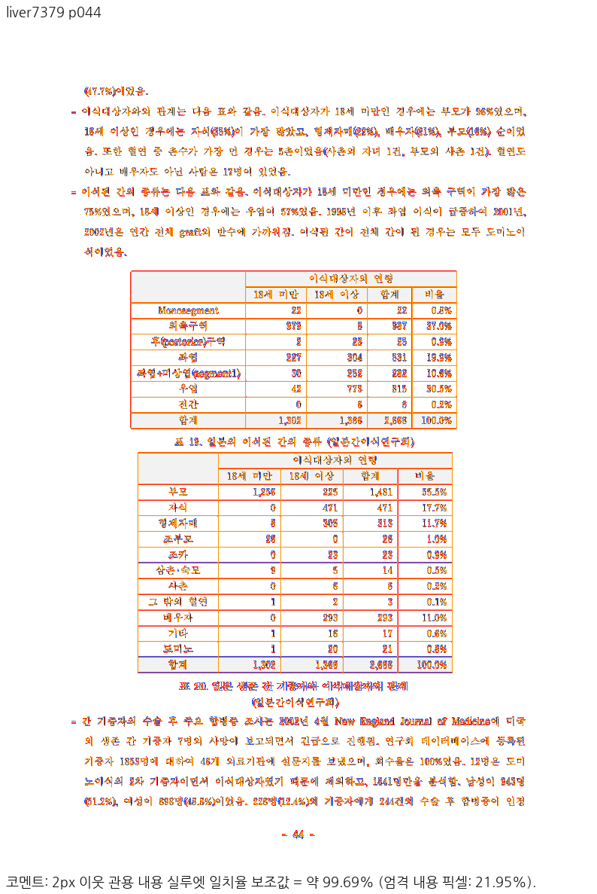
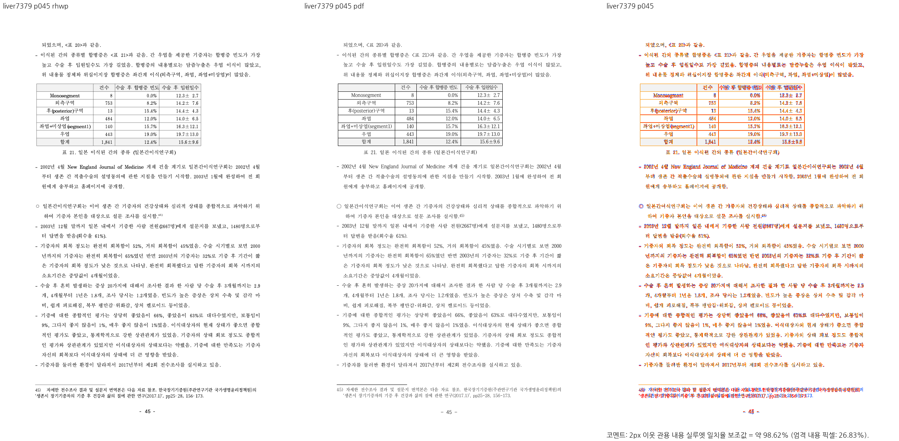

## 메인터너 보정 20: 표시 쪽 본문 점유와 각주 소급 예약 공유

원본 문단1297은 첫 문장 뒤에 각주160 표시가 있고, 저장 앞7줄과 뒤3줄이 121/122쪽에 나뉜다. [원본 XML·동일 입력 HWP/HWPX 기준 PDF 좌표](../assets/pr7382_20260926/stage20_independent_geometry.json)에서 121쪽은 각주159/160, 122쪽은161만이다. 본문 컷은 맞았지만 통째 각주 소급 등록이 Native 전용이어서 HWPX의160을 꼬리 쪽122에 잘못 붙였다. 자동 점수98%도 이 소유 결함을 잡지 못했다.

기존 `native_hwp5_body_footnote_tail_reset`가 단단·단일 각주·비합성 표시와 양수→0 저장 경계 및 실제 꼬리 컷을 입증한 HWPX에 완료 표시 쪽 등록을 연결했다. 소급 등록은 기존 각주가 있는 쪽에 한정하며, 첫 각주·두 줄 충돌·별도 표시 reset의 우선순위를 유지한다. Native 등록에는 새 HWPX fit 조건을 적용하지 않는다.

공통 `plan_fragment`는 같은 `FormattedParagraph` 메트릭으로 흐름 전진량과 수용한 모든 줄 상자의 최대 점유 끝을 함께 생산한다. `commit_split_paragraph_fragment`가 `(문단, 끝 줄)`의 단 상대 점유 끝을 보존하고, `completed_body_fragment_note_fits`는 완료 단의 마지막 실제 조각을 확인한 뒤 그 끝과 단 원점, 기존 각주 영역·추가 예약량으로 공존을 판단한다. 예약 조회와 확정은 같은 `completed_page_note_added_height`를 소비하며 실제 본문·각주는 확정된 조각/영역에서 배치한다. 값이 없는 다단·데코 호스트는 새 경로로 승격하지 않는다. 음수 줄간격이 전진량을 줄여도 앞의 큰 줄 상자의 점유 끝을 잃지 않으며, 뒤 문단 간격은 본문 점유 끝으로 잘못 가산하지 않는다.

Producer `5375b1f33` + 최종 Rust/test diff SHA256 `481af03a6f15c74cdc470c25dc88b379a22e0d94fe284f0fe36a55d93649c472`; [명령·소스별 해시·전후 결과·잔여](../assets/pr7382_20260926/stage20_validation.json).

| 검사 | 결과 | 의미 |
| --- | --- | --- |
| 수정 전 실제 각주 소유 회귀 |1FAIL/1PASS, exit100,0.413s |159 상단1027.347 vs 독립PDF1011.729, 잘못된160 이월 검출 |
| 최종 관련·정상 대조군 |86PASS/1FAIL, exit100,5.771s | 대상45PASS, 정상 대조41PASS; 잔여1개는 아래 별도 캡션 결함 |
| 큰 각주·합성 저장 줄·큰 줄 상자 |PASS | 완료 쪽 강제 예약 거절. 수정 전에도 통과한 대조군을 결함 검출로 세지 않음 |
| Native HWP 동일 원본 |PASS |121/122의 기존 번호·좌표·본문 소유 보존 |
| CLI·쪽수 |build exit0,1m50s;215/PDF215 | 동일 입력, 최종 검증 코드 |
| fmt·source 단위 테스트 정책 |exit0;4205검사/298모듈 | 고정 base `eb9142dd7c` 대비 검사 |
| Native120/123 |99.67776/95.08258% | 앞뒤 표·본문·각주 직접 판독 |
| Native121/122 |98.96031/99.37751% |121에159/160,122에161만 표시됨을 직접 판독 |

점유 생산식의 임시 단위 계약은 줄 상자0..30/5..15px와 흐름 끝15px로 수정 전1FAIL(0.015s)→수정 후1PASS(0.014s)를 확인했다. 신규 `src` 단위 검사 정책이 거절해 진단 소스·로그는 `output`에 보존하고 제출 소스에서는 제거했다. 추가 실물 배치 반례는 `tests/cases/`에 두었다. 수동 큰 줄 반례 두 구성은 보완 전에도 통과해 최대 점유 생산식의 결함 검출 증거로 확대하지 않으며 정상 거절 대조로만 남긴다. 첫 suite 실행은 준비 후005→003 재배정을 놓친 내 오류로0검사/exit4였고, 위 실제 결과와 구분했다.

선택4쪽의 review/standalone overlay8개를 직접 확인했다. gate `passed`, sweep exit0, 글꼴 예외 없음이다. 글자 외곽·간격과123쪽 각주 줄바꿈 차이는 남아 완전 일치를 주장하지 않는다. [수정 전 manifest](../assets/pr7382_20260926/stage20_before_native_manifest.json)·[수정 후 manifest](../assets/pr7382_20260926/stage20_native_manifest.json)·[summary](../assets/pr7382_20260926/stage20_native_summary.json)·[metrics](../assets/pr7382_20260926/stage20_native_overlay_metrics.json).

정상 대조에서 Native HWP90의 표27 캡션 겹침을 발견했고, [보정20 전 정확한 커밋의 대조](../assets/pr7382_20260926/stage20_native90_prior_control.json)에서도 같은 검사1FAIL/exit100/0.208s로 재현했다. devel 실패나 이번 각주 변경의 회귀로 분류하지 않는다. 앞선 통합·보정에서 놓친 결함으로 다음 개별 보정에서 해결한다. 전체 최종 회귀·lint·fresh WASM·전체 시각 gate도 미완료여서 통합 PR 생성·승인 보류를 유지한다.

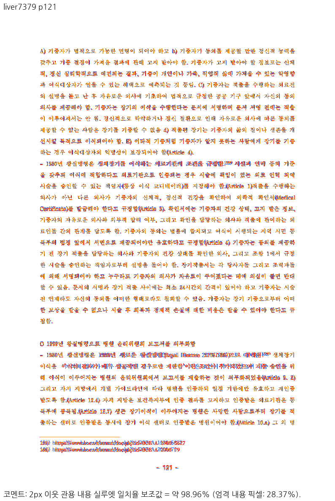

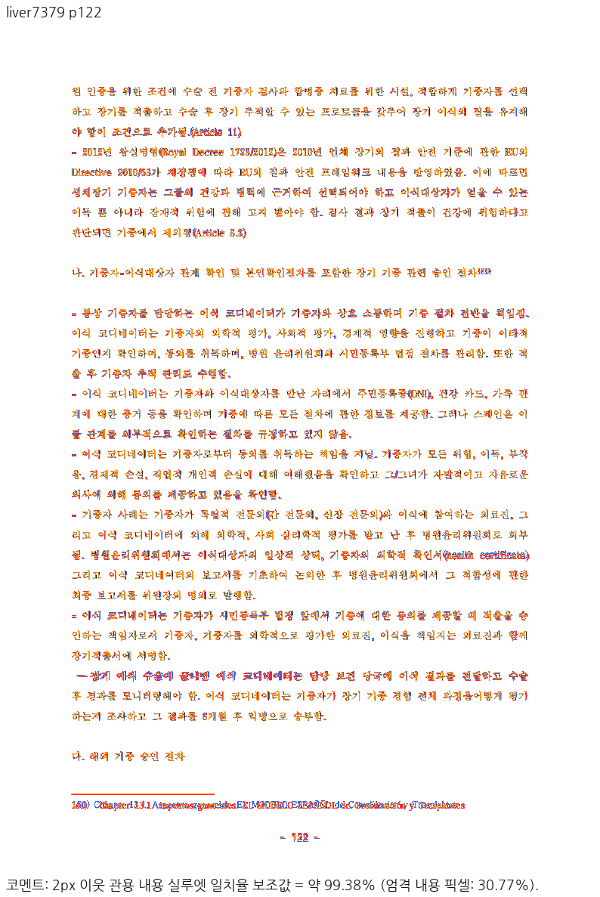

## 메인터너 보정 21: 선방출 Native 캡션과 첫 표 조각의 문단 기준 공유

[동일 원본 HWP·한컴 PDF90](../assets/pr7382_20260926/stage21_independent_geometry.json)의 표27은 캡션696.421..709.701px 뒤에718.095px에서 시작한다. 저장 문단962의 vpos46000HU, 표의 문단 기준 양수 오프셋1390HU와 바깥 위여백283HU가 이를 뒷받침한다. 앞 보정에서 첫 조각까지 넓힌 일반 흐름 원점은 선방출 호스트 전진량을 뺀 offset을 사용해700.267px에서 표를 칠했고, 이미 정상 위치에 있는 캡션과 겹쳤다. 단순히 Native를 fallback 대상에서 빼거나 paint에서 clamp하지 않고, 실제 문단 기준 좌표의 생산 결과를 마련했다.

`query_pre_emitted_caption_rowbreak_placement`는 기존 Native 번호 캡션 선방출 조건과 현재 단의 실제 `PartialParagraph` 소유, 비합성·연속 저장 줄, 미편집 단단/문단 상단 정렬을 확인한다. 저장 캡션 앵커를 현재 단 영역 좌표로 변환하고 signed offset·바깥 위여백으로 `ParagraphFloatPlacement`를 생산한다. 첫 조각 budget은 같은 table_top으로 가용 높이·컷을 고르고, commit은 같은 원점과 확정 조각 높이로 점유 끝을 기록한다. layout의 호스트 줄은 같은 stored_host_origin, 표는 resolved_table_top을 소비하므로 별도 para_start_y가 뒤에서 덮어쓰지 않는다. 새 쪽 이어받기는 이 first-only 계획을 재사용하지 않고 기존 실제 바깥여백·소유 계약을 유지한다. 앞 캡션이 현재 단에 없는 이월, 합성/편집/무효 저장 프레임과 다른 정렬은 이 계획으로 승격하지 않는다.

Producer `c34c15bbd` + 최종 Rust/test diff SHA256 `8ac3def6592910224db5c6445c7871333f6d7d328a35dd95109759394710337f`; [정확한 명령·해시·전후 결과](../assets/pr7382_20260926/stage21_validation.json).

| 검사 | 결과 | 의미 |
| --- | --- | --- |
| 수정 전 원본/양수 오프셋 정식 회귀 |2FAIL, exit100,0.498s | 원본 표 상단700.267 vs 독립PDF718.095 검출 |
| 최종 대상·정상 대조군 |89PASS, exit0,6.583s | 대상47와 정상42. 앞 단계의 Native90 캡션 실패도 PASS |
| 실제 표·뒤 내용 |PASS | 원본 첫 조각 하단995.711, 캡션 불겹침,90 관계 행/91 끝 행·캡션 무중복 |
| signed 양수 offset 변형 |PASS |500HU 증가에 표만6.667px 이동, 캡션 원점·뒤 행 소유 보존. 수동 좌표 계약 |
| CLI·쪽수 |build exit0,1m55s;HWP/HWPX215/PDF215 | 검증 코드와 동일 입력 |
| fmt·source 단위 테스트 정책 |exit0;4205검사/298모듈 | 고정 base `eb9142dd7c` 비교 |
| Native HWP90/91 |83.32319/96.28253% | 캡션·표 겹침 해소.90 본문 줄바꿈 차이는 보류 |
| Native HWPX106/107 |99.94111/99.02564% | 앞 보정의 공통 첫 표 여백·이어받기 배치 보존 |

새 Native HWP90/91과 HWPX106/107의 review/standalone overlay8개를 직접 확인했다.90은68.56281→83.32319%로 개선됐지만 앞 본문의 줄바꿈 차이가 남아 HWP gate `re_review_required`, sweep exit1이다. HWPX 선택 gate는 `passed`, exit0이다. 글꼴 예외를 쓰지 않고 본문 잔여 원인을 다음 개별 보정으로 조사한다. 표·캡션 부분 개선을 문서 전체 승인으로 확대하지 않으며 전체 최종 회귀·lints·fresh WASM·시각 gate 미완료로 통합 PR을 만들지 않는다.

[HWP manifest](../assets/pr7382_20260926/stage21_native_hwp_manifest.json)·[summary](../assets/pr7382_20260926/stage21_native_hwp_summary.json)·[metrics](../assets/pr7382_20260926/stage21_native_hwp_overlay_metrics.json), [HWPX manifest](../assets/pr7382_20260926/stage21_native_hwpx_manifest.json)·[metrics](../assets/pr7382_20260926/stage21_native_hwpx_overlay_metrics.json).

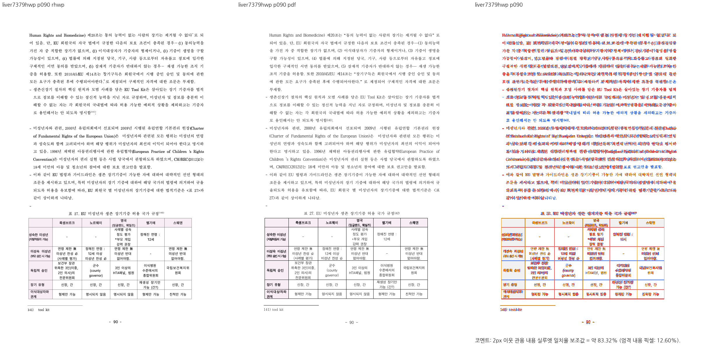

## 메인터너 보정22 — 저장 목록 줄 원점과 뒤 표의 실제 각주 경계

- 사전 근거: Native957의 비합성 저장9줄 원점496HU/폭44856HU는 해소 여백으로 계산한496..45352HU와 같다. 기존 목록 원점 차단이0..44856HU로 바꾸어 정확 프레임 수용이 실패했고,90쪽꼬리8줄이7줄로 재조판됐다. 독립 PDF는 마지막269.861px/후행958 첫296.421px다. [독립 입력·좌표](../assets/pr7382_20260926/stage22_independent_geometry.json).
- 생산→소비: `ParagraphBox::for_stored_body_rows`가 가시·비합성·유효 원본 분할의 실제 여백 원점과 첫 저장 원점 일치를 확인해 물리 상자를 복원한다. 공통 composer와 증거 probe가 같은 상자를 받고, 기존 전체행 폭/원점·stale/controls/float 수용 검사는 유지한다. typeset 확정 컷과 paint는 같은 구성 줄을 소비한다. 편집·빈 목록·NO_LS·합성·다른 원점은 기존 경로다.
- 첫 후보는 Native 목표/빈 목록 커서 통과이나 HWPX216쪽 및19FAIL이었다. 본문 복원 후 뒤 표962가 실제 각주 영역 외40px를 이중 예약해 관계 행을 밀었다. 목록 조건을 Native 예외로 좁히지 않았다. 원본 HWPX의 같은 ordinary RowBreak/후속 저장 되감김/기존 각주/셀 각주·rowspan 없음 경로를 실제 각주 경계 소비에 연결했다. 편집·표 재조판·합성·다단은 새 HWPX 저장 계약에서 제외했다.

| 검사 | 실제 전후 결과 | 판정 |
| --- | --- | --- |
| Native90 원본 꼬리/후행 문단 | 1FAIL(exit100,0.205s):7≠8 → PASS | 충족 |
| HWPX90 괘선/관계 행/이어받기 | 첫 후보1FAIL(exit100,0.289s):하단931.947≠995.711 → PASS | 충족 |
| 집중·정상 대조군 | 최종96PASS/0FAIL(exit0,5.424s),threads8 | 충족 |
| 잘못된 폭·합성 목록/빈 목록 편집 커서 | 원본 줄 수용 거절·내용 보존 및 기존#1329/#5677 통과 | 충족 |
| fmt/소스 단위검사 정책 | exit0 / base eb9142dd7,4205검사·298모듈 | 충족 |
| 새 CLI / 쪽수 | exit0,1m45s / Native HWP215·HWPX215,각 PDF215 | 충족 |
| Native HWP90/91 | 94.09514%/96.28253%,gate passed,exit0 | 선택 자동 gate 충족 |
| Native HWPX90/91 | 94.09514%/95.99030%,gate passed,exit0 | 선택 자동 gate 충족 |
| 직접 판독 | 양 입력90/91 review·standalone overlay 8개 확인; 본문 꼬리·관계 행·캡션/괘선 개선 | 해당 보정 의미 충족 |
| 남은 직접 차이 | HWPX91의 캡션 각주142 누락, 목록 표식/본문 가로 시작 차이 | 미충족, 별도 후속 보정 |
| 전체 회귀·세 Clippy·fresh WASM·전체 시각 | 아직 실행 전 | 미검증 |

- [최종 source 해시·명령·결과](../assets/pr7382_20260926/stage22_validation.json). source producer `865d9e8605ae70e1dbb54d8566e462683d988725`, Rust/test diff SHA256 `87afc5898223467cf57df1dc05b84df50f09c642b142b0e71f4dc85bed706f1e`. 글꼴 예외와 허용치 변경 없음.
- [HWP90 review](../assets/pr7382_20260926/stage22_native_hwp_review_090.png) · [overlay](../assets/pr7382_20260926/stage22_native_hwp_overlay_090.png) · [HWP91 review](../assets/pr7382_20260926/stage22_native_hwp_review_091.png) · [overlay](../assets/pr7382_20260926/stage22_native_hwp_overlay_091.png).
- [HWPX90 review](../assets/pr7382_20260926/stage22_native_hwpx_review_090.png) · [overlay](../assets/pr7382_20260926/stage22_native_hwpx_overlay_090.png) · [HWPX91 review](../assets/pr7382_20260926/stage22_native_hwpx_review_091.png) · [overlay](../assets/pr7382_20260926/stage22_native_hwpx_overlay_091.png).
- 해결 범위는 저장 줄 소유와 실제 표 분할 경계다. 자동90% 이상을 캡션 각주 소유의 완료 증거로 삼지 않으며, 각주142 누락을 다음 개별 단계로 추적한다. 영어 설명 주석 추가 없음. 로그·진단·generated suite는 output/ignored 작업 증적이며 커밋하지 않는다.

## 메인터너 보정23 — 분할 표 캡션의 형제 각주 등록

- 원인: `section::controls → register_body_footnote(has_table=true)`에서 HWPX는 Native 전용 표 캡션 각주 분기와 `!has_table` 분기 모두 제외되어 각주 참조가 발행되지 않았다. 원본937/962/1000의 표 다음 형제 각주138/142/147은 셀 내부 각주가 아니다. [독립 입력·PDF 가시 글자 영역](../assets/pr7382_20260926/stage23_independent_geometry.json).
- 생산→소비: 원본 유효 HWPX의 단단·단일 번호 캡션 표·직후 단일 형제 각주를 기존 구조 판별에 연결한다. 실제 확정 `Table` 또는 끝 행/빈 끝 컷 `PartialTable`의 소유를 format 중립 `table_host_terminal_fragment_placement`로 확인한 뒤, 같은 composed content 높이의 fit 검사→FootnoteRef·예약 높이→최종 각주 배치를 소비한다. Native 기존 경로와 큰 각주의 기존 다음 쪽 수용 계약은 보존한다. 편집·무효 텍스트 분할·합성·표 재조판·다단은 새 원본 HWPX 경로에 승격하지 않는다.
- 신규 검사 첫 실행의 Native 좌표 assertion은 PDF 가시 글자 상단과 실제 논리 줄 상단을 같은 측정값으로 비교한 내 오류였다(918.16 vs920.368571). 제품 좌표를 clamp하지 않고 두 측정값을 구분해 기준 글자 상단의 실제 줄 상자 소속과 쪽 유일성을 검사했다. 교정된 수정 전 실행은 Native1PASS/HWPX3FAIL이며, 기존 golden/visual 허용치 변경은 없다.

| 검사 | 실제 결과 | 판정 |
| --- | --- | --- |
| 정식 원본 각주 소유 전후 | 1PASS/3FAIL(exit100,0.652s) → 세 HWPX 각주 및 Native 대조 통과 | 충족 |
| 집중·정상 대조군 | 96PASS/0FAIL(exit0,8.319s),threads8 | 충족 |
| fmt/소스 단위 정책 | exit0 / base eb9142dd7,4205검사·298모듈 | 충족 |
| 새 CLI / 원본 HWPX 쪽수 | exit0,1m58s /215쪽,PDF215쪽 | 충족 |
| Native HWPX86/87 | 97.15232%/98.92215% | 선택 gate 충족 |
| Native HWPX90/91 | 94.09514%/96.28253% | 선택 gate 충족 |
| Native HWPX94/95 | 98.91562%/97.85246% | 선택 gate 충족 |
| 직접 판독 | 영향6쪽의 review·standalone overlay12개; 각주138/142/147의 번호·본문 복원과 뒤 내용/표 경계 확인 | 해당 보정 의미 충족 |
| 편집·재조판·다단 확장 | 이번 원본 출력의 대용으로 주장하지 않음 | 비적용/미검증 |
| 전체 Native/fresh WASM·최종 회귀/lint | 최신 전수 inventory와 최종 검증을 이어서 실행할 단계 | 미검증 |

- [정확한 source 해시·명령·결과](../assets/pr7382_20260926/stage23_validation.json): producer `04b4162f2`, Rust/test diff SHA256 `f5f7e03e5be8678e2b3bb3b3bed6891ca8dc62f0968ef709f45a0b0cc9dd087d`. 자동 gate는 passed/exit0이며 글꼴 예외 없음.
- [87쪽 review](../assets/pr7382_20260926/stage23_native_hwpx_review_087.png) · [overlay](../assets/pr7382_20260926/stage23_native_hwpx_overlay_087.png), [91쪽 review](../assets/pr7382_20260926/stage23_native_hwpx_review_091.png) · [overlay](../assets/pr7382_20260926/stage23_native_hwpx_overlay_091.png), [95쪽 review](../assets/pr7382_20260926/stage23_native_hwpx_review_095.png) · [overlay](../assets/pr7382_20260926/stage23_native_hwpx_overlay_095.png).
- 남는 목록 표식/가로 시작·글자 메트릭 차이와 전체 전수 gate는 이 각주 등록 통과로 완료 처리하지 않는다. 영어 설명 주석 추가 없음. 모든 로그·진단·generated 파일은 output/ignored 증적이며 커밋하지 않는다.

## 메인터너 보정24 — 내부 저장 줄 앵커와 내용 없는 물리 첫 조각

### 사전 근거와 공통 소비 경로

- 그림7의 원본 문단246은 가시 저장5줄을 가지며, 원본 제어 UTF16 위치207은171..230 구간의 내부 줄(vpos12000HU)에 속한다. 기존 Native의 호스트 뒤 원점과 HWPX의 첫 줄 원점은 둘 다 잘못된 앵커였다. `12000+offset3618+outerTop283+height18534+outerBottom283=후행34718HU`로 닫히는 저장 프레임과 PDF 그림 상단296.794667px를 확인했다. 문서 번호나 좌표 상수를 구현 분기로 사용하지 않는다.
- `stored_control_line_indices → stored_interior_control_table_frame → whole_fit`은 유효 미편집 원본의 내부 줄 소유와 실제 측정 높이/저장 전체 프레임 일치를 확인해 공통 `ParagraphFloatPlacement`를 생산한다. fit 예산·최종 배치가 같은 table_top/occupied_bottom을 소비한다. 첫/끝 줄, 무효·합성·편집·표 재조판·다단은 새 저장 계약으로 승격하지 않는다.
- 그림8의 표250은 첫 조각13678HU 동안 내용 유닛을 소비하지 않지만 물리 공간을 점유한다. 첫 셀25619HU 전체를 무시하거나 첫 쪽에서 그림을 잘라 보이는 처리는 원인 해결이 아니다. 이어받기 요구 높이는 `max(25619-13678,17772+282)+1282+283+283=19902HU`이며 후행 저장 vpos와 정확히 닫힌다.
- `saved_picture_row_empty_opening_frame → prepare의 실제 각주 경계/수용 검사 → scan의 양수 높이·빈 컷[0] → emit의 남은 물리 높이 → budget/PartialTable paint`가 같은 계획을 소비한다. 첫/다음 조각의 위여백과 끝 조각의 아래여백도 같은 확정 소유에 연결한다. 첫 조각 각주7, 다음 조각 각주8/9/10 및 뒤 본문을 정식 최종 tree에서 검사한다.
- [독립 입력·HU·PDF 좌표](../assets/pr7382_20260926/stage24_independent_geometry.json), [대조군 단일 속성 변경·입력 해시](../assets/pr7382_20260926/stage24_input_provenance.json), [전체215쪽 대조 좌표](../assets/pr7382_20260926/stage24_all_page_controlled_geometry.json). 높이0은 각주8을 앞쪽으로 이동시키므로 원본 통과의 대용이 아니다. 높이40000은216쪽과 더 큰 이어받기로 선언 높이 전역 무시를 기각한다. noAdjust 변경은 원인이 아니었다.
- [한컴 가시 괘선 대조 PDF](../../../pdf/issue7379/liver7379-table250-visible-border-2024.pdf)는 두 셀의 같은 .12mm NONE 괘선만 SOLID로 바꾼 수동 대조군이다. 원본과215쪽 전체의 텍스트/그림 bbox가 정확히 같으며,12쪽 빈 괘선820.062663..1002.263997px와13쪽86.945312/327.321370/344.422689px가 물리 첫 조각·이어받기를 드러낸다. 대조군 출력을 원본 일치로 보고하지 않는다.

### 전후 결과와 남은 보류

| 검사 | 실제 결과 | 판정 |
| --- | --- | --- |
| 정확한 보정 전6fa 코드 + 최종 신규6개 회귀 | 0PASS/6FAIL,exit100,0.275s | 앵커·빈 조각·이어받기 결함 검출 |
| 최종 집중·정상 대조군 | 102PASS/0FAIL,exit0,6.337s,threads8 | 해당 소유/좌표/물리 높이 계약 충족 |
| fmt·새 CLI | 각각exit0 | 동일 Rust/test diff의 불변 CLI로 캡처 |
| manifest / source 단위 정책 | exit0 /4205검사·298모듈,base eb9142dd7 | fmt 뒤 prepare하고 별도 명령의 exit 확인 |
| Native HWP11/12/13/14 | 80.37557/99.76685/77.85867/82.03316% | exit1,re_review_required |
| Native HWPX11/12/13/14 | 68.96816/99.76685/77.05428/81.51575% | exit1,re_review_required |
| 직접 판독 | 두 형식4쪽 review·standalone overlay16개 | 12쪽 그림7/뒤 본문,13쪽 상단 그림8/캡션/각주 개선 |
| 남은 차이 | 13쪽 하단 표2·그림9 위치,11·14쪽 차이 | 미충족; 다음 개별 보정 |
| 최종 전체 회귀·Clippy·Skia·fresh WASM·전수 시각 | 미완료 | 미검증 |

[정확한 해시·명령·결과](../assets/pr7382_20260926/stage24_validation.json): producer `6fa58aef8813c185ce113754fbda60792db2a84e` + Rust/test diff SHA256 `5cdda382e642690e2a2728c11667e40eee305b55abbd8864c0718d748ae369a9`, 불변 CLI SHA256 `8477eeca956b269d3cc33608f2b355e048da784df2f99ef728c28587586b8b04`.
중간 후보의 ctrl_idx 누락 컴파일 실패는 수정 후 재검증했으며 결함 재현으로 세지 않는다. 첫 manifest 검사의 fmt 뒤 파생 drift도 prepare 후 별도 check에서 통과했다. 기존 baseline·golden·시각 허용치와 글꼴 예외를 변경하지 않았다. 추가한 설명 주석은 한글이다. 로그/output/generated suite는 커밋하지 않는다.

[보정 전 전체 Native inventory](../assets/pr7382_20260926/stage23_full_native_hold_inventory.json)는6fa의215쪽 전수 완료/32쪽90% 미만/exit1이다. 보정24 뒤 전수 통과로 바꾸어 보고하지 않는다. 단계16의 실제 TABLE 편집/재조판 반례도 최종 검증 전에 남아 있다.

[HWP manifest](../assets/pr7382_20260926/stage24_native_hwp_manifest.json) · [metrics](../assets/pr7382_20260926/stage24_native_hwp_overlay_metrics.json), [HWPX manifest](../assets/pr7382_20260926/stage24_native_hwpx_manifest.json) · [metrics](../assets/pr7382_20260926/stage24_native_hwpx_overlay_metrics.json).

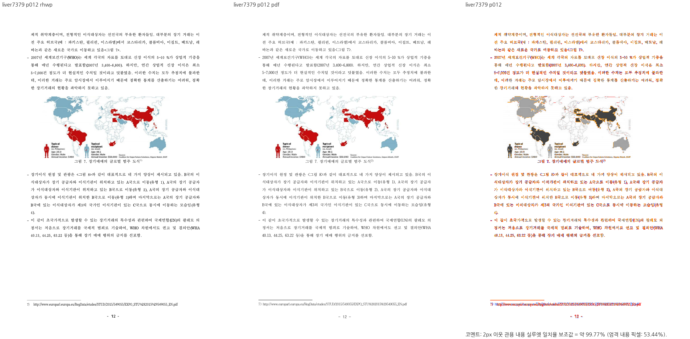

## 메인터너 보정25 — 나란히 배치된 그림 표의 공통 바깥 프레임

### 독립 근거와 실제 소비 경로

- 원본 문단259의 비TAC Square/ParaTop/ColumnLeft 표2·그림9는 같은 유효 저장 줄40102HU를 공유한다. 기존 경로는 바깥 위/왼쪽 여백과 양수334HU 오프셋을 빠뜨렸다. [입력·대조군 provenance](../assets/pr7382_20260926/stage25_input_provenance.json).
- [한컴 가시 괘선 PDF](../../../pdf/issue7379/liver7379-table259-visible-border-2024.pdf)는 네 셀의 같은 .12mm NONE 괘선만 SOLID로 바꿨다. 원본과215쪽 전체 텍스트/그림 bbox가 정확히 같으며 표2 원점98.346670/625.395996px, 그림9 원점410.338664/620.921346px를 확인했다. [괘선 좌표](../assets/pr7382_20260926/stage25_border_pdf_geometry.json). 음수 오프셋을0으로 바꾼 별도 한컴 출력도 전체215쪽 bbox가 같아, 이 형제 표의 음수 값을 새 상단 앵커로 해석하지 않는다. [대조군](../assets/pr7382_20260926/stage25_offset_control_provenance.json) · [좌표](../assets/pr7382_20260926/stage25_offset_pdf_geometry.json).
- `stored_square_sibling_outer_frame → empty_float::prepare → ParagraphFloatPlacement(table_left/table_top/occupied_bottom) → layout::Table → table_layout 최종 원점`이 같은 확정 프레임을 소비한다. lane은 바깥 상자를, 실제 표는 그 안의 여백을 소비한다. 편집·합성·표 재조판·다단·외부 캡션은 원본 계약에 승격하지 않는다. 문서 번호·좌표 상수·paint clamp 분기는 추가하지 않았다.
- 첫 후보에서 최종 x를 inline override로 전달해 그림9의 가로 오프셋이 다시 더해졌다(722.61333px). 실제 최종 소비 지점에 공통 원점 쌍을 전달해 이중 적용을 수정했다. 양수 오프셋 수동 IR 변경의10px 이동 기대값은 독립 근거가 부족해 정식 검사에서 제외하고 진단 실패 기록을 보존했다. 해당 편집 계약은 미검증이며 관측 출력에 맞춘 assertion으로 통과시키지 않았다.

| 검사 | 실제 결과 | 판정 |
| --- | --- | --- |
| 정확한 b617 코드 + 원본 신규 좌표2개 | 0PASS/2FAIL,exit100,0.198s | 여백·원점 결함 검출 |
| 최종 집중·정상 대조군 | 131개128PASS/3FAIL,exit100,5.821s,threads8 | #6950 기존 회귀3개 미충족 |
| #6950 수정 전 b617 대조 | 25개22PASS/3FAIL,exit100,0.174s | 이번 Square 보정 전부터 있는 통합 회귀; 해결 필요 |
| 원본 HWP/HWPX·음수0 대조·합성 호스트 신규4개 | 모두PASS | 해당 원본 프레임·적용 제외 계약 충족 |
| fmt/manifest/소스 단위 정책 | exit0 /6196 static attrs /4205검사·298모듈,base eb9142dd7 | 충족 |
| 새 CLI·쪽수 | build exit0,1m49s /두 형식215쪽,PDF215쪽 | 충족 |
| Native HWP11/12/13/14 | 80.37557/99.76685/96.31316/82.03316% | exit1,re_review_required |
| Native HWPX11/12/13/14 | 68.96816/99.76685/94.95851/81.51575% | exit1,re_review_required |
| 직접 판독 | 두 형식4쪽 review·standalone overlay16개 | 13쪽 표2·그림9·캡션 복원,상단 그림8/각주 보존 |
| 남은 차이·필수 검증 | 11·14쪽 위치/크기,전수 검증·fresh WASM·전체 회귀/lint/Skia | 미충족/미검증 |

[정확한 source·diff·CLI 해시와 최종 명령](../assets/pr7382_20260926/stage25_validation.json). 최종 검사는 근거 없는 수동 IR 검사를 제외한131개 결과다. 이전132개 실행은 최종 검사로 재사용하지 않는다. 캡션의 PDF 가시 글자 상단과 저장HU 논리 줄 상단은 구분한다. 기존 baseline·golden·시각 허용치·글꼴 예외를 변경하지 않았다. 추가 주석과 이번에 손댄 기존 설명 주석은 한글로 바꿨다. 모든 로그는 output에 두며 커밋하지 않는다.

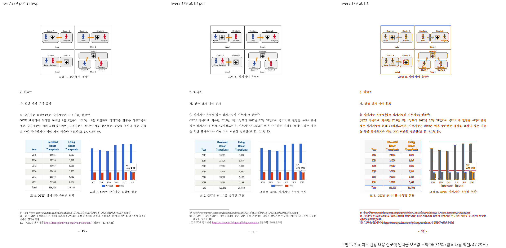

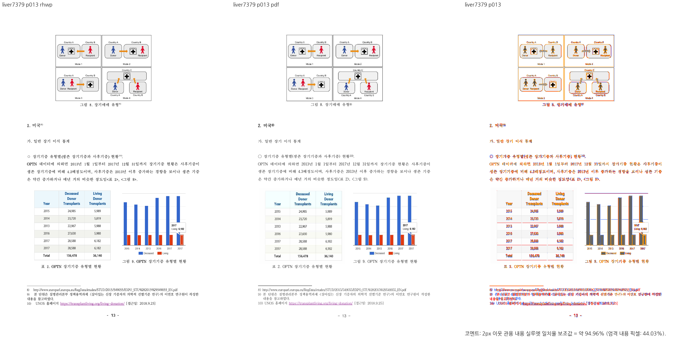
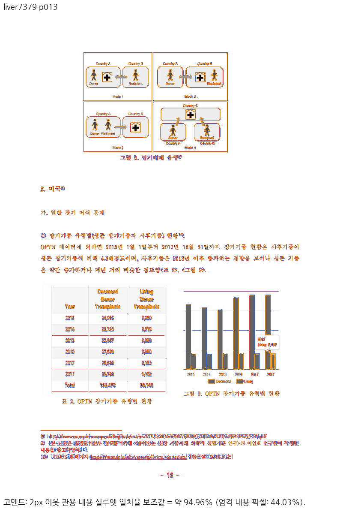

다음 개별 단계는 #6950의 객체 전용 문단에서 표 사이 간격과3쪽 계약을 복원한다. 보정19의 복수 TopAndBottom 원점 생산·예약·실제 배치를 최신 devel 대조와 연결해 확인하며, 기존 테스트를 완화하지 않는다.

## 메인터너 보정26 — 확정된 지연 좌표 기준의 마지막 줄 소비

### 사전 근거와 기대값 교정

- 현재 devel `eb9142dd7`에서 #6950의 기존25개는 모두 PASS(0.221s)다. 동일 원본 [한컴 PDF](../../../pdf/hwpx/20260909-para-table-2024.pdf)를직접확인하면 첫 표98.132..147.199px, 세 번째 표199.461..492.261px로 바깥 여백이 필요하다. devel의 첫 표94.5..143.6,세 번째180.9..474.0은위 여백·표 간 여백을 잃고 있다. 녹색 검사를 PDF 일치로 승격하지 않는다. [원본SHA·HU·PDF 좌표](../assets/pr7382_20260926/stage26_independent_geometry.json).
- 기존 ‘표 간격0’ 기대값은 PDF와 달랐다. 원본 각283HU의 앞 아래+뒤 위 여백 합7.546667px로 교정했으며 허용치0.02px는 유지했다. 관측 출력에 맞춰 허용치를 늘린 것이 아니며, 이 교정은 페이지 결함을 숨기지 않는다. 교정된 기존 검사도 수정 전에는4≠3쪽으로 실패했다.
- 추가 쪽의 원인은 마지막 예산 설명 줄(문단5,vpos68707HU,lh1200HU)이다. 실제 본문933.573333px 안에916.093333..932.093333px로 들어가며 PDF 가시 글자1010.2556..1026.2426px도 본문94.466667..1028.04px 안이다. 그러나 소비자가 확정 lazy 기준0을 버리고 첫 호스트30164를 다시 선택해 마지막 줄 소유의 증거를 거절했다. 4px 안전마진을 제거하거나 출력을 clamp하지 않는다.
- 실제 연결은 `section/vpos::vpos_snap_current_height → st.vpos_lazy_base → paragraph::prepare_forced_page_boundary → whole_fit의 저장줄 경계/fit → 실제 페이지 소유`다. page_base가 있으면 기존 우선, 없으면 이미 확정된 lazy_base, 둘 다 없으면 기존 첫 항목 fallback을 쓴다. 기존 source 유효성·흐름 일치·원본 쪽 끝 검사를 유지한다.

| 검사 | 실제 결과 | 판정 |
| --- | --- | --- |
| 정확한 보정 전ef572b3c9 + 최종26개 | 22PASS/4FAIL,exit100,0.173s | 쪽수·마지막줄소유결함검출 |
| 수정 후 #6950 전체 | 26/26PASS |3쪽·표여백·문단종료·마지막줄소유충족 |
| 확대12모듈 |140개138PASS/2FAIL,exit100,17.277s,threads8 | #6312 보류2개 |
| #6312 수정 전 불변CLI 대조 |0PASS/2FAIL,exit100,0.667s,365.7px | 보정26 전부터있는통합차이;다음단계해결 |
| fmt/manifest/source-unit |exit0/6197 static attrs/4205검사·298모듈,base eb9142dd7 |충족 |
| 새 CLI |release-test build exit0,1m36s |불변사본으로새캡처 |
| #6950 전체3쪽 |98.66178/99.1346/79.76857%,exit1 |3쪽위치차이로재검토 |
| #7382 HWPX43–46쪽 |91.32182/99.68706/98.61863/97.24002%,exit0 |선택gate충족;215쪽유지 |
| 직접 판독 |위7쪽 review·standalone overlay14개 +devel3쪽6개 |첫쪽여백·마지막줄복원,44쪽표19/20·캡션·뒤본문보존 |
| 전체최종검증 |전체회귀/세Clippy/Skia/fresh WASM/최신전수미완료 |미검증 |

[source·명령·해시·결과](../assets/pr7382_20260926/stage26_validation.json). 공유 캐시의 다른 checkout 라이브러리로 첫 검사가 빌드 실패(exit101)한 것은 결함 재현으로 세지 않았다. 캐시 삭제 없이 root 소스를 재빌드하고 같은 명령에서 의도한 페이지 결함 실패를 확인했다. 설명 주석은 한글로 바꿨고 base c80a8370a 이후 추가 영어 설명 주석은0개다. 로그·generated·output은 커밋하지 않는다. 최종 head 시각/WASM 증적은 이 중간 결과로 대체하지 않는다.

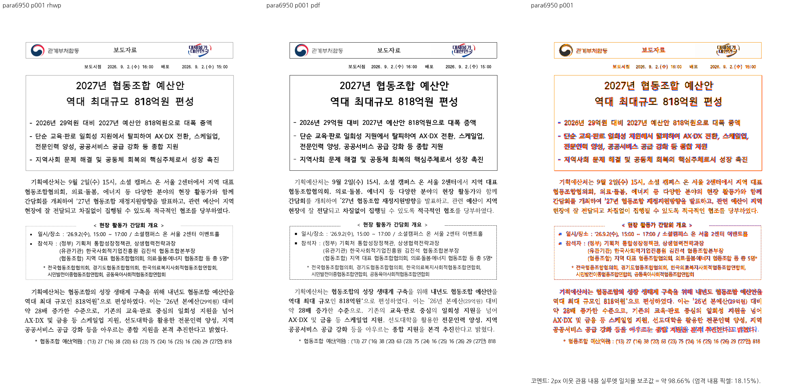
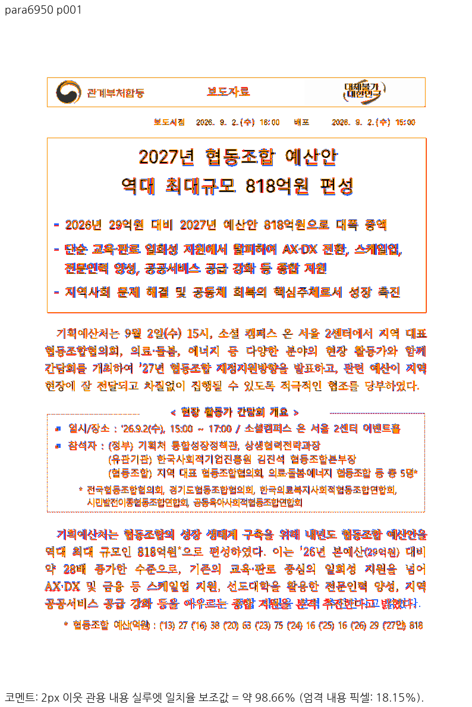

#6950의3쪽하단표여백/원점과#6312의호스트줄·형제표차이는보류다. 기존 골든·실루엣 허용치·글꼴 예외를 변경하지 않으며 다음 개별 보정에서 독립 출력과 연결한다.

## 메인터너 보정27 — 가운데 정렬을 소유한 1×1 표의 물리 프레임

### 사전 분석

- #6950 원본3쪽의 문단29는54805HU 최소 높이의 가운데 정렬 셀 안에52416HU 중첩 표와 위/아래283HU 바깥 여백을 담는다. 셀 안 여백은141HU씩이다. 내용52982HU를 담고도1541HU의 정렬 공간이 남는다. PDF 안쪽 표의 위 괘선307.823px와 아래1005.94px가 독립 기준이며, 현재297.9px 상단은 약10px 위다.
- `height_measurer::measure_table_impl`은 빈1×1셀의 첫 표를 바로 반환하고, `layout::table_layout`도 외곽 셀을 제거해 자식에 안 여백만 더한다. 두 경로 모두 외곽 셀의 최소 높이와 가운데/아래 정렬을 잃는다. 글자처럼 표라는 속성은 이 공간을 제거할 근거가 아니다.
- 선언 내용과 실효 안 여백보다 큰 최소 높이에 가운데/아래 정렬이 지정된 상자는 투명 래퍼가 아니다. 측정·배치의 동일 판별에서 외곽 셀을 보존하고 기존 일반 셀의 물리 높이·정렬 결과를 소비하도록 한다. Top 정렬 및 정렬 공간 없는 기존 빠른 경로는 대조한다. 문서 번호·좌표 상수·출력 clamp를 추가하지 않는다.
- 신규 정식 검사는 원본 최종 tree에서 외곽 셀 높이, 안쪽 표 유일성·PDF 상단·점유 끝과3쪽 소유를 검사한다. 실제 전후 실행과 #6621/#6648/#7063 정상 대조 및3쪽 직접 Visual Sweep 뒤 결과를 연결한다. #6312는 이번 코드 수정과 분리해 다음 단계에서 다룬다.

### 보정 결과

- 공유 판별 `single_table_wrapper_has_vertical_alignment_space`에서 실효 안 여백과 안쪽 표의 선언 높이·바깥 여백을 포함해 외곽 셀의 남는 정렬 공간을 확인한다. 측정과 paint가 이 판별을 함께 소비해 이 셀을 제거하지 않는다. 이후 기존 일반 셀 경로의 최소 물리 행 높이와 실제 내용 높이가 가운데/아래 정렬의 원점·점유 끝을 결정한다. 실제 최종 tree는 외곽292.3/높이730.7px, 안쪽308.2/높이698.9px다(진단 JSON의0.1px 표기).
- 수정 전 정식 원본 검사는 외곽 표 소실로0PASS/1FAIL,exit100,0.028s였다. 수정 후 최초 집중·정상 대조33/33PASS,exit0,0.273s였다. Top/Center/Bottom 수동 IR 정렬 불변식을 포함한 최종 집중은34PASS/0FAIL,exit0,0.303s다. 수동 IR을 한컴 생성 출력 증거로 승격하지 않는다.
- #6950 전체3쪽은98.66178/99.13460/99.78442%,exit0,gate passed다. 3쪽의 목표/투자·화살표·지원방향 표 전체와 아래 끝, 앞2쪽의 제목·본문/표·로고를 새 review/standalone overlay6개에서 직접 확인했다. 기존3쪽79.76857%의 위치 차이를 해결했다. 글꼴 폭·얇은 선/색 표현의 잔여를 완전 픽셀 일치로 보고하지 않는다.
- #7382 원본HWPX11–14쪽도 새로 비교·직접 판독했다.68.96816/99.76685/94.95851/81.51575%,exit1이다.12/13쪽의 앞 보정은 유지됐고11/14쪽의 큰 위치 차이는 보류다. 원본215/PDF215쪽은 유지됐다. 이전 전수 snapshot을 현재 전수 통과로 재사용하지 않는다.
- fmt·manifest 정책(6199 static attrs)·source-unit 정책(4205검사/298모듈)은 고정base eb9142dd7에서 통과했다. 불변 새 CLI는release-test 빌드exit0,1m43s다. [source·명령·파일/CLI 해시와 최종 결과](../assets/pr7382_20260926/stage27_validation.json), [독립 PDF/HU 근거](../assets/pr7382_20260926/stage27_independent_geometry.json).
- 이번 변경 주석과 손댄 기존 영어 설명을 한글로 교정했다. baseline·golden·시각 허용치·글꼴 예외는 변경하지 않았다. 모든 로그는output에 남기며 커밋하지 않는다. #6312의 두 기존 실패·전체 최종 검증은 다음 단계에서 다루며 아직 통합 PR을 만들지 않는다.

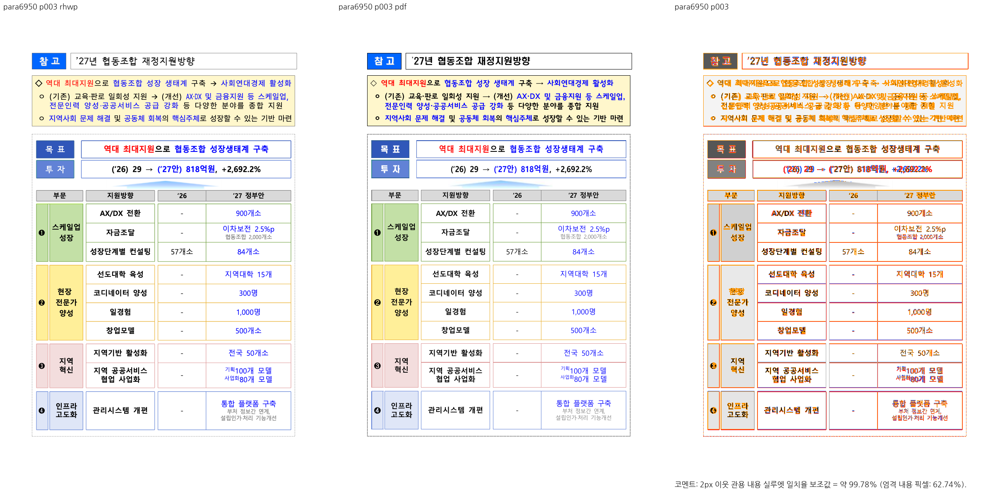

보존된 외곽 셀이 실제로 분할·이월되는 물리 소유 경계는 이번 단계에서 실행하지 않았다. 해당 경로는 미검증이며 제출 전에 실제 컷·점유 끝·자식 내용의 누락/중복을 대조한다. 온전한 셀과 세 정렬의 통과를 이 경로의 증거로 대신하지 않는다.

## 메인터너 보정28 — 다른 셀의 확장이 빈 앵커 줄의 소유를 바꾸지 않도록 보정

### 사전 분석과 독립 기준

- #6312 머리 표의 세 셀은 최소2994HU를 공유한다. 왼쪽 로고의 유효 그림 흐름2704HU와 빈 줄1000HU는 각각 이 최소 안에 들어간다. 오른쪽 글자처럼 그림의 저장 줄3194HU+실효 안 여백282HU는 실제 행을3476HU로 확장한다. 다른 셀의 확장은 로고 셀의 빈 앵커 줄을 그림 위에 다시 쌓아야 한다는 증거가 아니다.
- `height_measurer::row_declared_covers_stored_content`는 모든 셀의 저장 줄이 초기 최소 안에 들어가야만 빈 줄 중복 계상을 제거했다. 오른쪽3194>2994 때문에 왼쪽에서도 억제가 풀려 머리 표가3985HU(53.1px)로 부풀었다. 측정 결과의 실제 row_heights를 typeset과 최종 table_layout이 소비하므로 뒤 형제 표·본문까지 약6.8px 내려간다. 셀 하나의 줄/개체 소유를 다른 셀의 줄 크기로 판정하는 가정을 제거한다.
- 입력 저장 정보는 한컴오피스2020이다. 동일 공개 슬라이스를2020 엔진으로 새 변환한 기준은 정상 세로4쪽이다. 기존2-up PDF의 원시 좌표와 직접 혼합하지 않는다. 새 PDF 머리 괘선98.132..144.3227px(높이46.1907px), 마지막 제목 표196.7454..318.6920px, 첫 본문 가시 글자358.2463px가 독립 근거다. 저장 실제 머리 높이3476HU=46.3467px와 본문 논리 시작(7085+19829)/75=358.8533px가 이 출력과 대응한다.
- 기존 검사의346.8px/표 하단307.0px는 과거 rhwp 출력 상수이며 현재 원본 수용 기준이 아니다. 실제 최종 tree의 마지막 표 하단과 호스트 줄2700HU+아래 여백283HU 간격을 검사한다. 이 간격 검사는 보정 전에도 통과할 수 있는 정상 대조이며 결함 검출로 세지 않는다. 머리 표 높이와 독립 본문 논리 시작 검사는 수정 전후를 실행한다. 시각 허용치·baseline을 늘리지 않는다.

### 보정 결과

- 초기 공유 행 최소를 각 셀의 자기 저장 줄·비인라인 개체 점유와 비교하도록 바꿨다. 오른쪽 셀이 행을 확장해도 왼쪽 로고의 빈 앵커를 새 높이로 더하지 않는다. 실제 확장된 row_heights는 기존 typeset·최종 paint가 소비한다. oversized 개체와 rowspan의 적용 제외, 기존 단일 빈 문단 조건은 유지했다.
- 독립 기준으로 교정한 정식3개는 수정 전1PASS/2FAIL(exit100,0.030s), 최초 수정 후3PASS(exit0,0.027s)다. 표 사이 간격 검사는 수정 전에도 통과한 정상 대조다. 셀 직렬화 순서를 뒤집은 수동 IR과 #7382 그림5의 독립 프레임 대조를 포함해 최종44PASS/0FAIL(exit0,0.692s,threads8)을 확인했다. 그림5 신규 검사는 수정 후에만 실행했으며 수정 전 결함 검출 증거로 세지 않는다.
- [새 한컴2020 기준 PDF](../../../pdf/issue6312/fiscal-trend-float-table-anchor-2020.pdf)와 #6312 전체4쪽을 비교했다. 첫 쪽65.74324→96.76471%, 나머지92.79928/71.83139/99.88721%다. 새 review·standalone overlay8개를 직접 확인했다. 머리 로고/표·제목과 첫 본문 위치가 복원됐으나3쪽의 표와 뒤 본문 차이는 수정 전 불변 CLI에서도 동일하게 남는다. 전체 gate는 exit1/re_review_required이며 다음 개별 보정 대상이다.
- #7382 HWPX11–14쪽도 새로 캡처해 review/overlay8개를 직접 읽었다.66.82800/99.76685/94.95824/81.51575%,exit1이다. 그림5 첫 행은179.6→178.9px로 독립 원본13417HU(178.893333px)에 맞아졌고 그림/캡션도 한컴 좌표에 가까워졌다. 자동 점수 감소를 그 자체로 배치 회귀로 판정하지 않으며 뒤 그림6·본문의 남은 위치 차이를 해결해야 한다.12/13쪽의 앞 보정과215쪽은 유지됐다.14쪽 표/그래프/뒤 본문 위치 차이도 계속 보류다.
- fmt·manifest(6202 static attrs)·source-unit(4205검사/298모듈)은 고정base eb9142dd7에서 exit0이다. 새 불변 CLI는 release-test build exit0,1m35s다. [source·diff·CLI 해시/정확한 명령/판정](../assets/pr7382_20260926/stage28_validation.json), [독립 입력·HU·PDF 좌표](../assets/pr7382_20260926/stage28_independent_geometry.json)를 연결했다. 중간 source+diff의 진단 증적이며 최종 head의 전수/fresh WASM/전체 회귀·lint·Skia로 대체하지 않는다.
- 이번 통합에 추가한 영어 설명 주석은0개다. [주석 재검사](../assets/pr7382_20260926/stage28_english_comment_scan.json). 모든 설명을 한글로 유지하고 로그·output·generated는 커밋하지 않는다. 골든·baseline·시각 허용치·글꼴 예외를 변경하지 않았다.

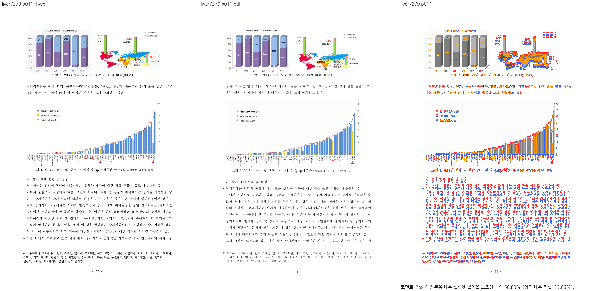

## 메인터너 보정29 — 빈 줄이 이미 소비한 간격의 지연 기준 재가산

### 사전 분석

- #6312 원본3쪽 첫 표 하단은 rhwp419.6px/PDF419.0614px로 대응하며 다음 빈 문단39도 저장 시작25155HU에 맞게429.8667px에 놓인다. 그 줄은1400HU 높이와772HU 간격을 소비해 다음 본문40의 논리 시작(7085+27327)/75=458.8267px로 전진한다. PDF 가시 글자457.9773px도 이 시작에 대응한다.
- typeset은 확정 page 기준70099HU에서364.36px를 소비해 올바르게 판정한다. layout은 TAC 표 뒤 기준을 초기화한 뒤 빈 문단의 간격을 lazy 역산에 다시 더해 base69327HU를 선택하고469.12px로 밀어낸다. 다음 표·뒤 본문도 같은772HU=10.2933px만큼 내려간다. 빈 텍스트라는 상태로 실제 간격 소비 여부를 대신한 가정이 원인이다.
- `layout::last_item_content_bottom → HeightCursor::prev_item_content_bottom_y → vpos_adjust의 lazy 역산 → 실제 다음 문단/표 원점`을 확인한다. 직전 실제 점유 끝과 순차 cursor 사이가 유효 저장 trailing 간격과 같고 다음 저장 줄이 그 끝을 이어받으면 이 간격은 이미 소비됐다. 미소비/비연속/합성/편집 경로에는 이 증거를 적용하지 않는다. 기존 그림 전용 계약과 누락 간격 bridge는 대조한다. 저장 좌표 상수·paint clamp·허용치 완화를 추가하지 않는다.
- 정식 원본 검사로40·46 문단 최종 원점과 빈 줄의 실제 점유 끝·전진량을 확인해 수정 전후를 연결한다. 원본4쪽과 정상 빈 줄/그림 대조군·전체 Native4쪽을 먼저 검증한다.

최초 후보는 가시 콘텐츠 하단을 소비해 빈 줄의 실제 줄 상자 끝을 얻지 못했다(6개중5PASS/1FAIL). 기존 배치의 `last_line_box_bottom` 결과를 별도로 전달한 후보는 원본6개를 통과했지만 확대105개중1개가 실패했다.175쪽의 뒤 제목은 독립PDF641.061px/보정 전641.1px에서627.8px로 올라갔다. 분할 표로 시작한 단의 빈 줄은 저장 원점이 아직 확정되지 않았으며 실제 간격 소비만으로 그 원점을 입증할 수 없었다. 처음 확정한 저장 단 원점을 유지해 원점·실제 줄 배치를 함께 대조하도록 가정을 교정했다. 원점이 없는 단의 기존 누락 간격 bridge와 독립 제목 좌표는 유지하며 최종 재검증한다.

### 보정 결과

- 실제 줄 배치에서 이미 계산한 `last_line_box_bottom`을 `last_item_flow_line_bottom → HeightCursor::prev_item_flow_line_bottom_y`로 전달했다. 셀 내부 줄은 본문 값을 덮어쓰지 않으며 항목마다 초기화한다. 가시 글자 하단은 기존 값으로 유지해 빈 줄의 공간 점유와 혼동하지 않는다. 빈 composed 문단의 실제 기본 줄 결과도 같은 소비자에 전달한다.
- TAC 이후 활성 기준을 초기화해도 처음 확정한 저장 단 원점을 독립 대조용으로 보존한다. 유효 저장 연속성, 실제 줄 상자 끝과 순차 전진, 확정 원점의 다음 줄 위치가 함께 일치할 때만 trailing 간격 재가산을 제거한다. 원점 없는 분할 표 시작·다른 원점·미소비·합성·편집 상태는 기존 bridge를 유지한다. typeset은 이미 확정된 원점에서 올바르게 판정하므로 실제 배치의 추측을 측정에 복제하지 않았다.
- 신규 실물 배치 회귀는 수정 전0PASS/1FAIL(exit100,0.030s)이었고 최종 원본6개와 확대105개가 모두 PASS다. 최종 집중105PASS/0FAIL(exit0,4.000s,threads8), 커서와 초기화 대조56PASS(exit0,0.072s)를 확인했다. 소스 단위 검사 총량을 늘리는 후보는 정책에 걸려 기준 상향 없이 기존 lazy 기준 검사에8개 경계를 보완했다. 이는 수동 커서 계약이며 실물 한컴 출력 증거와 구분한다.
- 최초 단위 빌드에서는 보정24의 `empty_opening_row_frame`이 기존 issue2424 fixture 초기화에 빠진 오류(exit101)를 발견했다. 이 정상 대조에서는 새 시작 프레임을 사용하지 않으므로 None을 명시하고 재검증했다. 빌드 실패를 결함 검출 증거로 세지 않는다. [중간 확대 실패와 가정 교정](../assets/pr7382_20260926/stage29_expanded_initial_result.json)도 보존했다.
- #6312의 전체4쪽은96.76471/92.79928/99.68480/99.88721%,exit0,gate passed다. 새 review·standalone overlay8개에서 머리 표/제목,3쪽 두 표·채무/국고채 본문·마지막 줄,4쪽 표·본문 소유를 직접 확인했다. 3쪽의71.83139% 위치 차이를 해결했다.2쪽의 기존 작은 표/글자 간격 차이는 전후 점수가 같으며 완전 픽셀 일치로 보고하지 않는다.
- #6950 전체3쪽도98.66178/99.13460/99.78442%,exit0으로 유지됐다. 새6개 PNG에서 제목·표 여백·마지막 본문·로고와 가운데 정렬 도표의 전체 끝을 확인했다. #7382의11/12/13/14/174/175쪽은66.82800/99.76685/94.95824/81.51575/99.85942/92.46177%,exit1이다. 새12개 PNG에서 기존12/13쪽 그림·표/캡션·각주와174/175쪽 표 앞뒤 내용·외곽·뒤 제목/각주 비충돌을 확인했다.11/14쪽의 위치 차이는 계속 보류다. 세 입력 모두 기준 PDF와 같은4/3/215쪽을 유지했다.
- fmt·manifest(6203 static attrs)·source-unit(4205검사/298모듈)은 고정base eb9142dd7에서 exit0이다. 새 불변 CLI는 release-test 빌드exit0,1m36s다. [source·파일/diff/CLI 해시·정확한 명령·최종 판정](../assets/pr7382_20260926/stage29_validation.json), [독립 HU/PDF와175쪽 대조](../assets/pr7382_20260926/stage29_independent_geometry.json)를 연결했다. 최종 전수·전체 Rust/lint/Skia·fresh WASM은 아직 미검증이다.
- 추가 영어 설명 주석은0개다. [주석 재검사](../assets/pr7382_20260926/stage29_english_comment_scan.json). baseline·golden·시각 허용치·글꼴 예외를 바꾸지 않았고 로그·output·generated는 커밋하지 않는다. 다음 개별 보정은 #7382의11쪽 그림6/뒤 본문 위치를 독립 원본과 대조한다.

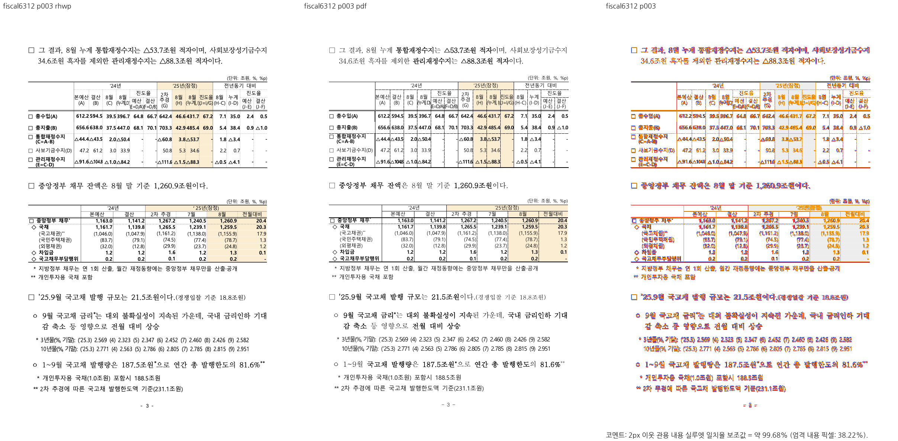
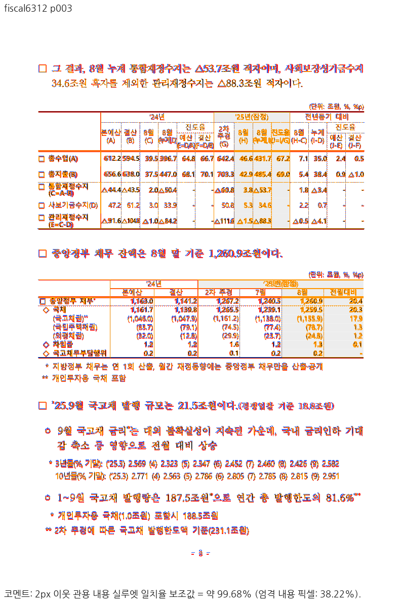

## 보정30 사전 분석 — 빈 개체 앵커의 오프셋·바깥 상자 소유

- 기준은 원본 HWPX 11쪽과 한컴2024 PDF다. 그림6 앞 본문239는313.5px/PDF313.381px로 맞지만 그림 상단373.0px/PDF376.229329px, 뒤 제목692.17px/PDF703.781006px가 어긋난다. 글꼴로 분류하지 않는다.
- 원본240의 호스트21265HU, 오프셋319HU, 위283HU, 전체 표22400HU, 아래283HU는 다음 빈 문단241의44550HU를 정확히 닫는다:21265+319+283+22400+283=44550. 그림/캡션 셀의 실측 전체 높이도21118+1282=22400HU다. 본문 원점6239HU를 더한 뒤 제목242의 논리 상단은703.853333px다.
- `empty_float::prepare`는 세로 오프셋이 있는 단일 T&B 표를 거절해 block whole-fit으로 보낸다. 기존 내부 줄 프레임 helper는 가시 다행 호스트/RowBreak만 수용하므로 이 빈 CellBreak 앵커는 공통 결과가 없다. paint의 빈 lane은 위여백을 누락하고 흐름 끝은 실제 오프셋을 제외한다. 그 뒤 lazy base874HU가 뒤 본문을 끌어올린다.
- 적용 조건은 원본 단일 단·미편집·표 재조판 아님, 유효 폭0 단일 빈 호스트와 다음 저장 줄, 선언 높이와 실측 전체 내용의 일치 및 위 등식이다. 합성/편집/잘못된 간격·높이, 여러 호스트 개체, 분할 저장 높이는 수용하지 않는다. `저장 닫힌 상자 → whole-fit 점유 하단/기록 → layout 원점/점유 하단`으로 한 결과를 소비하게 보정한다. 실제 정식 tree와 정상 대조군을 먼저 확인하고 새 시각 증적 뒤 결과를 보고·커밋한다.

### 보정 결과

- `stored_empty_control_table_frame`이 유효 빈 호스트와 다음 저장 줄 사이에서 오프셋·위/아래 여백·실측 전체 높이가 정확히 닫히는 원본 프레임을 만든다. whole-fit이 이를 예약·fit·배치 기록에 사용하고 기존 layout은 같은 표 상단과 점유 하단을 소비한다. 그림6 표 논리 상단374.746667px와 뒤 제목703.853333px를 복원했다. 합성/편집·높이/간격 불일치 및 분할 높이를 같은 근거로 수용하지 않는다.
- 원본 HWP/HWPX 정식2개는 수정 전0PASS/2FAIL(exit100,0.197s),수정 후2PASS(exit0,0.214s)다. 합성 호스트/후속 줄, 닫힘 간격 불일치, 선언/실측 높이 불일치의 수동 IR 대조까지 최종 집중108PASS/0FAIL(exit0,4.199s,threads8)이다. 이전 suite 번호로 정상3개를 놓친105PASS 시도는 최종 검증으로 세지 않고 현재 manifest의 실제 번호에서 재실행했다.
- Native HWPX의11쪽66.82800→94.81767%,14쪽81.51575→90.37937%,210쪽72.49487→99.91680%다. HWP의 같은 쪽은94.81767/91.00235/99.91680%다. 그림6·캡션과 뒤 제목/본문,14쪽 첫 표/그림10 프레임,210쪽 표 외곽/셀 글자를 직접 확인했다.2쪽 표 상단도142.0→143.9px로 PDF143.84269px에 맞아졌다. HWPX2쪽 점수95.34141→94.69572% 감소만으로 배치 회귀라고 판정하지 않는다.
- 양쪽 입력의2/11/12/13/14/23/68/210쪽 새 review·standalone overlay32개를 직접 읽었다.12/13쪽 앞 보정·68쪽 표/각주와215쪽 수는 유지됐다.23쪽은74.73376→75.76624%로 여전히 gate 미충족이다. 점수가 통과한11쪽 그림5 오른쪽 지도와14쪽 아래 그림11도 위로 치우친 차이가 남는다. 글꼴 예외나 점수 통과로 이 의미 차이를 해소하지 않으며 PR 보류를 유지한다.
- fmt·manifest(6206 static attrs)·source-unit(4205검사/298모듈)은 고정base eb9142dd7에서 exit0이다. 새 불변 CLI는 release-test 빌드exit0,1m28s다. [source/diff/CLI 해시·실제 명령·판정](../assets/pr7382_20260926/stage30_validation.json), [독립 HU/PDF](../assets/pr7382_20260926/stage30_independent_geometry.json), [영어 추가 설명 주석0개](../assets/pr7382_20260926/stage30_english_comment_scan.json)를 연결했다. 전체 최종 Rust/lint/Skia/fresh WASM과 최신 전수는 미검증이다. 로그·output·generated는 커밋하지 않는다.

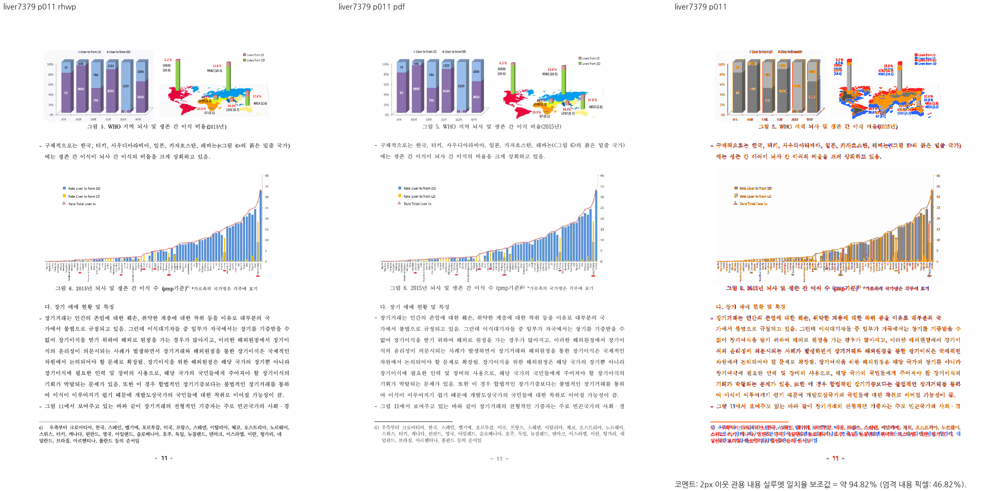
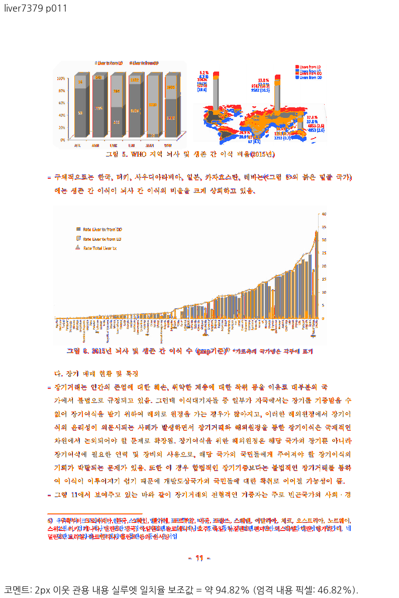

## 보정31 사전 분석 — 가운데 정렬 셀 그림의 흐름 프레임과 음수 오프셋

- 원본11쪽 그림5 오른쪽 상단은 PDF95.096029px/현재87.1px,23쪽 그림22는 PDF166.378662px/현재155.3px다. 두 그림은 단일 빈 문단·자리차지·문단 기준·흐름 제한 켜짐·가운데 셀 정렬이며 음수 오프셋−2179/−1696HU를 가진다. 왼쪽 그림은 각각0/+187HU이며 PDF88.704/151.994670px에 대응한다.
- 측정과 cell flow는 현재 `max(offset,0)+개체·여백`으로 점유 높이를 계산한다. `table_layout`의 셀 정렬은 이후 signed offset을 다시 더하며11쪽은 마지막 cell clamp에 걸려 셀 상단으로 올라간다. 공통 점유 프레임과 정렬에 쓰인 오프셋이 다른지 확인한다. clamp로 위치를 맞추지 않는다.
- 두 오른쪽 그림의 `pos.vertOffset`만0 및+1000HU로 바꾼 독립 한컴2024 대조군을 준비했다. 나머지 ZIP 내용·section XML 문자열은 그대로다. 저장 음수/정렬 계약은 변환 결과에서 확인한 뒤 구현하며, 먼저 원본 HWP/HWPX 정식 최종 그림 좌표 검사의 수정 전 실패를 기록한다. 양수 오프셋·다문단 저장 흐름·나란히 무리·제한 해제 경로는 적용 경계로 대조한다.

0 대조군은 원본과215쪽 전체 텍스트/그림 좌표가 동일했다. +1000HU 대조군의23쪽 오른쪽 그림은166.378662→173.090678px로 이동했고 캡션도 함께 내려갔다.11쪽은 같은 수동 속성 변화에서 PDF 좌표가 변하지 않았다. 이 문서는 HWPX 재저장/LineSeg 재생성 대조군이 아니므로 그11쪽 수용 계약은 미검증으로 남기고23쪽 양수 결과를 일반화하지 않는다. 원본 정식2개는 수정 전0PASS/2FAIL(exit100,0.218s), 최초 수정 후2PASS(exit0,0.261s)다.

확대125개는123PASS/2FAIL(exit100,4.631s)이었다. 새 양수/음수 정렬 대조의 캡션 단일 소유 assertion은 기존 캡션 중복을 함께 검출했다. 정렬과 캡션 소유를 별도 정식 검사로 분리해 두 의미를 모두 보존한다. #6782 일본 마크는 보정 전 불변30 CLI에서도320.2/320.5px로 동일하게 어긋나며, 이번 Center 변경의 회귀로 분류하지 않는다. 이 두 미충족을 허용치나 기대값 변경으로 숨기지 않고 다음 개별 보정에서 해결한다.

### 보정 결과

- `topbottom_flow_vertical_offset_hu`로 측정과 셀 흐름의 기존 앞 공간 계산을 공유했다. 온전한 셀과 이어받는 셀의 가운데 정렬은 같은 앞 공간을 소비하며 음수 저장값을 별도 이동으로 다시 더하지 않는다. 다문단 저장 vpos·나란히 무리·제한 해제, Top/Bottom의 다른 앵커 계약은 실제 기존 경로로 남는다. 부분 셀의 화면 이탈 판정을 가운데 정렬의 근거로 사용한 가정을 제거했다. 측정의 수치·컷 선택은 기존 max(offset,0)와 동일하며 paint 원점 소비를 교정한 변경이다.
- 최종 확대126개는124PASS/2FAIL(exit100,4.696s,threads8)이다. 원본 HWP/HWPX11·23쪽 그림 위치와23쪽−1696/0/+1000HU 대조는 통과했다. 다문단/자기 변위·작은 Top 음수 오프셋·실제 부분 셀 정상 대조도 통과했다. 캡션 소유 검사는 독립 검사로 그대로 남아 FAIL이며 일본 마크 기존 차이도 FAIL이다. [전후 동일한 마크 좌표](../assets/pr7382_20260926/stage31_prior_6782_difference.json)를 보존했다.
- 추가 이어받기 대조1개는PASS(exit0,0.448s)다. 원본103쪽 문서의 구역4/문단118은77쪽에서3..14행을 이어받는다. 그 실제 부분 셀의 그림 오프셋−187/0/+187HU를 수동 IR로 바꿔 물리 셀의 중앙 정렬 불변식·그림12개 보존·103쪽을 확인했다. 수정 후에만 실행한 경계 대조이며 수정 전 결함 검출이나 정상 한컴 재저장 문서의 증거로 세지 않는다.
- 새 Native HWPX11/12/13/14/23/68/210쪽은98.39093/99.76685/94.51340/90.37937/99.61877/90.85432/99.91680%,HWP는98.39093/99.76685/96.29076/91.00235/99.61877/90.85432/99.91680%다. 둘 다exit0,선택 gate passed이며215쪽을 유지했다. 새 review·standalone overlay28개를 직접 읽어 지도와 오른쪽 그래프 정렬, 그림/표·뒤 본문·각주 보존을 확인했다.13쪽 왼쪽 표 그림은626.1→628.0px로 PDF627.313px에 가까워졌고 점수 감소만으로 회귀라고 판정하지 않았다.
- 점수가 통과해도23쪽 캡션 중복과14쪽 그림11의 위치 차이는 미충족이다. 새 통합 PR을 만들거나 승인하지 않는다. 다음 개별 보정은 캡션 단일 소유를 해결한다. [독립 입력 변형·한컴 PDF 좌표](../assets/pr7382_20260926/stage31_independent_geometry.json), [재현 스크립트](../assets/pr7382_20260926/stage31_control_recipe.py), [0 대조 PDF](../../../pdf/issue7379/liver7379-cell-picture-offset-zero-2024.pdf), [+1000HU 대조 PDF](../../../pdf/issue7379/liver7379-cell-picture-offset-positive-2024.pdf)를 보존했다.
- 최종 fmt·manifest(6211 static attrs)·source-unit(4205검사/298모듈)은 고정base eb9142dd7에서exit0이다. 불변 CLI는release-test 빌드exit0,1m21s다. [명령·source/runtime/test diff·CLI 해시·남은 판정](../assets/pr7382_20260926/stage31_validation.json). 캡처 뒤 추가한 것은 이어받기 반례 검사뿐이며 runtime4파일/diff 해시는 동일하다. 이 중간 증거를 최종 exact head 전수/전체 Rust/lint/Skia/fresh WASM의 대용으로 사용하지 않는다. [추가 영어 설명 주석0개](../assets/pr7382_20260926/stage31_english_comment_scan.json)이며 로그·output·generated를 커밋하지 않는다.

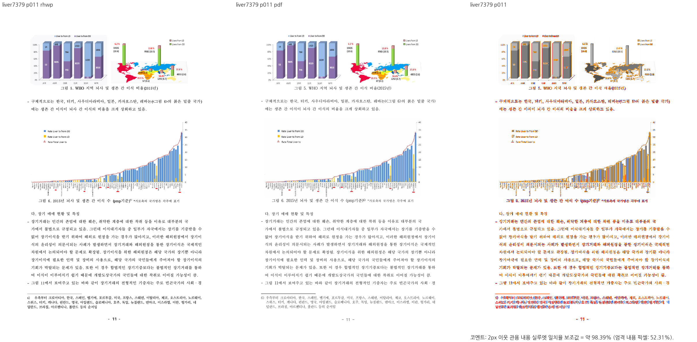
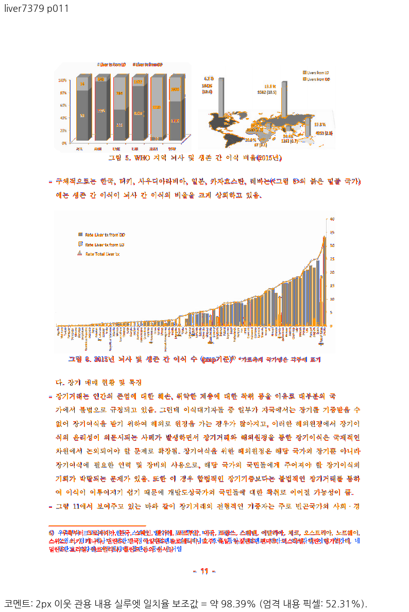

## 보정32 사전 분석 — 셀 그림 캡션의 중복 출력

- 원본23쪽 표339의 두 그림 캡션은 각각 원문5줄인데 최종 셀에 같은5줄이 두 번 출력된다. 보정31에 보존한 정식 `cell_picture_bottom_caption_has_one_owner`는 왼쪽 캡션2개를 검출해 실패했다. 독립 한컴2024 PDF에는 각 캡션이 한 번만 있으며 위치는 유지된 상태에서 글자가 겹쳐 굵게 보인다.
- `table_layout::layout_picture` 호출 → `picture_footnote::layout_picture`의 공통 방향별 캡션 좌표/소유/출력 → 호출자 아래의 별도 Bottom `layout_caption` 재호출을 추적했다. 부분 셀 경로는 공통 호출만 사용한다. 별도 Bottom 블록은 기존 메인터너 커밋9bed077a1a(2026-08-02), 소유 표식은4198c6df47(2026-09-11)에서 온 코드이며 원 기여자의 #7382 변경으로 분류하지 않는다.
- 그림 공통 경로가 예약한 캡션 띠와 실제 셀 문맥·원본 개체 소유를 한 번 출력하게 하고 호출자의 중복 블록을 제거한다. 최종 글자를 숨기거나 tree를 사후 중복 제거하지 않는다. 온전한 원본 HWP/HWPX의5줄·좌표·소유·뒤 본문 보존과 본문/상단/옆 캡션 정상 대조를 실행하고 직접 Visual Sweep으로 확인한다. 기준값·허용치·페이지 수를 바꾸지 않는다.

### 보정 결과

- 온전한 셀의 별도 Bottom 캡션 호출을 제거해 그림 공통 경로가 좌표·셀 문맥·개체 소유와 출력까지 한 번 처리한다. 측정·예약·분할 컷은 변경하지 않았다. 부분 셀과 글자처럼 그림은 이미 같은 공통 호출만 사용하며 본문/상단/옆 캡션 정상 대조를 함께 실행했다.
- 기존 정식 HWPX 검사는 수정 전0PASS/1FAIL(exit100,0.238s)로 캡션2개를 검출했다. 수정 후 두 형식의 정식2개는PASS(exit0,0.213s)다. 각 캡션의 원문5줄·전체 내용/순서·원본 개체 소유·독립 PDF 상단/원본 줄 간격·뒤 본문·215쪽을 확인했다. 신규 HWP 검사는 수정 후만 실행했으며 변경 전 HWP의 중복은 불변31 CLI의 실제 tree로 확인했다. 그 진단을 신규 HWP 검사의 수정 전 실행으로 보고하지 않는다.
- 확대142개중141PASS/1FAIL(exit100,4.959s,threads8)이다. 본문/상단/좌우 캡션·각주/그림·중첩 표·이전 저장 프레임 정상 대조는 통과했다. 남은 실패는 기존 #6782 일본 마크320.2/320.5px와 독립318.2/319.0px 차이이며 다음 개별 보정으로 다룬다. 기대값·허용치 상향으로 숨기지 않았다.
- 새 Native HWPX11/13/23/68쪽은98.39093/94.51340/99.62374/90.85432%, HWP는98.39093/96.29076/99.62374/90.85432%다. 두 입력 모두215/PDF215쪽, exit0,선택 gate passed다. 새 review·standalone overlay16개를 직접 읽어23쪽 두 그림과 캡션5줄/뒤 본문,11쪽 그림5/6·뒤 본문/각주,13쪽 표2/그림8/9·각주,68쪽 그림49·본문/각주를 확인했다. 변경 전20개 캡션 줄은10개로 줄었고 래스터 차이는23쪽 캡션 영역에 있다. 작은 실루엣 점수 개선을 완전 픽셀 일치나 다른 보류 사유의 해소로 보고하지 않는다.
- fmt·manifest(6212 static attrs)·source-unit(4205검사/298모듈)은 고정base eb9142dd7에서exit0이다. 불변 CLI는release-test 빌드exit0,1m27s다. [source/diff/CLI 해시·정확한 명령·검사/시각 판정](../assets/pr7382_20260926/stage32_validation.json), [원본/PDF·변경 전후 캡션 줄](../assets/pr7382_20260926/stage32_independent_geometry.json), [추가 영어 설명 주석0개](../assets/pr7382_20260926/stage32_english_comment_scan.json)를 보존했다. 모든 로그는output/logs에 남기며 커밋하지 않는다.
- 일본 마크 실패·14쪽 그림11의 기존 위치 차이·실제 TABLE 편집/보존 래퍼 분할 경계·최신 전수/전체 Rust/lint/Skia/fresh WASM은 남아 있다. 이번 중간 보정은 통합 PR 제출/승인의 증거를 대신하지 않는다.

## 보정33 사전 분석 — 빈 마지막 글줄과 부동 그림 묶음의 원점

- #6782 물리77쪽/인쇄55쪽 일본 셀의 두 그림은 독립 PDF318.051982/319.010701px에 대해 현재320.2/320.5px다. 행 괘선305.745/385.817px는 현재306.0/386.1px와 대응하며 전체 표 이동으로 분류하지 않는다. 원본103쪽과 정식 위치 검사의 실패를 그대로 보존한다.
- 원본 HWP의 압축된 `BodyText/Section4` 개체 공통 레코드를 직접 읽었다. 두 그림은 문단/Top 기준·흐름 제한 켜짐·비TAC이며 세로 오프셋780/862HU, 높이3806/3866HU, 바깥 여백0이다. 두 번째 그림 끝862+3866=4728HU는 빈 마지막 저장 줄의 vpos4728과 같다. 저장 셀1282HU는 그 줄1000HU와 양쪽 안 여백141HU씩을 담고, vpos4728+셀1282=형제 셀의 실제 선언 행6010HU를 닫는다.
- 기존 보정은 그림이 셀 밖으로 나갈 때마다 `실제 셀 하단−아래 여백−빈 줄 높이−각 그림 높이+상대 오프셋`으로 되돌린다. 이는 같은 문단의 두 그림에 각기 다른 원점을 만들어 그림 높이 차이60HU가 상대 위치에 다시 섞인다. 빈 줄의 실제 배치도321.2px로 묶음 시작에 남고, 줄의 높이/오프셋/그림 위치를 함께 소유한 저장 프레임을 소비하지 않는다.
- 원본 공통 레코드의 두 세로 오프셋만 바꾼 한컴 대조군으로 원점 계약을 추가 확인한다. 그 뒤 `저장 닫힌 셀 프레임 → 측정/실제 정렬 높이 → 빈 줄과 그림의 공통 원점`의 호출 경로를 연결해 기존 사후 이탈 보정의 가정을 제거한다. 수동 속성 변형을 정상 재저장 문서로 보고하지 않으며, 편집/합성/닫힘 불일치·실제 컷이 다른 경로는 적용 경계로 구분한다.

0 오프셋 대조군은 높이가 다른 두 그림의 상단이319.012/319.011px로 같았다. 따라서 그림마다 높이를 빼서 서로 다른 원점을 만드는 기존 가정을 제거한다. 저장 마지막 줄 앞의 공통 그림 띠 원점은 `마지막 줄 위치−묶음의 최대 개체 끝`이다. +750HU 대조군은 개체 끝5478HU가 저장 줄4728HU를 넘어 이 원본 닫힘 조건을 깨므로 정상 저장/편집 재조판의 수용 증거로 쓰지 않는다.

기존 PDF의 변환 엔진 차이를 구분하기 위해 원본도 같은engine2020으로 다시 출력했다. 원본/0/+750 대조군은 모두103쪽이다. 같은 엔진 원본과 비교하면 두 변형의 전체 텍스트 좌표는 같고 그림 좌표는77쪽에서만 바뀐다. 기존2022 PDF와의6–21/23쪽 텍스트·65쪽 그림 차이는 속성 변경의 영향으로 보고하지 않는다. [독립 PDF/CFB 바이트 동일성/전수 좌표](../assets/pr7382_20260926/stage33_independent_geometry.json), [레코드 변경 재현 절차](../assets/pr7382_20260926/stage33_control_recipe.py)를 보존했다.

### 보정 결과

- `stored_empty_picture_cell_frame`이 원본의 마지막 빈 줄·그림 띠·행 닫힘을 함께 결정한다. 측정의5728HU와 `cell_units`의 같은 높이를 사용하며 두 그림과 마지막 줄을 하나의 원본 유닛/개체 범위로 소유한다. 실제 정렬과 빈 줄·그림 배치도 같은 프레임을 소비한다. 개별 그림 높이로 셀 하단에 되돌리던 기존 가정을 제거했다. 온전한 셀의 기존 일반 clamp는 이 프레임에서 위치를 바꾸지 않음을 최종 좌표 검사로 확인했다.
- 기존 정식 위치 검사는 수정 전0PASS/1FAIL(exit100,0.130s), 첫 수정 후 기존7개는PASS(exit0,0.540s)다. 최종 확대145개는145PASS/0FAIL(exit0,4.890s,threads8)이다. 추가3개는 수정 후 경계 검사로 원본/0 오프셋의 빈 줄·공통 원점, 온전한 셀, 실제 부분 셀/이월에서 그림2장과 마지막 줄의 단일 소유·뒤 문단·본문 하단을 검사했다. 신규 검사의 수정 전 실행으로 보고하지 않는다. 원본/축소103쪽과77쪽 그림12개를 유지했다.
- 같은 원본의77쪽 Native 시각은99.16488→99.16303%, 0 대조군은99.15771%다. 점수는 근소히 내려갔으며2px 관용 점수만으로 이 위치 결함을 검출하지 못한다. 독립 최종 좌표·빈 줄/공통 원점 검사와 직접 판독으로 두 그림의 위치·상대 오프셋과 행 괘선, 나머지 마크/본문/쪽번호를 직접 확인했다. 실제 그림이 제거된 축소 fixture의 그림 없는 래스터를 마크 일치 증거로 사용하지 않고 전체 원본으로 다시 실행했다. 전체103쪽의 변경 전후 render-tree에서 달라진 것은77쪽뿐이며, 주 검토 HWP215쪽의 tree는 모두 동일했다. 이 수치 비교를 직접 판독의 대용으로 쓰지 않는다.
- 원본76/77/78쪽과0 대조77쪽, 주 검토 HWP11/14/23쪽의 새 review·standalone overlay14개를 직접 읽었다. 주 검토11/14/23쪽은98.39093/91.00235/99.62374%로 앞 보정의 지도/그림6·캡션·뒤 본문을 보존했다. 그러나 원본76쪽60.83855%는 표/캡션이 본문과 겹치고,78쪽49.22912%는 표 위치와 아래 그림 누락이 남는다. 두 쪽은 이전 CLI의 tree와 같지만 기존 차이라는 이유로 보류를 해소하지 않는다. 이 원본 선택 gate는 `re_review_required`이며 새 PR 생성/승인은 계속 보류한다.
- 자체 구현의 bool 타입·대조군 필드 빌드 오류, 이전 suite의0-test 실행, 잘못 구성한 본문 예산과 문단 문자 메타데이터는 같은 범위에서 수정했다. 실패 로그/원인을 [전후 명령·source/test/CLI 해시·최종 판정](../assets/pr7382_20260926/stage33_validation.json)에 구분해 보존하며 성공 증거로 세지 않는다. fmt·manifest(6215 static attrs)·source-unit(4205검사/298모듈)은 고정base eb9142dd7에서exit0이다. 불변 CLI는release-test 빌드exit0,79.103s다.
- [전체 원본 전후 tree 범위](../assets/pr7382_20260926/stage33_original_tree_difference.json), [영어 추가 설명 주석0개](../assets/pr7382_20260926/stage33_english_comment_scan.json), [같은 엔진 원본 PDF](../../../pdf/issue6782/japan-cell-original-2020.pdf), [0 대조 PDF](../../../pdf/issue6782/japan-cell-zero-2020.pdf), [+750HU 무효 저장 경계 대조 PDF](../../../pdf/issue6782/japan-cell-forward-750-2020.pdf)를 연결했다. 마지막 대조군을 정상 재저장/편집 출력 통과로 보고하지 않는다. 로그·output·generated는 커밋하지 않는다. 다음 개별 보정은14쪽 그림11의 위치 차이다.

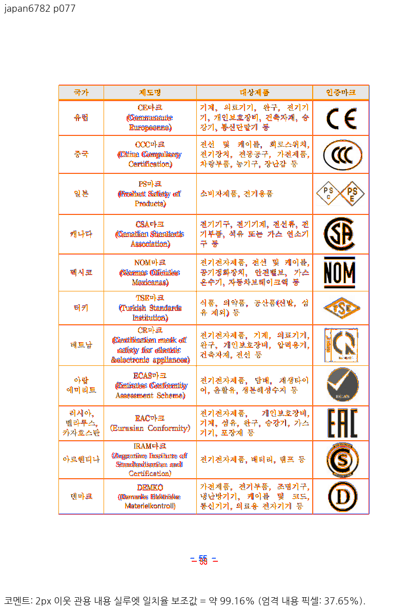
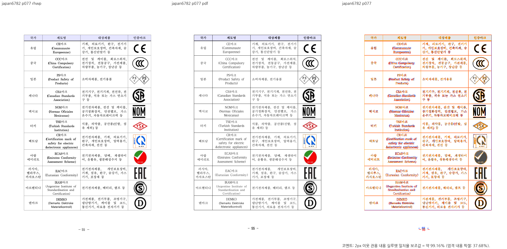

## 보정34 사전 분석 — 그림11의 저장 바깥 여백과 최종 원점

- 원본14쪽 문단273의 빈 호스트는vpos45803HU/폭0이며 그림11은2×1 RowBreak 표 안의 글자처럼 그림이다. 문단 기준 오프셋948HU·위/아래 바깥 여백283HU·전체 표17819HU는 다음 저장 빈 줄65136HU를 정확히 닫는다:45803+948+283+17819+283=65136. 독립 원본/PDF와 이 저장 관계로 원점을 정하며 점수91% 통과를 위치 차이의 해소로 쓰지 않는다.
- 현재 최종 표 상단706.5px는 바깥 위 여백을 제외한 원점과 대응한다. 독립 저장 본문 원점6239HU를 포함한 표 상단은710.306667px, 원본 첫 행16537HU 뒤 캡션 줄은932.68px다. HWPX PDF의 그림 가시 상단711.382650px/캡션932.581055px와 대조한다. HWP PDF의 원시 이미지 bbox는 crop clip 전의 전체 이미지이므로 HWPX 가시 bbox와 혼동하지 않는다.
- 보정30의 닫힌 빈 호스트 프레임을 whole-fit에서 조회하지만 이 RowBreak 표의 실제 호출 경로에서 수용 조건·측정 높이·분할 선택·최종 원점 덮어쓰기를 추적해야 한다. 먼저 원본 두 형식의 최종 표/그림/캡션 정식 실패를 기록한 뒤 같은 원본 프레임을 실제 예약·배치에 연결한다. 분할 높이/편집 캐시·합성 줄·닫힘 불일치 경로를 같은 근거로 수용하지 않는다.

원본 정식2개는 수정 전0PASS/2FAIL(exit100,0.204s)로 표 상단706.506667px/독립710.306667px 차이를 검출했다. 진단에서 실측/유효 전체 높이는 모두237.6px로 선언17819HU와 같았다. 그런데 일반 각주 안전 여유40px를 뺀857.0px에 저장 바깥 끝868.48px가 들어가지 않아 유효 프레임 자체를 버리고 위여백 없는 폴백에 들어갔다. 실제 각주 경계는약897px로 원본 프레임이 들어간다. `원본 프레임 검증 → 실제 각주 경계로 fit → 같은 프레임 기록/배치`, 예산 실패 시에는 원점을 보존한 분할 준비/유닛 컷으로 이어지도록 수정한다.

### 보정 결과

- 그림11의 원본 호스트/다음 저장 줄 닫힘을 예산과 분리해 조회한다. 실제 각주 경계 안에 들어가는 전체 프레임은 안전 여유40px 때문에 원점을 잃지 않으며, 통째 수용과 실제 배치가 같은 하단을 소비한다.
- 예산 실패 시 `SplitTableEntry`의 프레임과 물리 쪽/단/영역 키를 분할 준비에 전달한다. 폭0 빈 앵커를 별도 글줄로 전진시키지 않는다. `FragmentBudget`은 소유 프레임에서만 원래 원점을 쓰고 이월/이어받기에서는 이미 소비한 앵커 거리를 반복하지 않는다.
- 좁은 본문19500HU에서 추가 검사는 처음에7.3px 표 넘침을 검출했다. 마지막 한 줄 주석 행이 강제 전진한 컷을 완전 소비라는 이유로 수용해6px밴드에17.1px행을 담는 경로였다. 실제 표시 높이를 같은 패딩 포함 컷으로 확인한다. 물리 끝행 높이를 바꾼 경우에는 `PartialTable`로 확정하여 통째 표의 원래 높이로 다시 덮어쓰지 않는다.
- 원본2개는 수정 전0PASS/2FAIL(exit100,0.204s), 최종 원본/수동 IR 경계3개는3PASS(exit0,0.959s)다. 본문24000/19500/18000HU의 두 형식에서 그림·캡션·뒤 문단 단일 소유, 원래 첫 표 원점, 행0/행1 실제 다른 쪽 소유, 첫 행 이월, 본문 점유 하단과 불필요한 빈 쪽을 확인했다. 추가 경계 검사를 원본 한컴 재저장 증거 또는 수정 전e7985dc9a 실행으로 보고하지 않는다.
- 자체 타입/누락 import 빌드 오류와 검사 코드의 부분 셀 표식/형식별 이미지ID 가정은 성공이나 결함 재현으로 세지 않는다. 온전한 행의 `page_fragment=false`와 형식별 BinData 번호를 구분해 실제 행/그림 소유를 검사했다.

실제 소비 경로는 `whole_fit::query_original_control_table_frame → entry의 occupied_bottom fit/기록 → place_table_with_text의 확정 원점`, `SplitTableEntry의 프레임/소유 키 → prepare의 첫 조각 예산 → fragment/budget의 같은 원점과 하단 → fragment/emit의 기록 → table_partial`, `row_entry의 실제 컷 표시 높이 → row_step의 수용 → emit의 end_row_height_override → 조각 행 높이`다. helper 반환 뒤 통째 표로 복원되던 덮어쓰기도 제거했다. 이월 후에는 이전 물리 프레임의 앵커 거리를 다시 적용하지 않음을 좁은 실제 쪽 소유 검사로 확인한다.

- 최종 확대 검사는25모듈/18개 실제suite에서155PASS/0FAIL(exit0,5.742s,threads8)이다. 추가154쪽 정식 검사는 한컴PDF 마지막 두 줄의942.181071/968.741048px 위치·원본 표1682 소유·다음 쪽 중복 없음을 확인했다. 이 신규 검사는 수정 후 경계 보강이며 수정 전 정식 실행이라고 보고하지 않는다. fmt·manifest(6219 static attrs)·source-unit(4205검사/298모듈)은 고정base eb9142dd7에서exit0이다. 불변 CLI는release-test 빌드exit0,82.817s다. [정확한 명령·파일/CLI 해시·실패 시도와 판정](../assets/pr7382_20260926/stage34_validation.json)을 연결한다.
- 새 원본 HWPX/HWP11/14/23/68/210쪽의review·standalone overlay20개를 직접 읽었다.14쪽은90.37937→97.52614%/91.00235→97.54155%로 그림11 가시 원점·캡션이 복원됐고 각주11/12와 뒤 쪽을 보존했다.11/23/210쪽은98.39093/99.62374/99.91680%로 앞 보정을 유지했다.68쪽은두형식모두90.85432→95.61071%이며 끝행 높이 조각 소비로 그림49 캡션 위치가 복원됐다. 남은 글자 메트릭·일부 글머리표 차이를 전수 일치로 보고하지 않는다.
- 전체215쪽 tree의 변경은 HWP14/68쪽, HWPX14/68/154/155쪽뿐이다. [전후 전체 tree 범위](../assets/pr7382_20260926/stage34_original_tree_difference.json). 추가154/155쪽은 수정 전후review·standalone overlay8개를 직접 확인했다.154쪽의 마지막 두 줄이 원래 쪽에 들어가94.61010→99.83033%이며155쪽 뒤 제목/본문 원점도 복원돼53.07895→75.49194%다. 하지만155쪽 그림64의표/본문 겹침과 기준PDF의그림 출력 차이가 남는다. 이 선택 gate는 여전히 `re_review_required`이며 PR 생성/승인 보류를 해소하지 않는다. 앞의14쪽 변경 전PNG2개까지 새PNG30개를 보존했다. tree 변화 범위를 직접 시각 판독의 대용으로 쓰지 않는다.
- [영어 추가 설명 주석0개](../assets/pr7382_20260926/stage34_english_comment_scan.json). Rust/Python/JS/Shell의 이번 통합 추가 설명 주석을 재검색했다. 기준값·골든·시각 허용치·글꼴 예외를 바꾸지 않았고 로그·output·generated는커밋하지 않는다. 전체시각/freshWASM·최종전체회귀/lint/Skia가 아직필요하며 다음 개별 보정은155쪽 그림64의 소유 원점·본문 겹침이다.

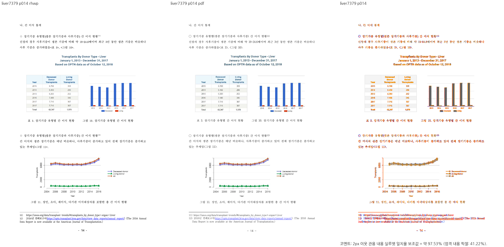

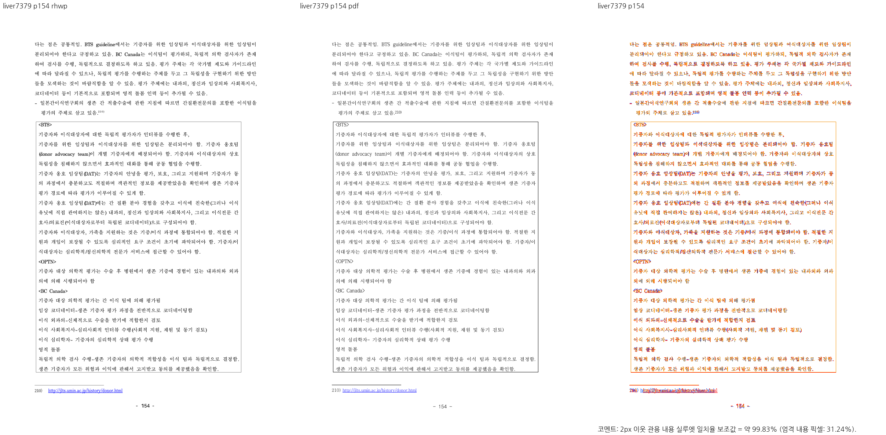

## 보정35 사전 분석 — 다음 쪽 어울림 그림의 저장 소유와 원점

- 두 독립 원본 한컴2024 PDF는 그림64를155쪽이 아닌156쪽의가시상단89.981363px/캡션404.101033px에출력한다. 원본 문단1692의Square/문단Top/Column그림은오프셋518HU·높이22713HU·상하여백510HU와아래캡션을갖는다. 다음문단1693은앞쪽의전폭2줄뒤vpos0/폭25139HU로재개하며1694–1697의좁은어울림띠가이어진다. 단순빈공간추정이아니라이저장줄소유와PDF로쪽소유를확인한다.
- HWPX는Native전용next_page_owner가같은저장계약을제외해155쪽표/본문위에그림을남겼다. Native는그림을156쪽으로이월하지만배치helper가후속문단의첫LineSeg만조회해이미앞쪽에서소비한전폭줄을읽고518HU를다시더한다(상단96.9px). 유효저장계약의출처조건과실제로이쪽이소유한PartialParagraph시작줄을함께대조해야한다. 저장리셋/어울림폭이없는일반Square그림,편집/합성정보는같은근거로이월하지않는다.
- 소비경로는저장후속밴드조회→DeferredSquarePictureControl→push_new_page의정확한밴드문단/WrapAnchorRef→flush의첫Shape와실제후속Full/PartialParagraph→layout의그림원점→공통그림/캡션배치다. 원본두형식의155쪽없음/156쪽단일그림·캡션·독립좌표정식실패를먼저기록하고,측정·그림띠·후속본문소유와같은프레임을소비하도록보정한다.

### 보정35 결과

- 원본 정식 두 검사는 수정 전0PASS/2FAIL(exit100,0.208s), 수정 후2PASS였다. HWPX는155쪽에 그림을 남겼고 Native HWP는156쪽에서518HU를 다시 더했다. 저장 그림의 다음 쪽 조회를 두 형식에 공통으로 적용하고, 배치는 현재 쪽의 실제 Full/PartialParagraph 시작 컷과 같은 WrapAnchorRef를 확인한다. 앞쪽에서 소비한 문단 오프셋을 새 쪽에 반복하지 않는다. 일반 그림의 좌표를 clamp하거나 숨기지 않는다.
- 원본215쪽·155쪽 그림/캡션 없음·156쪽 단일 그림/캡션과 독립89.981363/404.101033px 좌표·157쪽 중복 없음·후속 본문을 검사했다. 저장 어울림 폭을1000HU 바꾼 수동 IR 대조군에서는 그림을 임의로 다음 쪽에 넘기지 않는다. 이 대조군을 한컴 재저장 출력 일치로 보고하지 않는다. 편집/합성 줄을 제외하는 소스 조건과 기존 객체 편집 검사를 확인했지만 이 그림의 실제 편집 후 한컴 대조는 미검증이다.
- 기존 #3738 검사의96.9px 기대값은 다른 문서의 문단 기준 그림으로 이 이월 경로를 추정한 값이었다. 동일 원본 한컴 PDF156쪽의67.486008pt 가시 상단과 새 원본 검사를 근거로89.981344px로 갱신했다. 허용치를 완화하지 않았다. 최종 실제 suite 배정을 재발견한 확대 검사는192개 중191PASS/1FAIL(exit100,8.350s,threads8)이며 실패는 기존120쪽 표1283의 중복 위여백이다. 보정 전34의 전체 tree에도 상단90.7px이며 PDF 괘선86.945312px와 다르다. 이 실패를 승인 가능으로 바꾸지 않는다.
- 검사 보강 중 지역 탐색 함수 참조 빌드 오류와 prepare 뒤 suite 이동으로 빠진 범위는 최종 검증으로 세지 않는다. 최종 정확한 명령·source/test/CLI 해시·실패 시도·판정은 [검증 기록](../assets/pr7382_20260926/stage35_validation.json)에 연결했다. fmt·고정base manifest(6222 attrs)·source-unit(4205/298)은exit0, 불변 CLI 빌드는exit0/94.476s다. 추가 영어 설명 주석은 [0개](../assets/pr7382_20260926/stage35_english_comment_scan.json)이며 변경한 경로의 기존 영어 설명도 한글로 바꿨다.
- HWPX155/156쪽은75.49194→99.15740%/66.51470→93.52007%, HWP156쪽은86.04285→94.81768%다. 각주211–215·표36·뒤 제목을 보존하고 그림64/캡션 원점을 복원했다. 전후 review와 standalone overlay16개를 직접 읽었다. 남은 글자 메트릭/일부 표 내부 차이를 완전 일치로 보고하지 않는다.
- 전체215쪽 tree 변화는 HWPX126/127/155/156쪽, HWP156쪽뿐이다. [전후 범위](../assets/pr7382_20260926/stage35_original_tree_difference.json). 추가 HWPX126/127쪽의 전후 review/overlay8개도 직접 읽었다. 그림56이126쪽 표/각주를 덮지 않고127쪽 좁은 띠에 출력되어67.14618→84.96470%/65.32413→97.52687%다.126쪽의 표 원점·캡션과 각주 차이는 남으며 이 선택 gate는 `re_review_required`다. 총 새PNG24개를 보존했다.
- 판정: 그림64 쪽 소유/원점은 충족.120쪽 표 회귀와126쪽 시각 gate는 미충족. 최신 전체215쪽 시각/fresh WASM·전체 nextest/lint/Skia·TABLE 편집 및 wrapper 분할 반례는 미검증이다. 통합 PR 생성/승인은 계속 보류하고, 이 단계 커밋 뒤120쪽 표 위여백을 다음 개별 보정으로 처리한다. 로그·output·generated는 커밋하지 않는다.

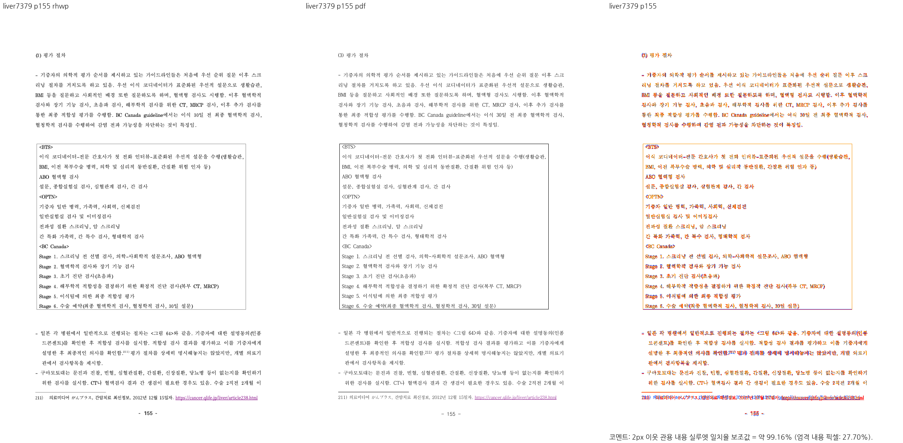
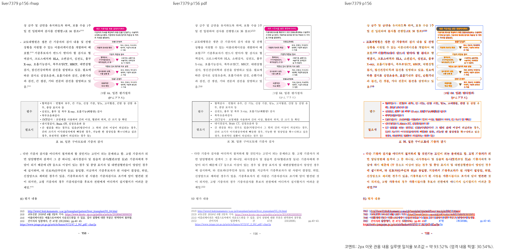
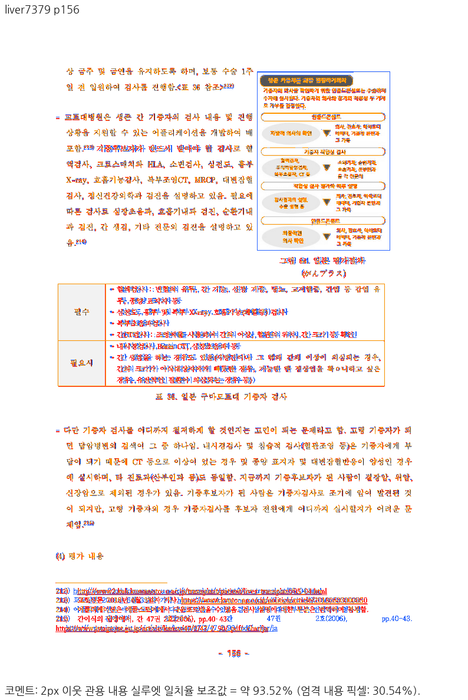
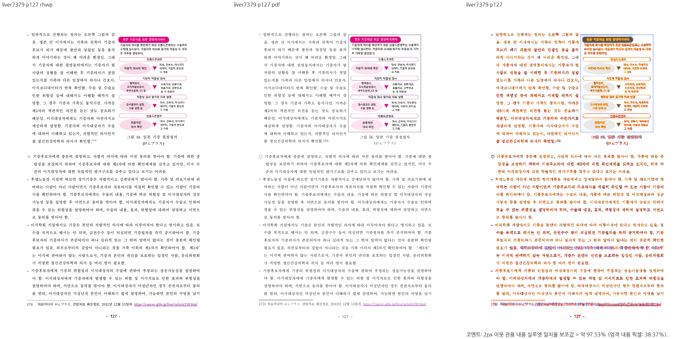

## 보정36 사전 분석 — 확정 표 원점 뒤 바깥 위여백 중복 적용

- 원본120쪽 빈 호스트 문단1283은vpos0/폭0이며6×1 RowBreak 표는선언23790HU·위/아래여백283HU·오프셋0이다. 다음 저장 줄은24356HU로전체바깥프레임을닫는다. 독립 한컴 HWP PDF120쪽 괘선 상단65.208984pt=86.945312px이며본문83.16px+283HU=86.933333px와대응한다. 기존90.706667px는위여백을두번더한위치다.
- 실제 소비 경로는`stored_empty_control_table_frame → query_original_control_table_frame/whole-fit → paragraph_float_placements.table_top → layout.rs의확정원점선택 → table_layout의physical_outer_box_paint_inset`이다. 앞 결과가이미여백을포함하지만마지막legacy paint inset이다시283HU를더한다. 같은분기의흐름끝은이inset을빼므로뒤문단은맞고표원점만어긋난다. 최종원점을clamp하지않고확정계획과legacy inset중한계약만소비해야한다.
- 기존원본정식회귀는보정35의최종확대에서위여백중복으로FAIL했다. 먼저새독립PDF좌표검사와HWPX정상대조군을수정전에실행하고,위치·크기·뒤문단·215쪽보존을검증한다. 확정계획이없는legacy표의위여백은유지하고분할/편집을전체프레임증거로새로승격하지않는다.

수정 전 새정식2개는1PASS/1FAIL(exit100,0.252s)이며 HWPX정상대조군은PASS, Native원본은90.706667px/독립86.945312px 차이로FAIL했다. 확정계획이있는호스트는legacy paint inset과그흐름끝차감을함께비활성화하여표원점만한번소비하고후속흐름을유지한다.

### 보정36 결과

- 확정 `paragraph_float_placements.table_top`이 있는 호스트는 이미 바깥 위여백을 소비했으므로 legacy paint inset을 반복하지 않는다. 같은 조건으로 흐름 끝의 inset 차감도 끄며, 확정 계획이 없는 기존 경로는 유지한다. 측정 원점을 배치 뒤 clamp하거나 표 크기를 바꾸지 않았다.
- 과거 불변 CLI를 대조하니 보정29의120쪽 표 상단은86.9px였고 보정30에서90.7px로 밀렸다. 이번 결함은 기여자 원 변경이 아니라 메인터너 보정30의 회귀다. [발생 단계와 CLI 해시](../assets/pr7382_20260926/stage36_maintainer_regression_origin.json)를 보존했다.
- 원본 정식2개는 수정 전1PASS/1FAIL(exit100,0.252s), 수정 후 모두PASS다. 표 원점/크기·뒤 본문·각주와215쪽, 다음 쪽 중복 없음까지 검사했다. 확대208개는207PASS/1FAIL(exit100,6.676s,threads8)이다. 남은 #2097 실패는 마지막 행이 실제2쪽으로 넘어가며, 불변33/34/35 CLI 대조에서 보정34부터 생겼다. 단순 `PartialTable` 표기 변화로 분류하지 않으며 [행 소유 증거](../assets/pr7382_20260926/stage36_2097_owner_origin.json)를 남겼다.
- Native HWP120쪽은81.72702→99.67776%, HWPX120쪽99.67776%와 양쪽121쪽98.96031%는 유지됐다. 전체215쪽 tree 변화는 HWP2/119/120쪽뿐이고 HWPX는 없다. 추가 HWP2쪽91.23975→94.69572%,119쪽89.59948→99.75059%다. 새 전후 review·standalone overlay24개를 직접 읽어 표 원점·뒤 제목/그림55·각주158–160·후속 본문 보존을 확인했다. 점선 화살표·글자 메트릭의 작은 차이는 남으며 완전 픽셀 일치로 보고하지 않는다.
- fmt·고정base manifest(6224 attrs)·source-unit(4205/298)은exit0, 불변 release-test CLI 빌드는exit0/79.866s다. [정확한 명령·source/test/CLI 해시·전후 검사](../assets/pr7382_20260926/stage36_validation.json), [전수 tree 변경 범위](../assets/pr7382_20260926/stage36_original_tree_difference.json), [추가 영어 설명 주석0개](../assets/pr7382_20260926/stage36_english_comment_scan.json)를 연결했다. 모든 로그는output/logs에만 남기고 커밋하지 않는다.
- 판정:120쪽 위여백 중복은 충족. #2097 마지막 행 분할과126쪽·#6782의76/78쪽 시각 차이는 미충족이다. 실제 TABLE 편집/래퍼 분할·최신 전수 시각/fresh WASM·전체 nextest/lint/Skia는 미검증이며 통합 PR 제출/승인은 보류한다. 이 단계 커밋 뒤 #2097 실제 행 소유 변경을 다음 개별 보정으로 분석한다.

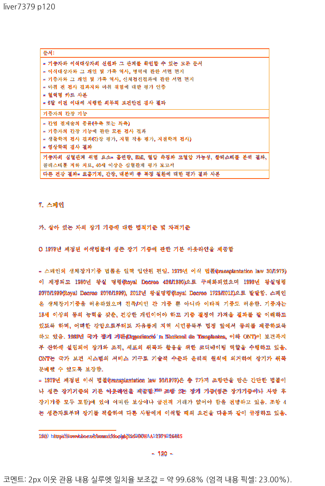
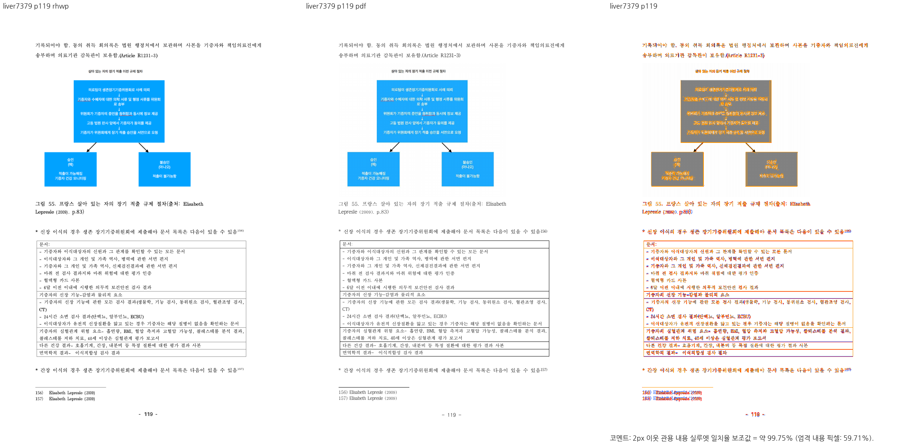

## 보정37 사전 분석 — 수동 저장 셀 높이와 마지막 행의 실제 점유

- #2097 합성 입력은66300/1200/500HU 셀을68000HU 표로 묶었지만 마지막 두 셀의 저장 줄은vpos141+줄높이1200HU이고 양쪽 안여백141HU다. 특히 마지막 셀500HU는 가시 줄과 여백을 담지 못한다. 기존 README도 한컴이 이 값을 재실측·확장하므로 합성 선언-fit 기대를 한컴 정답지로 쓰지 말라고 명시한다. 실측 초과16px를 모두 노이즈로 보는 기존 검사의 가정부터 재검토한다.
- 동일 합성 원본을 저장 제품 메타데이터(한컴2020)에 따라 engine2020으로 독립 변환했다. 새 PDF는2쪽이고 BIG/MID ROW는1쪽, TAIL ROW EXPANDING과 AFTER TABLE은2쪽이다. 보정33의 강제 통째 표는 실제 본문 하단1028.04px를 넘어1043.1px까지 출력한다. 보정34/36의 마지막 행 이월은 한컴의 행 소유와 대응하며, 실제 원본3080901은 전후 모두1쪽이다.
- 따라서 보정34의 실제 행 소유 변경 자체를 결함이라고 단정하지 않는다. 독립 PDF·원본 저장값·실제 후속 점유를 근거로 잘못된 합성 기대를 교정하되 원본 실패와 전후 증거를 보존한다. 정상 실문서의 통째 배치와 이월 반례의 가시 줄/테두리/뒤 문단·단일 소유를 정식 검사로 연결한다. 합성 PDF와 저장 IR의 글자/셀 높이 차이는 재조판 여부를 구분해 기록하며, 이 증거 보정만으로 전체 시각/PR 승인을 선언하지 않는다.

### 보정37 결과

- 수동 원본의 마지막 행 이월은 동일 입력 한컴2020 PDF의 소유와 대응한다. 이전 검사는 실측 초과11.3px를 노이즈라고 간주해500HU 셀 안의1200HU 줄을1쪽에 강제로 남기는 기대였다. 그 기대는 독립 PDF와 물리 예산에 맞지 않아 교정했다. 렌더러의 수용 조건·paint·허용치를 완화하지 않았고 런타임 코드는 바꾸지 않았다. 보정36에서 실제 행 소유 변경을 잠정 보류한 판단은 이 근거에 따라 정정한다.
- 교정 전 기존2개는1PASS/1FAIL(exit100,0.019s)이다. 교정 후 최종 확대91개는90PASS/1FAIL(exit100,5.984s,threads8)이며 #2097의 원본/재생성 쪽 소유·물리 하단·뒤 문단·정상 실물17개 행은 충족했다. 새 검사는 현재 코드에서 통과한 경계 증거이며 수정 전 구현 결함 검출로 보고하지 않는다. 남은 #2105 합성 선언-fit 실패는 별도 보류로 기록하고 다음 개별 검토에서 독립 입력/기준부터 확인한다.
- 새 물리 검사에서 뒤 문단 그룹 bbox를 실제 글줄 위치로 잘못 조회한 자체 오류는 `TextLine`의 실제 원점으로 수정·재실행했다. venv symlink를 resolve해 다른 interpreter로 실행한 PIL 실패도 올바른 venv 절대 경로로 재실행했다. 같은 형식 HWPX 저장은 client에서 지원하지 않아 한컴2020 HWP→HWPX의 실제 저장 경로를 사용했다. 이 실패를 결함 재현이나 시각 gate로 세지 않는다. [명령·전후 검사·실패 시도·source/CLI 해시](../assets/pr7382_20260926/stage37_validation.json).
- 원본 수동 HWPX와 그 PDF를 보존했고, 한컴 HWP를 거쳐 독립 재저장한 HWPX 및 해당 PDF를 별도로 커밋한다. 재생성은 셀 줄높이1200→1000HU/vpos141→0, 표 높이68000→67582HU, 실제 저장 어울림 폭/뒤 문단 줄 정보를 바꿨다. [입력/PDF 해시·독립 텍스트 좌표·원본 행 소유·재생성 명령](../assets/pr7382_20260926/stage37_independent_geometry.json). 정상 실문서3080901의 전후 전체 page-items는 동일하고1쪽이며2020/2022 PDF도 같은1쪽이다.
- Native 수동 원본의1/2쪽은73.45554→86.39337%/27.87648→64.42367%로 마지막 행/뒤 문단 소유를 복원하지만 저장 줄의 글자 높이와 셀 괘선 차이가 남는다. 정상 실문서도51.76291%로 행 괘선과 내부 줄 위치가 차이나므로 전체 시각 충족으로 보고하지 않는다. 재생성 대조군의1/2쪽은100.00000/100.00000%이고 표 경계·마지막 행·뒤 글줄을 직접 확인했다. 이는2px 관용 점수이며 완전 픽셀 일치가 아니다. 서로 다른 입력의 통과를 원본 점수 개선으로 섞지 않았다.
- 전후12개와 재생성4개의 새 review·standalone overlay16개를 직접 읽었다. fmt·고정base manifest(6227 attrs)·source-unit(4205/298)은exit0이다. [추가 영어 설명 주석0개](../assets/pr7382_20260926/stage37_english_comment_scan.json). 모든 로그/중간 HWP/MCP 원문은output에만 두고 커밋하지 않는다.
- 판정: 독립 출력에 따른 #2097 마지막 행 이월과 실제 소유는 충족. 원본/실문서 전체 시각 gate 및 #2105 기대 재검토는 미충족/보류다.126쪽·#6782의76/78쪽,실제 TABLE 편집/래퍼 분할·최신 전수 Native/fresh WASM·전체 nextest/lint/Skia도 남아 있어 통합 PR 생성/승인은 계속 보류한다.

## 보정38 사전 분석 — 쪽 시작 RowBreak 합성 표의 짧은 마지막 셀

- 남은 #2105 검사는 #2097과 같은 수동500HU 마지막 셀/1200HU 저장 줄을 쪽 시작에 둔다. 큰 첫 행68000HU와 두 짧은 셀1200/500HU를69700HU 표 선언으로 묶었으므로 선언 합이 본문에 들어간다는 이유만으로 가시 내용까지 수용한다고 볼 수 없다.
- 먼저 같은 입력의 한컴2020 독립 PDF와 기존 실패를 보존한다. 원본을 재저장 대조군으로 바꾸어 승인하지 않고, 쪽 시작/중간 쪽의 실제 행 소유와 표 끝/뒤 문단을 각각 검사한다. README에서 언급한19378753 원본은 저장소와 Mac 기준 자료 경로에서 아직 확인하지 못했으므로 그 실물의 정합은 미검증으로 둔다.

재생성 대조군의 새 정식 검사는 수정 전 마지막 행 조각 누락으로FAIL했고 실제 표 하단이 본문을7.3px 넘었다. `TABLE_DRIFT`의 실측940.9px/본문933.6px와 `DIAG_FIT`의plain=false/declared=false/overlay=true를 대조했다. 원인은 빈 `current_items`의 `all(Shape)`가 참이 되어 실제 배경 개체가 없는데도12px 여유 경로를 사용한 것이다. 저장 높이 수용이나 측정 행 높이를 바꾸는 원인이 아니므로 그 조건을 넓히지 않는다. `TypesetState`의 실제 배경 개체 조회를 block/inline 호출이 공유하게 한다. inline 호출은 뒤의 명시적 `!current_items.is_empty()`가 빈 단의 이월 자체를 막으므로 이번 빈 단 결과 변경으로 동작이 바뀌지 않는다. 실제 Shape만 있는 비빈 단의 기존 판정/12px 값은 동일하다.

### 보정38 결과

- 원본 수동 #2105의 통째 기대는 독립 한컴2020 PDF의 행 소유와 달라 교정했다. 원본 PDF는 BIG/MID ROW가1쪽, TAIL ROW/AFTER TABLE이2쪽이다. 수동 원본과 HWP→HWPX 독립 재저장 대조군 및 두 PDF를 각각 보존했다. 재저장은 표69700→69282HU, 줄높이1200→1000HU/vpos141→0 등을 바꿨으며 대조군 통과를 원본 전체 일치로 바꾸지 않는다. [입력·PDF 해시/독립 좌표/재생성 명령](../assets/pr7382_20260926/stage38_independent_geometry.json).
- 재저장 대조군의 정식 검사는 수정 전217PASS/1FAIL(exit100,6.805s)에서 마지막 행 조각 누락과 본문7.3px 초과를 검출했다. 빈 배열의 `all(Shape)`가 참이어서 빈 단을 배경 도형만 있는 단으로 판단한 것이 실제 원인이다. `current_column_has_only_overlay_shapes`가 실제 개체 존재·Shape만 소유·흐름 높이를 함께 확인하고 block/inline 두 소비 지점이 같은 결과를 사용한다. 기존12px 예산·정상 배경 도형 경로·표 프레임 높이는 바꾸지 않았다.
- 최종 확대219개는219PASS/0FAIL(exit0,6.907s,threads8)이다. 쪽 시작/중간 쪽의 원본·재저장 행 단일 소유와 물리 하단·뒤 TextLine, 정상 실물17행 및 배경 도형 대조군을 검사했다. 기존 원본 기대 실패와 새 실제 구현 결함 실패를 구분한다. fmt·고정base manifest(6229 attrs)·source-unit(4205/298)은exit0, 불변 release-test CLI 빌드는exit0/78.616s다. [정확한 명령·source/test/CLI 해시·로그 해시·판정](../assets/pr7382_20260926/stage38_validation.json).
- Native 재저장 대조군은 수정 전83.99649/28.92386%에서 수정 후100/100%로 두 쪽의 마지막 행·뒤 글줄 소유와 표 경계가 복원됐다. 이는2px 관용 점수이며 완전 픽셀 일치가 아니다. 원본 수동 입력은78.03985/64.42264%로 unchanged이고 저장 줄 높이/괘선 차이가 남는다. 원본 점수 실패를 재생성 입력으로 숨기지 않는다.
- 주 원본 HWPX/HWP의14/120/156쪽 새 review·standalone overlay12개를 직접 읽었다. 각각97.52614/99.67776/93.52007% 및97.54155/99.67776/94.81768%이며 그림·표·캡션·각주와 후속 본문을 보존했다. 전체215쪽 tree는 두 형식 모두 변경 없이 유지됐다. [전체 tree 범위](../assets/pr7382_20260926/stage38_original_tree_difference.json). 전후 원본/재저장까지 새PNG32개를 직접 확인하고 보존했으며 tree 동일성을 전체 래스터 검증으로 보고하지 않는다.
- 추가 설명 주석902줄을 재검색하여 [영어 설명 주석0개](../assets/pr7382_20260926/stage38_english_comment_scan.json)를 확인했다. 활성 수정 파일의 기존 영어 설명도 한글로 바꿨다. 제품/형식/API 식별자는 유지한다.19378753 실제 원본은 Mac 및 Windows 지정 자료 경로에서 찾지 못해 실물 정합을 미검증으로 남겼다. 로그·중간 자료·generated는output에만 두고 커밋하지 않는다.
- 판정: 빈 단의 배경 오인 및 원본 행 소유 기대는 충족. 원본 수동/실문서 전체 시각,126쪽·#6782의76/78쪽,실제 TABLE 편집/래퍼 분할·최신 전체 Native/fresh WASM·전체 nextest/lint/Skia는 남아 통합 PR 생성/승인은 계속 보류한다. 이 단계 커밋 뒤126쪽 표/캡션/각주를 다음 개별 보정으로 분석한다.

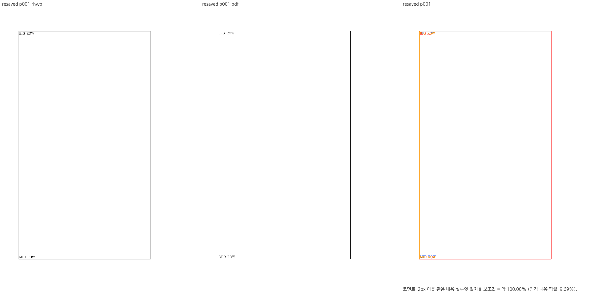
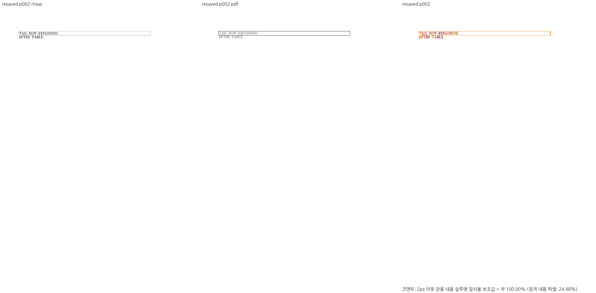

## 보정39 사전 분석 — 캡션이 닫는 빈 호스트의 전체 저장 프레임

- 현재 CLI의126쪽은84.96470%로 재검토 상태다. 표1350은 빈 폭0 호스트vpos28000HU, 문단 상대Top오프셋479HU, 위/아래여백283HU, 표17432HU, 아래캡션 gap850HU/줄1000HU이며 다음 저장 줄48327HU다. `28000+479+283+17432+850+1000+283=48327`로 실제 전체 개체 프레임이 닫힌다. 두 원본 한컴2024 PDF의 괘선/캡션과 대조한 PDF 괘선 상단은466.209351px, 캡션710.34px다. 저장 프레임의466.653333px와0.444px차이는 같은0.5px허용 범위다. 현재 표/캡션은462.9/706.6px로 위여백 하나가 빠졌고 뒤 본문782.2px는 유지된다.
- 실측은 본체232.426667px+캡션24.666667px=257.093333px다. 기존 전체 저장 프레임 조회는 캡션을 일괄 제외하고 수평기준Column만 허용해, 동일한 수직 프레임을 가진 Para수평 표도 배치 계획을 얻지 못한다. 수평 기준은 같은 문단/단 계열이며 현재 가로 원점은 이미 PDF와 대응한다. 가로 원점이나 본체 높이를 다시 보정하지 않고 전체 수직 개체 프레임·캡션 측정 결과·실제 다음 저장 줄을 대조해야 한다.
- 소비 경로는 공통 캡션 높이→표 실측의 effective_height→query_original_control_table_frame→whole/split 준비의 occupied_bottom/소유 키→paragraph_float_placements.table_top→layout 확정 원점/캡션 배치다. 먼저 원본 HWP/HWPX의 표·캡션·뒤 본문 위치 정식 FAIL을 기록한다. 위/아래 캡션과 편집/손상 저장 줄의 적용 여부를 실제 코드와 대조하며, 전체 프레임을 입증하지 못한 수동 변형은 원본 출력과의 일치로 보고하지 않는다. 각주 들여쓰기 차이는 이 원점 수정과 별도 사유로 남긴다.

### 보정39 결과

- 공통 캡션 실측과 본체 높이·바깥 여백이 실제 다음 저장 줄을 닫는 경우 전체 수직 프레임을 공유한다. 수평 Para/Column은 기존 가로 원점을 유지한다. 후속 첫 줄의 앞 간격까지 저장 프레임이 소유하므로 측정의 문단 커서와 실제 layout이 같은 `stored_frame_successor_shared_spacing_px`를 소비한다. 부분 조각의 실제 컷/쪽 소유로 바뀌면 전체 후속 원점을 제거한다. 본체 높이·clamp·기존 허용치는 바꾸지 않았다.
- 원본 HWP/HWPX 정식 검사는 수정 전2FAIL(exit100,0.230s)로 표/캡션 위여백 누락을 검출했다. 최종 확대 검사는223PASS/0FAIL(exit0,7.660s,threads8)다. 위 캡션 수동 계약과 본문 예산을 줄인 실제 분할에서 원본15개 셀 문단 전체 내용·행 소유·캡션 단일 소유·뒤 제목·본문 물리 끝을 확인했다. 수동 변형은 한컴 재저장 일치 증거로 승격하지 않는다. [정확한 명령·source/test/CLI 해시·최종 검사·자체 오류·로그 해시](../assets/pr7382_20260926/stage39_validation.json).
- 후속 앞 간격을 중복 계상한 후보 실패3개, 생성자 필드 누락 컴파일101, 행 번호 반복을 중복으로 본 잘못된 검사1개를 같은 범위에서 수정했다. 마지막 검사 목록에서5개가 빠진218PASS 실행은 최종 확대 결과로 사용하지 않고 현재 파생 suite를 다시 조회해223개를 재실행했다. CLI는exit0/81.533s이며 이후15문단 내용 보강은 테스트만 변경했다. [컴파일된 런타임 불변 증거](../assets/pr7382_20260926/stage39_cli_runtime_proof.json). fmt·고정base manifest(6233 attrs)·source-unit(4205/298)은exit0이다.
- Native 원본126쪽은 두 형식 모두84.96470→92.75732%, 추가 영향131쪽은84.22025→94.67057%다. 표31 괘선 상단466.653333px와 캡션710.34px가 복원되고 뒤 제목782.18px는 유지됐다.127쪽 HWPX97.52687%/HWP98.83521%로 그림56/뒤본문도 보존됐다. 전후 review·standalone overlay24개를 직접 읽었다. [독립 PDF 좌표](../assets/pr7382_20260926/stage39_independent_geometry.json), [전체215쪽 tree 전후 범위](../assets/pr7382_20260926/stage39_original_tree_difference.json). 두 형식 모두126/131쪽만 tree가 변경됐으며 나머지213쪽 tree 동일성을 전수 래스터 통과로 보고하지 않는다.
- 앞 단계 추가 설명902줄 검사와 이후17줄을 연결해 [추가 영어 설명 주석0개](../assets/pr7382_20260926/stage39_english_comment_scan.json)를 다시 확인했다. 제품/형식/API 식별자는 보존한다. 로그·output·generated는 커밋하지 않는다.
- 판정: 캡션 표 원점과 후속 줄 간격의 공통 소비는 충족.126쪽 각주171/172의 이어지는 줄이 PDF x112.0px 대비 rhwp x94.5px로 약17.5px 왼쪽인 문제는 미충족이며 점수 통과로 해소하지 않는다. #6782의76/78쪽·실제 TABLE 편집/래퍼 분할·최신 전수 Native/fresh WASM·전체 nextest/lint/Skia도 남아 통합 PR 생성/승인은 계속 보류한다. 이 단계 커밋 뒤 각주 들여쓰기를 다음 개별 보정으로 분석한다.

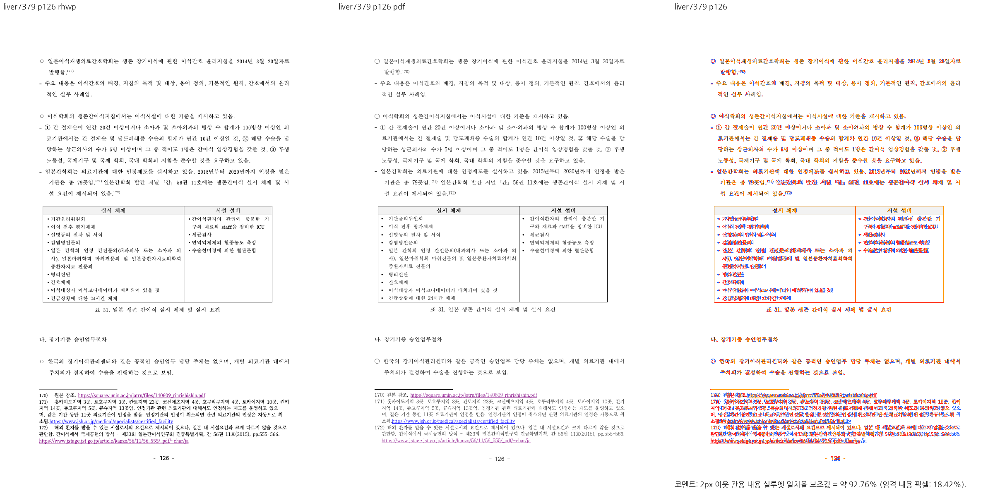
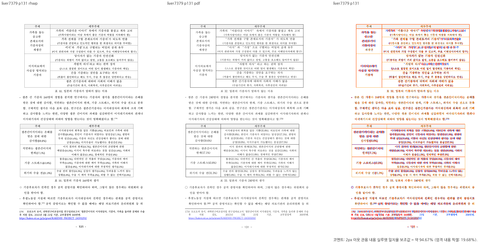

## 보정40 사전 분석 — 번호 있는 각주의 이어지는 줄 내어쓰기

- 원본 각주171/172는 문단속성3의 indent=-2620HU(해석 후-1310HU=-17.466667px), margin_left=0을 공유한다. 저장 첫 줄 플래그0x60000/나머지0x160000은 둘째 줄부터 내어쓰기를 적용한다. 두 독립 한컴2024 PDF126쪽은 번호를 포함한 첫 줄 x94.56px, 이어지는 줄 x112.0px이며 현재 번호 전용 경로는 모든 줄을 각주 영역x94.466667px에서 시작한다.
- 생산은 공통 ParaShape 해석→ResolvedParaStyle.margin_left/indent→compose_footnote_paragraph의 저장 글줄이고, 번호 없는 조각은 공통 문단 배치의 줄별 들여쓰기를 소비한다. 번호 있는 경로 `layout_footnote_paragraph_with_number`는 문단 여백/들여쓰기를 조회하지 않고 매 줄 area.x를 사용한다. 번호 너비를 상수로 복제하거나 좌표 clamp하지 않고 같은 문단 줄별 규칙을 실제 원본 줄 번호로 소비해야 한다. 가시 높이·페이지 소유·줄 내용/간격은 변경하지 않는다.
- 먼저 원본 두 형식의 번호/이어지는 줄 TextRun 좌표·전체 내용·쪽 소유 실패를 검사한다. zero/positive/negative 문단 계약과 번호 없는 실제 이어받기 정상 경로를 함께 대조한다. 수동 IR 변형은 독립 한컴 출력 일치 증거로 사용하지 않는다.

### 보정40 결과

- 기존 일반 문단의 줄별 들여쓰기/저장 플래그 판정을 공통 `paragraph_line_indent_for_source`로 옮기고 번호 있는 각주도 동일 결과를 소비한다. 실제 원본 줄 번호 `line_start+offset`을 사용하며 첫 줄 번호와 뒤 텍스트는 같은 원점에서 이어진다. 문단 좌/우 여백을 함께 반영한다. 셀/재조판의 기존 적용 조건은 유지하고 각주 가시 높이·쪽 소유·줄 내용/간격은 변경하지 않는다.
- 원본 HWP/HWPX 정식 두 검사는 수정 전0PASS/2FAIL(exit100,0.208s)로 이어지는 줄x94.493333px를 검출했다. 수정 후 두 형식과 0/양수/음수 들여쓰기·저장 적용 비트 없는 수동 변형의3검사는3PASS/0FAIL(1.029s)다. 원본171/172 전체 내용과1172HU 줄 전진, 첫 줄 번호와 이어지는 글줄·인접 쪽 중복 없음을 함께 확인했다. 수동 문단속성 변형은 한컴 재저장 일치 증거가 아니다.
- 최종 확대는 이전40모듈에 #6190의 저장 비트·셀 내어쓰기·HWP3·각주 폭 재조판/줄 높이 대조군을 추가해243PASS/0FAIL(exit0,8.465s,threads8)이다. fmt·고정base manifest(6236 attrs)·source-unit(4205/298)은exit0이며 release-test CLI 빌드는exit0/89.873s다. [정확한 명령·source/test/CLI 해시·로그 해시·판정](../assets/pr7382_20260926/stage40_validation.json), [원본 문단 속성/줄](../assets/pr7382_20260926/stage40_note_source.json), [독립 PDF 좌표](../assets/pr7382_20260926/stage40_independent_geometry.json).
- Native126쪽은 두 형식 모두92.75732→94.99385%이며 이어지는 글줄x111.96px가 독립 PDF x112.0px와 같은 허용 범위에 들어왔다. 번호 없는 이어받기도 포함한67/179쪽을 함께 직접 확인했다. HWPX67쪽93.58939→96.21756%,179쪽은양쪽97.53225→97.93535%다. 번호 없는 기존 꼬리·각주 번호 단일 소유·표/본문·후속 제목을 보존했다. 새 review·standalone overlay24개를 직접 읽었다.
- 전체215쪽 tree는 각주 영역 안에서만 HWPX78쪽/HWP79쪽이 바뀌었고, 두 형식 모두 각주 영역 밖의 tree는 모든215쪽에서 동일하다. [전수 tree 범위](../assets/pr7382_20260926/stage40_original_tree_difference.json). 이는 각주 전체 래스터 통과의 대용이 아니며 변경된 모든 쪽은 최종 전수 시각에서 재검토한다.
- 현재 통합 base c80a8370a 이후 줄 시작 위치의 추가 설명 주석922줄을 재검색해 [영어 설명 주석0개](../assets/pr7382_20260926/stage40_all_language_comment_scan.json)를 확인했다. 코드 울타리와 제품/형식/API 식별자는 유지한다. 로그·output·generated는 커밋하지 않는다.
- 판정: 번호 있는 각주 내어쓰기 누락은 충족. HWP67쪽은 수정 전72.73184%→수정 후74.64010%로 표/뒤 본문이 PDF보다 위에 놓인 차이가 남아 gate 재검토 상태다. 이를 기존 차이라는 이유로 승인하지 않는다. #6782의76/78쪽·실제 TABLE 편집/래퍼 분할·최신 전수 Native/fresh WASM·전체 nextest/lint/Skia도 남아 통합 PR 생성/승인은 계속 보류한다. 이 단계 커밋 뒤 최신 전수 시각과 HWP67쪽 원점부터 다음 개별 사유를 분석한다.

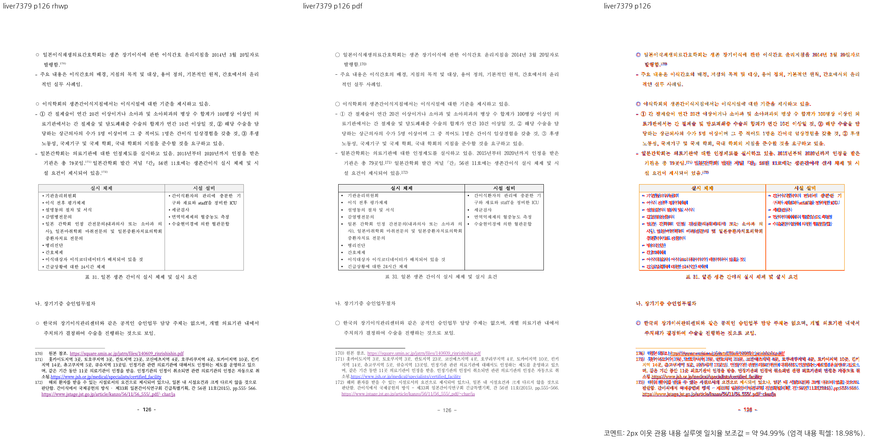
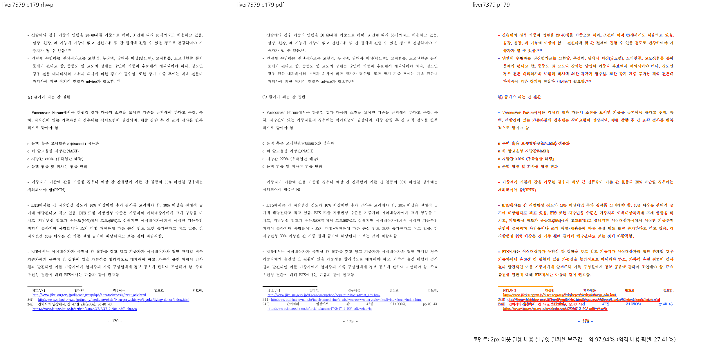
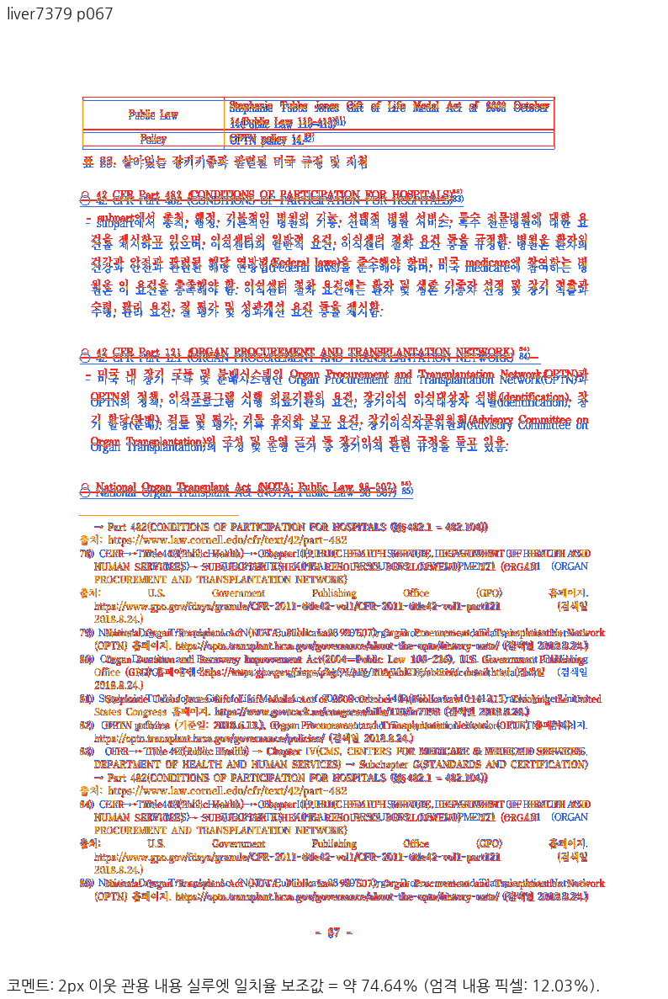

## 보정41 사전 분석 — 원본 HWP의 캡션 표 이어받기 바깥 프레임

- 같은 원본의67쪽 PDF는 두 형식 모두 표 상단86.945312px, 캡션156.434347px, 뒤 제목200.261047px다. 현재 HWPX는86.9/156.5/200.3px, HWP는83.2/152.8/192.8px다. 이어받은 표의 위여백283HU와 종료 아래여백283HU가 HWP 경로에서 빠져 표/캡션은3.773333px, 뒤 본문은7.546667px 위에 놓였다. 66쪽 첫 조각의 원점에도 두 형식의283HU 차이가 있다.
- 생산/소비 경로는 `hwpx_column_rowbreak_fragment_opens_outer_top`의 포맷 조건→continuation/budget의 host_before/terminal_outer_bottom→확정 ParagraphFloatPlacement→table_partial의 가시 원점→layout의 occupied_bottom이다. 같은 빈 폭0 앵커·수직 캡션·문단 기준 자리차지 RowBreak 프레임을 HWPX에서만 소비하는 가정부터 대조한다. 제목행 없는 일반 HWP 이어받기와 중첩 프레임은 기존 계약을 보존한다. 단순히 모든 Native 표에 여백을 추가하지 않는다.
- 먼저 원본 HWP/HWPX의67쪽 괘선/캡션/뒤 제목 및 원본 두 조각의 행·각주·캡션 단일 소유를 확인하는 정식 실패를 남긴다.66쪽의 약1px 잔여도 독립 PDF와 직접 대조하며 새 기대 허용치를 넓혀 숨기지 않는다.

### 보정41 결과

- 포맷 이름으로 제한했던 바깥 프레임 판정을 공통 `column_rowbreak_fragment_opens_outer_top`으로 바꿨다. HWP는 실제 폭0 빈 개체 앵커와 수직 캡션을 확인한 경우에만 같은 프레임을 소비한다. 캡션 없는 일반 HWP 이어받기·중첩 프레임·단 중간 조각은 기존 계약을 유지한다. 문서 ID나 수치로 대상을 고르지 않았다.
- 실제 소비는 block/whole_fit의 전체 캡션 배치 계획→continuation/fragment/budget의 이어받기 위여백/종료 아래여백→확정 배치→layout/table_partial의 가시 원점/끝점→layout의 occupied_bottom이다. 위여백283HU를 예약·배치에 같이 소비하고 종료 아래여백283HU를 후속 흐름에 한 번 소비한다. 실제 원본67쪽 괘선·캡션·뒤 제목의 독립 좌표는 [PDF 기하](../assets/pr7382_20260926/stage41_independent_geometry.json)에 보존했다.
- 정식 원본 두 검사는 수정 전1PASS/1FAIL(exit100,0.253s), 수정 후2PASS/0FAIL(exit0,0.262s)이다. 표23의5행/2행 조각, 끝 캡션·뒤 제목 좌표, 인접 쪽 캡션 중복 없음, 각주77 번호/꼬리 소유와215쪽을 확인했다. 이전 보정·일반 표/중첩/각주 대조군을 포함한 확대245PASS/0FAIL(9.793s,threads8), fmt·고정base manifest6238 attrs·source-unit4205/298도exit0이다. release-test CLI 빌드는exit0/106.338s다. [명령·exit·로그 해시·CLI 해시·시각 판정](../assets/pr7382_20260926/stage41_validation.json), [source/test 증거](../assets/pr7382_20260926/stage41_source_proof.json).
- HWP66쪽88.72983→98.94767%,67쪽74.64010→96.21756%,77쪽43.20381→98.35157%다. 표 외곽·후속 본문·그림/캡션 위치를 직접 읽었다. HWPX66/67/68쪽98.94767/96.21756/96.59031%와 HWP68쪽96.59031%는 그대로다. 전후 review/standalone overlay28개 중20개 고유 이미지를 직접 읽었고, 나머지8개는 이미 판독한 이미지와 바이트까지 동일함을 대조했다.
- 두 형식 모두215쪽이다. 전수 tree에서 HWP는66/67/77쪽만 변경됐고212쪽은 동일하며 HWPX215쪽은 모두 동일하다. 변경된 모든 쪽은 이번 Native 비교에 포함했다. [전수 변경 범위](../assets/pr7382_20260926/stage41_original_tree_difference.json), [점수/PNG 동일성](../assets/pr7382_20260926/stage41_visual_comparison.json). 전수 tree 동일성을 전체 래스터 통과로 보고하지 않는다.66쪽 약0.8px 저장 원점/독립 괘선 차이도 남겨 두며67쪽의0.5px 기대 허용치를 넓히지 않았다.
- [이번 추가 설명 주석4줄](../assets/pr7382_20260926/stage41_comment_scan.json)은 모두 한글이다. 앞 주석 전용 커밋292ba2161은 인라인을 포함한 추가 주석930줄·영어 설명0개를 확인했다. 로그/output/generated는 커밋하지 않는다.
- 판정: 원본 HWP 캡션 표의 바깥여백 누락은 충족. #6782의76/78쪽, 실제 TABLE 편집/래퍼 분할, 현재 수정 후 전체 Native/fresh WASM·전체 nextest/lint/Skia는 남아 통합 PR 생성/승인은 계속 보류한다. 실행 중인 전수 시각은 수정 전 동작의 stage40 고정 CLI이며 이번 보정41의 전체 시각 통과로 재사용하지 않는다.

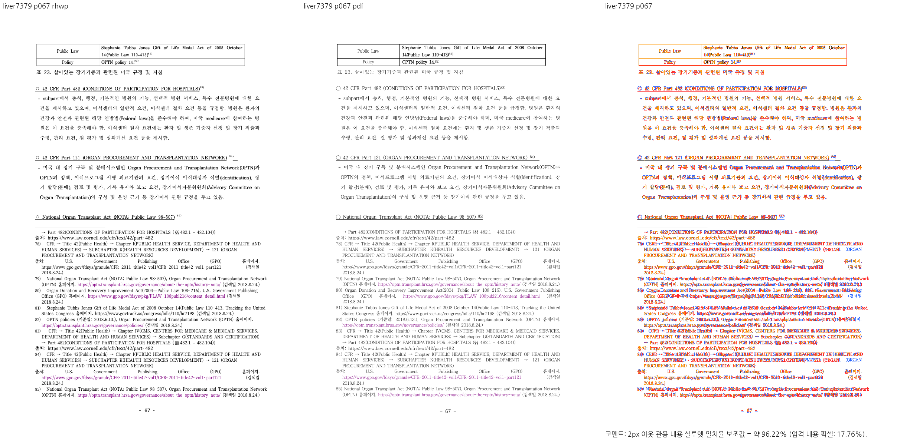
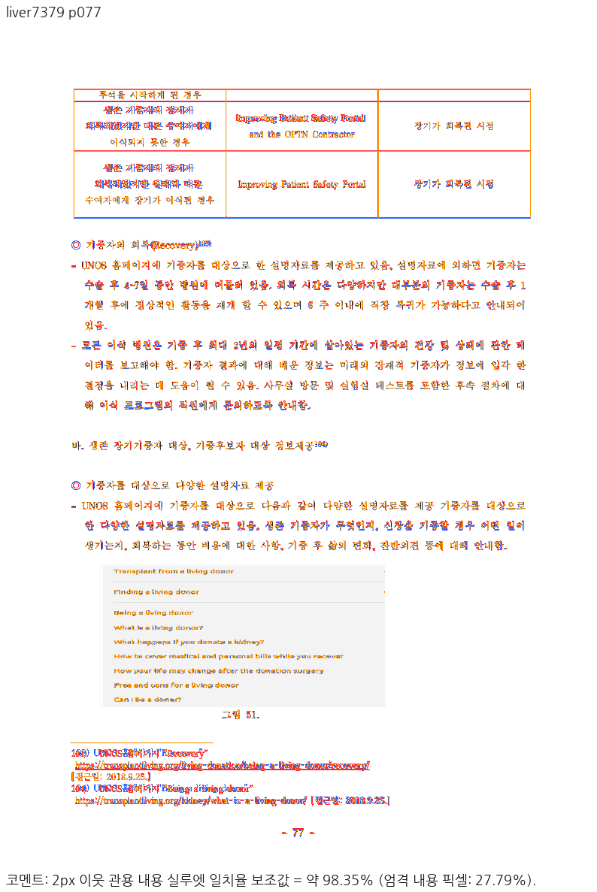

## 보정42 사전 분석 — 실제 표 셀 편집과 저장 프레임 제외

- 보정16의 표1136은 원본 저장 되감김/행 높이를 소비하지만 실제 셀 편집 경로는 아직 실행 증거가 없었다. 이전 보정18은 본문512의 편집이므로 이 증거를 대신하지 않는다. `insert_text_in_cell_native`→셀 문단 삽입→`reflow_cell_paragraph_after_text_edit`/셀 vpos 재계산→`mark_table_text_reflowed_after_edit`→재페이지네이션을 직접 실행한다.
- `query_closed_source_frame_placement`와 `saved_multirow_opening_frame_height`는 편집 세션/표 재조판 메타데이터를 거절한다. 이 조건의 실행 효과를 원본 HWP/HWPX에서 한 글자 공백과 실제 너비 부족 줄바꿈을 만드는 긴 삽입으로 확인한다. 수동 LineSeg 플래그 변경으로 편집을 대신하지 않는다.
- 독립 기대는 편집 API에 전달한 문자열과 편집 후 원본 셀/문단 전체 내용, 원본 용지의 네 여백/실제 각주 영역 경계다. 모든 표 조각에서 셀/문단 내용의 누락·중복, 원래 캡션 한 번, 표 물리 하단/후속 내용 소유를 확인한다. 변경된 문서에 원본 PDF 좌표·215쪽을 강제하지 않으며 한컴 편집 후 출력 일치로 승격하지 않는다. 아직 결함이 검출되지 않은 검증 공백이므로 수정 전 FAIL을 미리 주장하지 않는다.

- 첫 실제 실행은1PASS/1FAIL(exit100,1.145s)이다. HWPX의 한 글자 삽입에서105번쪽 표1136은 y669.827+높이408.52=1078.347px로 독립 용지 본문끝1039.347px보다39px(진단 로그38.8px) 넘었다. HWP의1자/120자 삽입은 전체216쪽에서 전체 셀 내용·표 조각·캡션·뒤 본문 검사를 통과했다. 편집 세션은 다른 기존 저장 배치 경로도 제외하며 그 문서의 다른 표/본문 overflow 진단이 있다. 이번 표29 검사의 통과를 편집한 문서 전체의 시각 통과로 확대하지 않는다.
- 원인은 저장 프레임을 거절한 뒤 일반 컷 높이를 선택하는 예약과, 온전한 행에서는 여전히 MeasuredTable을 소비하는 실제 배치가 갈리는 점이다. 재조판 메타데이터가 있는 온전한 행은 실제 공유 행 소유 판정과 같은 측정 높이를 fit에 연결한다. 내용 컷/중첩 행과 원본 저장 프레임 조건을 대신하지 않으며 저장4px 여유나 원점을 편집 경로에 재사용하지 않는다. 전체 fit과 분할 fit의 실제 소비를 함께 대조한다.

### 보정42 결과

- 실제 `insert_text_in_cell_native`로 표1136의 첫 셀에 공백1자 및120자를 삽입했다. 재조판 메타데이터가 있는 온전한 행은 기존 공통 배치 소유 판정의 측정 높이를 전체 fit/분할 예약에서 함께 소비한다. 원본 저장 프레임·4px 안전 여유·원점은 편집 경로에 재사용하지 않는다. 내용 컷/중첩 행의 기존 계약은 유지한다.
- 원본 두 형식의 실제 편집 검사는 수정 전1PASS/1FAIL(exit100,1.145s)에서 수정 후2PASS다. HWPX의 한 글자 삽입은 본문끝1039.347px를39px 넘던 표의 물리 높이를 검출했다. 최종 확대247PASS/0FAIL(exit0,10.594s,threads8)이며 전체 셀/문단 내용의 누락·중복, 실제 TextLine의 셀 내부 좌표, 표/각주 경계, 캡션 단일 소유와 뒤 문단 위치를 검사했다. 뒤에 보강한 셀 내부/캡션 좌표 검사를 최초 FAIL의 원인으로 보고하지 않는다.
- HWPX 공백 편집은215쪽/긴 편집216쪽, HWP 두 편집은216쪽이다. 변경한 문서에 원본215쪽/PDF 좌표를 강제하지 않는다. 편집 세션의 다른 기존 본문 overflow 진단은 남으며 이번 표의 통과를 편집 문서 전체 또는 한컴 편집 후 출력 일치로 확대하지 않는다. 독립적인 편집 후 한컴 PDF는 아직 없다.
- 실제 편집 상태의 SVG를 Native와 같은 local-font Style 경로로 생성해 PNG8개를 직접 확인했다. 본문 글꼴·표 이어받기·캡션/뒤 내용을 확인했다. 첫 None 출력과 굴림/휴먼명조의 cmap이 없는 Subset 출력은 글꼴이 깨져 승인 증거에서 제외하고 output에 보존했다. 이는 진단 캡처 경로의 보완이며 일반 Subset 내보내기 결함을 해결했다고 보고하지 않는다.
- 불변 CLI 빌드는exit0/93.189s이며 이후 변경은 테스트의 증적 생성 방식뿐이다. 원본215쪽 전체 tree는 HWP/HWPX 모두 이전 CLI41과 동일하다. fmt·고정base manifest(6240 attrs)·source-unit(4205/298)은exit0이다. [정확한 명령·source/test/CLI/로그 해시·직접 판독·자체 오류·추가 한글 주석](../assets/pr7382_20260926/stage42_validation.json), [원본 전체 tree 대조](../assets/pr7382_20260926/stage42_original_tree_difference.json), [거절한 Subset 글꼴 증거](../assets/pr7382_20260926/stage42_rejected_subset_font_proof.json). tree 동일성을 전수 래스터 통과로 보고하지 않는다.
- 판정: 보정16의 실제 TABLE 편집 검증 공백과 검출된 예약/배치 높이 불일치는 충족. 래퍼 실제 분할·이월/#6782의76/78쪽/최종 전수 시각·전체 검증은 남아 통합 PR은 보류한다. 새 설명 주석은 모두 한글이며 로그·output·generated는 커밋하지 않는다.

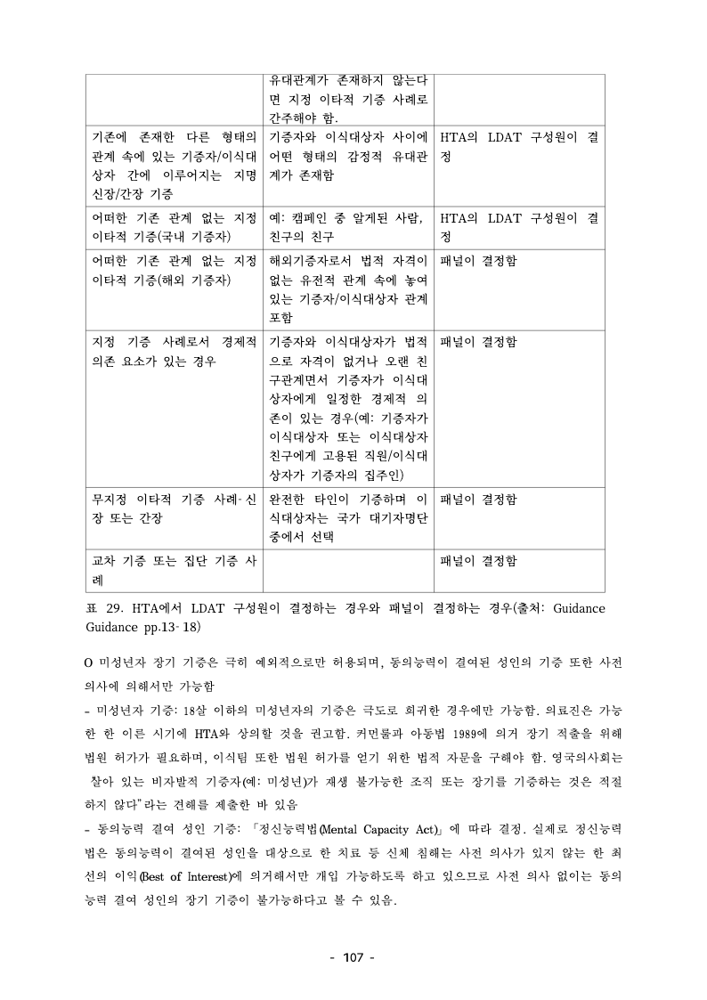

## 전체 검증과 기존 기대값 재검토 — 보정43 분석

- 제품 runtime head `96c4e47771ecf7f46016bffa1e09c467b2878cbb`, base `eb9142dd7c73297d555383d7d8434a470bdef26e`다. 이 단계는 지침·증거 분석이며 Rust·기대값·래칫 허용치를 바꾸지 않았다. [검증 체크포인트](../assets/pr7382_20260926/stage43_validation_checkpoint.json)와 [43건 원시 실패 목록](../assets/pr7382_20260926/stage43_nextest_full_failures.json)을 보존한다.
- 전체 integration은 `cargo nextest run --locked --cargo-profile release-test --target-dir target/pr-review --tests --test-threads 8 --no-fail-fast`:10,327PASS/43FAIL/50SKIP, exit100이다. 실패 목록의 반복 출력을 중복 집계하지 않았다. 43건은 개별21·본문넘침6·용지밖2·쪽수3·텍스트겹침11이며 아직43개 실제 출력 결함이라고 단정하지 않는다.
- release lib4,055PASS, Skia lib4,112PASS, Skia placeholder2PASS/direct PDF4PASS, doc8PASS, Studio1,785PASS/2SKIP다. fmt·Native/WASM/workspace Clippy·workspace build·고정 base manifest/unit 정책·TypeScript도 exit0이다. fresh WASM은 root wrapper의 `--no-opt` 로컬 대체 빌드이며 root pkg/Studio/frozen pkg 해시가 일치한다. Docker 최적화 빌드 통과로 보고하지 않는다. [WASM provenance](../assets/pr7382_20260926/stage43_wasm_pkg_provenance.json).
- 개별 실패 입력14개에 Native 수정 전·후27건, 래칫 증가 입력과 추가 대조군20묶음에40건의 Visual Sweep을 생성했다. 전체 자동 비교와 직접 읽은 대표 페이지를 구분한다. 한글 형식1.3 원본의 한컴 변환은 실패하여 그 PDF 대조는 미검증이다. 입력을 비정상으로 판정하지 않는다. [입력·PDF·페이지 매핑](../assets/pr7382_20260926/stage43_regression_baseline_visual_fixtures.json), [변환 출처](../assets/pr7382_20260926/stage43_regression_reference_conversions.json), [추가 출처](../assets/pr7382_20260926/stage43_regression_reference_extra_conversions.json). 새 기준 PDF는 `pdf/issue7382-regression-review/`에 보존했다.

| 대상 | 독립 출력과 직접 판독 | 현재 판단 |
| --- | --- | --- |
| #3738 HWP23쪽 | 동일 원본은 한컴2024 저장본. 기준 PDF 그림21 y151.995px·캡션498.322px, 현재152.1/498.4px, review99.62374% | 기존148.3±3/495.2±3은 PDF 자체를 벗어난다. 독립 기대값 보정 대상이며 허용치는 유지한다 |
| #6535 저슬랙/페이지 앵커, #6102 | 기준 PDF1쪽의 결재선·발신명·주소가 현재1쪽에서 사라지고 다음 쪽으로 이동 | 기존1쪽 기대는 유효한 실제 회귀. 보정27부터 높이 증가를 추적하며 코드를 보정해야 한다 |
| #7336 | 기준6쪽의 동의서 대신 현재6쪽에는 앞 표의 꼬리와 동의서 제목만 표시 | 7쪽·동의서 소유 기대에 실제 배치 회귀 근거가 있다 |
| #7390 KoPub | 대상 줄 폭414.2/574.1px는 전후 동일; 대상 줄은94/108→95/109쪽 이동 | 폭 회귀로 보고하지 않는다. 페이지 선택 실패와 실제 쪽 배치 회귀를 구분한다 |
| #1133 | HWP/HWPX PDF 괘선 간격113.476px, 현재HWP111.6/HWPX113.4px. 두 형식2쪽 직접 판독 | HWPX를111.6으로 되돌리지 않는다. 상대 일치만으로 양쪽 오답을 잡지 못해 독립 원점·간격 보강과 HWP 잔여 차이 검토가 필요하다 |
| #7203 | 뒤 표 PDF윗변436.961px, 전435.5/후437.4px. 11쪽 전후 직접 판독 | 저장 사다리32.43px와 실제 원점·여백의 계약을 추가 추적하며 기대 수정은 미검증 |
| #5941 | PDF302쪽, 전304/후303. 같은 마지막 내용의 실제 꼬리 PNG는 쪽번호 외 동일하나 PDF의 마지막 두 행 소유는 다름 | 304는 한컴 정답이 아닌 잠정 핀. 현재303으로 갱신하지 않으며 분할·내용 보존 계약을 추가 검증한다 |

[사례별 좌표·판정](../assets/pr7382_20260926/stage43_regression_reassessment.json). #6797 수동 변형은 원본 PDF로 기대값을 입증하지 않는다. 래칫 증가는 실제 보이는 글자·괘선과 raw 상자 진단을 대조하며, 점수 개선만으로 넘침/겹침 증가를 수용하지 않는다.

전체 Native/fresh WASM 시각 실행과 미판독 경계가 남았다. 현재 통합 PR·승인·merge는 계속 보류한다. 모든 로그와 임시 자료는 `output/pr-review/planet6897-7382-20260926/full-96c4e4777/`에 두고 커밋하지 않는다.

## 보정44 결과 — #3738 기존 기대값의 독립 좌표 교정

- 사전 분석은 보정43의 동일 입력·한컴2024 정본 대조다. 그림21 본체151.99467px·캡션498.32166px를 독립 기대값으로 사용하고 기존±3px 허용치를 유지했다. 제품 코드·baseline·golden은 바꾸지 않았다. 현재152.1/498.4px는 정본에 대응하며 과거 회귀198.4/544.7px는 계속 거절한다.
- 기존 검사는 runtime `96c4e47771ecf7f46016bffa1e09c467b2878cbb`에서 의도한 좌표 assertion으로 FAIL(exit100)이었다. 기대 교정 후 파생 `regression_suite_001`의 같은 검사1PASS/178SKIP(exit0,0.837s,threads8)다. base 출력148.3/494.7px는 새 독립 범위를 벗어나지만 새 검사를 base에서 실행한 것으로 보고하지 않는다.
- 파생 준비를 누락한 최초 manifest 검사 실패도 보존했다. `--prepare`부터 fmt·focused nextest·Native/WASM/workspace Clippy·workspace build·고정 base manifest·diff를 순차 재실행해 모두exit0을 확인했다. 준비 후 suite가010에서001로 바뀌었으므로 새 파생 소속에서 검사를 다시 실행했다. generated 파일·로그는 커밋하지 않는다.
- Native23쪽99.62374%, fresh WASM23쪽99.62947%의 review/standalone overlay를 직접 판독했다. 그림21/22·캡션·후속 본문 위치를 대조했으며 자동 점수를 직접 판독의 대용으로 쓰지 않았다. 제품 소스 불변이므로 runtime96의 고정 Native/WASM 증적을 연결한다. 테스트 변경 head의 전체 nextest 통과라고 보고하지 않는다.
- [독립 좌표·정확한 테스트 해시·입력/PDF 해시·명령/exit·WASM provenance](../assets/pr7382_20260926/stage44_caption3738_validation.json). 이번 기대값 교정은 충족이며 다른 실제 페이지 밀림/배치 결함과 미검증 경계 때문에 통합 PR·승인·merge는 보류한다.

## 보정45 사전 분석 — #7203 저장 사다리와 가시 표 원점 구분

- 같은 원본 `56345_regulatory_impact_analysis.hwp`의11쪽에서 pi186/187 저장 vpos는24560/26992HU다. 앞 개체 상자1300+566+566HU는 뒤 앵커까지2432HU를 닫는다. 뒤 표 자체의 위여백141HU(1.88px)는 이 앵커 간격에 포함되지 않는다. 기존 검사는 두 Table bbox의 간격을 원시 앵커 간격32.42667px와 직접 같게 검사했다.
- `stored_empty_control_table_frame`은 뒤 표의 닫힌 프레임을 anchor+offset+outer-top으로 생산하고 `query_original_control_table_frame`→whole-fit/continuation 예약→확정 ParagraphFloatPlacement→`layout.rs`의 col+placement.table_top→`table_layout.rs`의 resolved origin으로 전달한다. 확정 원점 경로는 physical inset을 재적용하지 않는다. 뒤 표 위여백은 여기서 한 번 소비된다. 앞 표는1300HU 개체 프레임과 특수 셀 여백을 가진 별도 경로이므로 두 raw bbox가 동일 앵커 규약이라고 추정하지 않는다.
- 독립 PDF11쪽 뒤 표 가로 괘선 y436.961344px, 전435.5/후437.4px다. 전후 review를 직접 판독했으며 현재 뒤 표는 기준에 더 가깝다. 다음 검사는 저장 간격에 뒤 표 위여백을 반영해 기존0.2px 공차를 유지하고, 같은 파일의 PDF 괘선으로 절대 원점도 검사한다(이 검사군의 기존1.5px 공차). 제품 코드·기준값·래칫은 바꾸지 않는다. 기대 교정 전 실제 FAIL은 보정43의 전체 nextest 원시 로그에 보존돼 있다.

### 보정45 결과

- 기존 간격 기대32.42667px는 뒤 표 바깥 위여백141HU를 누락했다. 독립 저장 메타데이터로34.30667px를 기대하며0.2px 공차를 유지했다. PDF11쪽 가로 괘선436.961344px의 절대 원점 assertion을 추가해 상대 간격만 맞는 양쪽 오답도 거절한다. 현재437.4px는 PDF와0.439px 차이다. 제품 코드·baseline·래칫은 변경하지 않았다.
- 같은 runtime의 기존 검사는32.43px 대신34.31px를 관측하며 FAIL(exit100)이었다. 교정 뒤 이 검사군 전체5PASS/207SKIP(exit0,4.086s,threads8)다. 저장 앵커·오프셋 적용 제외·TAC 대조·뒤 표 분할/본문 소유 검사를 함께 통과했다. 준비·fmt·Native/WASM/workspace Clippy·workspace build·고정 base manifest·diff 모두exit0이다. [입력/PDF 해시·독립 괘선·소스 메타데이터·정확한 테스트 해시·명령/exit](../assets/pr7382_20260926/stage45_anchor7203_validation.json).
- 전후11쪽 review와 현재 standalone overlay를 직접 읽었다. 대상 뒤 표 원점은 PDF에 가까워졌으며 앞 제목/설명 텍스트의 잔여 위치 차이도 남았다. 전93.74164/후93.19785%의 자동 점수를 전체 정합 판정으로 사용하지 않았다. 이 테스트의 기대 교정은 충족이며 다른 실제 회귀·전체 시각 보류는 유지한다. 테스트 변경 head의 전체 nextest 통과 또는 새 검사의 base 실행은 주장하지 않는다.

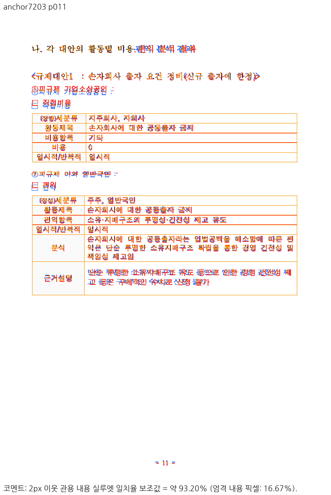
