# #7445 전체 피델리티 개선용 재현 자료

[이슈 #7445](https://github.com/edwardkim/rhwp/issues/7445)는 80250 규제영향분석서 전체의 한컴 출력 피델리티를 추적합니다. 사용자는 현재 문서 검사 항목을 제거하고, 원본은 이슈 재현 자산으로 이동해 보존하는 방식을 승인했습니다.

- [원본 HWP](80250_regulatory_analysis.hwp): 과거 `samples/80250_regulatory_analysis.hwp`의 한컴2024 저장본입니다.
- [파생 HWPX](80250_regulatory_analysis.hwpx): 과거 `samples/issue1891/80250_regulatory_analysis.hwpx`의 파생 입력입니다. 원본 생성 출처와 구분합니다.
- [한컴2024 독립 기준 PDF17쪽](../../../../pdf/80250_regulatory_analysis-hwp-2024.pdf)는 같은 원본 HWP의 engine2024 출력입니다. 파생 HWPX 자체의 독립 기준으로 승격하지 않습니다.
- [입력 해시·정확한 제거 행·승인 범위](MANIFEST.json), [보정53 전수 비교와 제품 해시](../pr7382_20260926/stage53_rowbreak_outer_top_validation.json).

원본 HWP의 Native/fresh WASM 전수 비교에서10쪽47.42712%,11쪽74.22791%,13쪽69.30824%,15쪽80.78939%가 남습니다. 글꼴 예외를 사용하지 않았고, 파생 HWPX의 전체 독립 비교는 미실행입니다.

#1891의 두17쪽/왕복 행과 이 문서의 baseline3행을 제거했습니다. 두 입력은 samples 밖에 바이트 동일하게 보존돼 corpus 자동 수집에 들어가지 않습니다. 별도 제외 로직이나 ignore 속성·공차 완화는 추가하지 않았습니다. 다른 문서의 검사·baseline 값은 그대로입니다. 제거를 결함 해결 또는 피델리티 승인으로 보고하지 않습니다.

처음 이동 뒤 사용자가 문서 보존을 강조해 원래 위치로 복원했다가, 이슈 자산으로 보존하는 이동은 괜찮다고 명시적으로 확인하여 위 최종 경로로 정리했습니다. 중간 상태의 두 검증은 중단·무효화했고, 최종 검증은 이 상태에서 다시 실행합니다. 역사적 실행 기록과 oracle corpus 보고서의 과거 samples 경로는 당시 출처로 보존합니다.

```bash
venv/bin/python scripts/visual_sweep.py \
  --hwp mydocs/pr/assets/issue7445/80250_regulatory_analysis.hwp \
  --pdf pdf/80250_regulatory_analysis-hwp-2024.pdf \
  --key regulatory80250-full --pages 1-17 --dpi 96 \
  --rhwp-bin target/pr-review/release-test/rhwp \
  --out output/fidelity80250/native
```

나중에 원본 전체의 Native/fresh WASM 각 페이지90% 이상과 실제 표 경계·글줄·내용 소유를 확인하고, 독립 기대값과 수정 전FAIL/수정 후PASS를 입증한 뒤 유효한 정식 회귀 검사를 다시 추가합니다.

## 추가: 생물독 연구 `1480000-201900698`

- [이관 등록 댓글](https://github.com/edwardkim/rhwp/issues/7445#issuecomment-5868460165), [원본 HWP](1480000-201900698-native-neartop-reset.hwp), [독립 한컴2020 PDF205쪽](../../../../pdf/issue5941-1480000-201900698-2020.pdf), [이동·제거 범위와 검증](neartop5941_test_removal_validation.json).
- 61,810,688byte 원본을 `samples/issue5941/`에서 바이트 동일하게 이동했습니다. 현재203/정상205쪽, Native39쪽47.03148%·53쪽58.70083%로 페이지 내용 소유와 제목/표 헤더 겹침이 남아 있습니다. fresh WASM 재실행과 전체205쪽 비교는 완료하지 않았습니다.
- 사용자 지시로 해당 문서의 잠정203쪽 함수와 #7147 반례 함수를 제거하고, body-overflow/off-canvas/text-overlap 세 원장 행만 제거합니다. 작은 #5921 함수와 #7147의 나머지 두 함수, generic corpus partition 검사는 유지합니다. corpus 소속은 이동 뒤 다시 계산합니다.
- 시작했던 렌더러 후보는 철회했고 이관을 피델리티 해결로 세지 않습니다. 다른 원문/PDF·기존 검사를 제거하지 않습니다.


## 추가: 자산관리규정 `3249937`

- [이관 등록 댓글](https://github.com/edwardkim/rhwp/issues/7445#issuecomment-5868575524), [원본 HWPX](3249937_asset_management_rules.hwpx), [기존 독립 PDF60쪽](../../../../pdf/3249937_asset_management_rules-2020.pdf), [선택6쪽 실제 비교·이동·검사 제거 검증](assets6031_test_removal_validation.json).
- 현재59/기준60쪽이며Native3·4·6·15·41·42쪽은모두90%미만(최저41쪽25.22086%)입니다. 본문초과15건과페이지내용소유차이가남습니다. 전체60쪽/fresh WASM비교통과를주장하지않습니다.
- 문서전용#6031/#6409두함수와세원장행을제거하고#7080의자산관리규정입력한개만matrix에서제거합니다. #7080기존5함수·다른두원문·최소20개관측과공차는유지합니다. 원본423,622byte를바이트동일하게보존하고렌더러는바꾸지않습니다.


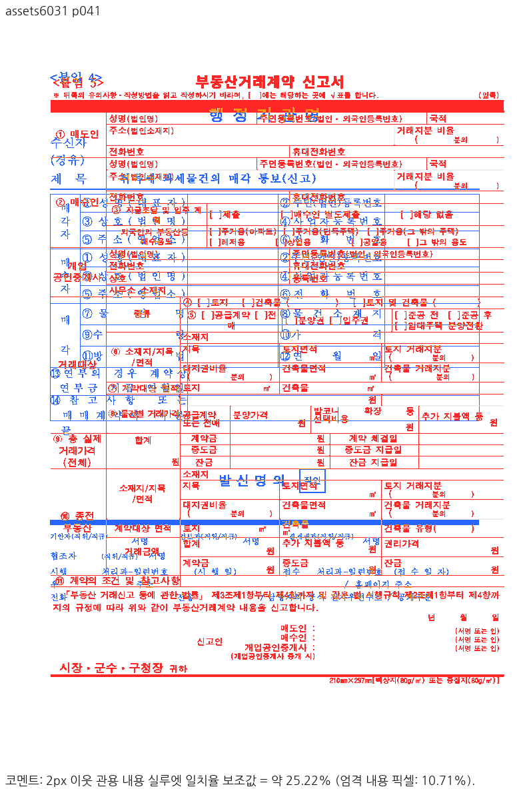

## 추가: 개인정보 분석 편람 `75544`

- [이관 등록 댓글](https://github.com/edwardkim/rhwp/issues/7445#issuecomment-5868672890), [보존 원본HWPX](75544_pii_bunseok.hwpx), [한컴PDF66쪽](../../../../pdf/task2097/75544_pii_bunseok-hwpx-2020.pdf), [선택쪽 비교·검사 제거 검증](pii75544_test_removal_validation.json).
- 현재70/한컴66쪽. Native22쪽93.59725%,46쪽65.56940%,59쪽30.66565%,60쪽30.63875%입니다. 46쪽 표높이/본문흐름과59쪽 내용소유차이를직접확인했습니다. 기존이름2020.pdf는cairo출력이므로이번독립기준으로사용하지않고보존합니다. 전체/fresh WASM통과는주장하지않습니다.
- 문서전용#5846함수와본문초과/캔버스/글자겹침/셀초과/쪽수oracle/render-page의해당원문행만제거합니다. generic함수와다른원문·공차는유지하고, 정적IR추출자료·직렬화계약은보존합니다. 렌더링결함해결로세지않습니다.


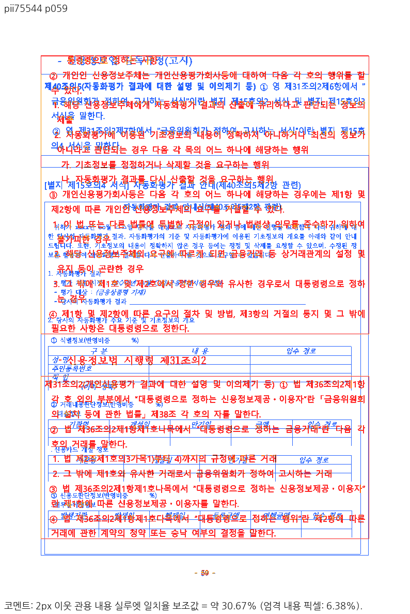

## 추가: 한컴 HWP5 변환본 `hwp3-sample16-hwp5.hwp`

- [보존 원문](hwp3-sample16-hwp5.hwp), [저장제품에 대응한 한컴2024 PDF64쪽](../../../../pdf/hwp3-sample16-hwp5-hwp-2024.pdf), [이관·실제 비교·검사 결과](sample16_test_removal_validation.json). [이관 등록 댓글](https://github.com/edwardkim/rhwp/issues/7445#issuecomment-5868738187).
- 현재65/정상64쪽, Native23쪽26.53989%·24쪽7.09794%·64쪽15.52702%입니다. 23쪽본문하한초과최대97.5467px와24쪽내용소유차이를직접확인했습니다. 전체64쪽/fresh WASM비교는미실행이며전체통과로세지않습니다.
- 이원문의본문초과/쪽수oracle/render-page원장3행과전용렌더링/쪽수11함수·관련helper를제거하고원문을바이트동일하게이동했습니다. #2158/source-side matrix의해당입력만제거합니다. #4680/#3693/#3695/#3744/#4155의파서/구조/문자음영계약과진단입력은유지하고보존경로로수정합니다. HWP3원본과다른연도변환본·정적IR자료·다른원문·공차는유지합니다. 피델리티해결로세지않습니다.


## 추가: HWP3 변환 HWPX sample16

- [이관 등록 댓글](https://github.com/edwardkim/rhwp/issues/7445#issuecomment-5869485533), [보존 원문 HWPX](hwp3-sample16-hwp5.hwpx), [독립 한컴2024 PDF64쪽](../../../../pdf/hwp3-sample16-hwp5-hwpx-2024.pdf), [이동·제거·검증 근거](sample16hwpx_test_removal_validation.json). 기존 HWP5와 별도 입력입니다.
- 현재65/기준64쪽이며 선택7쪽 모두90% 미만입니다. 최저64쪽11.02735%; 6쪽22.67417%에서 본문·표·수식의 세로 위치 차이,64쪽에서 합의각서의 쪽 소유 차이를 직접 확인했습니다. 전체/fresh WASM 통과를 주장하지 않습니다.
- 전용 렌더링/쪽수4함수와 corpus3행만 제거했습니다. 다른 입력의 온새미로 쪽수·HWP3 수식 검사 및 gradient IR 파싱 검사는 유지합니다. 유지 집중7PASS, 필수 lint/정책 exit0이며 생산 코드는 바꾸지 않았습니다. 제외를 피델리티 개선으로 세지 않습니다.


## 추가: sample16의 2010 이름 HWP 저장본

- [이관 등록 댓글](https://github.com/edwardkim/rhwp/issues/7445#issuecomment-5869562651), [보존 원문](hwp3-sample16-hwp5-2010.hwp), [독립 한컴2024 PDF64쪽](../../../../pdf/hwp3-sample16-hwp5-2010-hwp-2024.pdf), [개별 근거와 검증](sample16_2010_test_removal_validation.json). 실제 저장 metadata는 한컴2024이며 다른 버전 입력과 구분합니다.
- 현재65/기준64쪽, 선택7·22·23·24·64쪽 모두90% 미만(최저24쪽7.09794%). 본문 넘침과 페이지 내용 소유 차이를 직접 확인했습니다. 기존2020 이름 PDF는 cairo 출력으로 이번 독립 기준에서 제외하고 보존합니다. 전체/fresh WASM 통과는 주장하지 않습니다.
- #1105 전용2함수와 corpus2행만 제거했습니다. 다른 입력의 함수·공차·기대값과 IR 진단은 유지합니다. 집중8PASS, 필수 lint/정책 exit0. 재배정된 body partition15 통과를 보도자료·rowbreak 문서의 해결로 세지 않습니다.

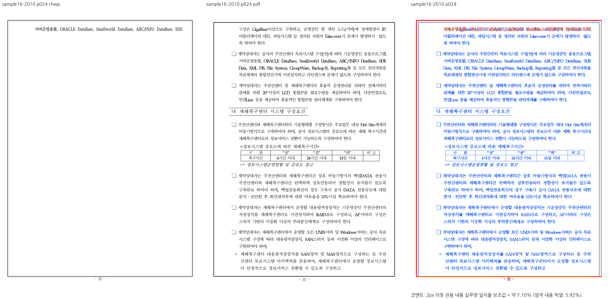

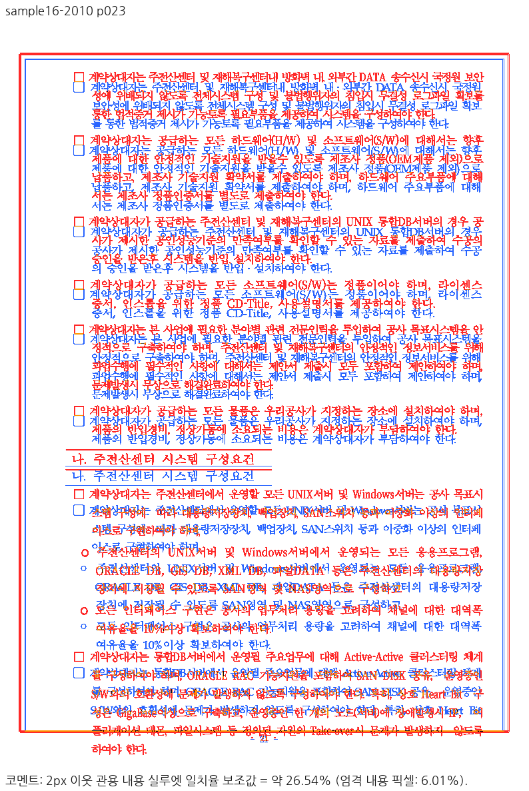

## 추가: sample16의2022 HWP 저장본

- [이관 등록 댓글](https://github.com/edwardkim/rhwp/issues/7445#issuecomment-5869647971), [보존 원문](hwp3-sample16-hwp5-2022.hwp), [독립 한컴2022 PDF64쪽](../../../../pdf/hwp3-sample16-hwp5-2022-hwp-2020.pdf), [근거·검증](sample16_2022_test_removal_validation.json).
- 현재65/기준64쪽, 선택3·6·23·24·64쪽 모두90% 미만(최저24쪽7.09794%). 3쪽 문단·도형 간격과24쪽 내용 소유 차이를 직접 확인했습니다. 전체/fresh WASM 통과를 주장하지 않습니다.
- 전용6함수와 corpus2행만 제거하고 다른 입력·기대값·공차와 저장 제품/IR 검사는 유지했습니다. 유지8PASS, body partition2의다른3원문은1FAIL이며 필수 lint/정책 exit0입니다. 다른 실패나 원문 피델리티 해결로 세지 않습니다.

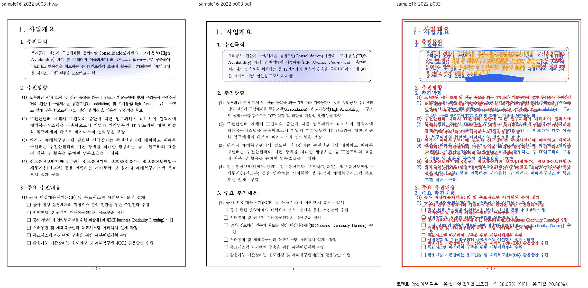


## 추가: 보도자료의 분할 셀·중첩 표 HWPX

- [이관 등록 댓글](https://github.com/edwardkim/rhwp/issues/7445#issuecomment-5869729786), [보존 원문](press_release_split_cell_nested_table.hwpx), [독립 한컴PDF12쪽](../../../../pdf/issue3637/press_release_split_cell_nested_table-hwpx-2020.pdf), [검사 제거와 유지 검증](press3637_test_removal_validation.json). 기존 cairo 출력은 독립 기준으로 쓰지 않고 보존합니다.
- 현재13/기준12쪽, 선택4·5·7·8·12쪽은97.23437/95.89646/91.68111/83.85004/36.41033%. 8쪽 중첩 상자/글줄·배경 차이와12쪽 향후계획 표 및 마지막 내용의 이월을 직접 확인했습니다. 전체/fresh WASM은 미실행입니다.
- 해당 입력의 전용4함수와 corpus3행을 제거했고 원문/PDF를 유지했습니다. 다른 입력·합성 계약·공차는 유지합니다. 유지5PASS/별도 입력2FAIL, 필수 lint/정책 exit0입니다. 제외를 원문 피델리티 개선이나 다른 실패의 해결로 세지 않습니다.


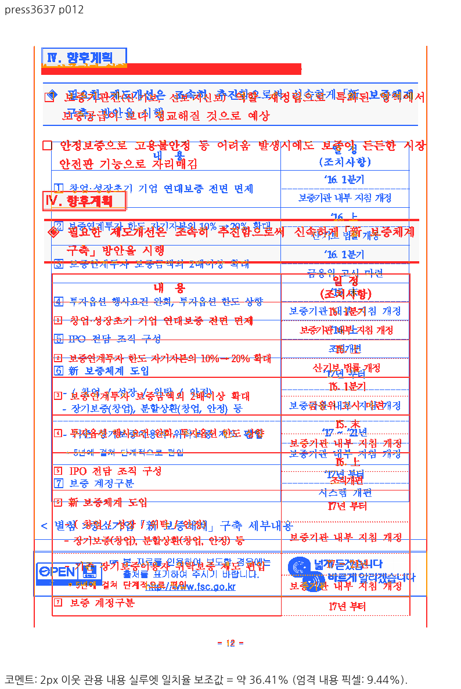

## 추가: rowbreak HWP의 표 분할과 내용 소유

- [이관 등록 댓글](https://github.com/edwardkim/rhwp/issues/7445#issuecomment-5869840624), [보존 HWP](rowbreak-problem-pages.hwp), [같은 원문의 독립 한컴2024 PDF18쪽](../../../../pdf/rowbreak-problem-pages-hwp-2024.pdf), [검사 제외·보존과 검증](rowbreak_hwp_test_removal_validation.json).
- 실제/기준 모두18쪽이지만 선택 Native3·8·12·13·17·18쪽은96.83411/49.39444/80.05503/71.99775/99.82183/88.25163%입니다. 8쪽 이전 내용 이어받기와 제27조 셀 경계/후속 항목 소유 차이를 직접 확인했습니다. 전체18쪽/fresh WASM 통과를 주장하지 않습니다.
- HWP 전용5함수와 공용4함수의 HWP matrix 입력, corpus3행만 제거했습니다. HWPX와 다른 matrix·기대값·공차는 유지하며, 순수 #1770 origin-marker 파서 계약은 보존 경로만 수정했습니다. #4967 cache-key 함수는 실제 page tree를 검증하므로 HWP 렌더링 검사 제외에 포함합니다. 정적 IR 자료는 보존합니다. 새 함수/ignore/skip/생산 변경은 없습니다.

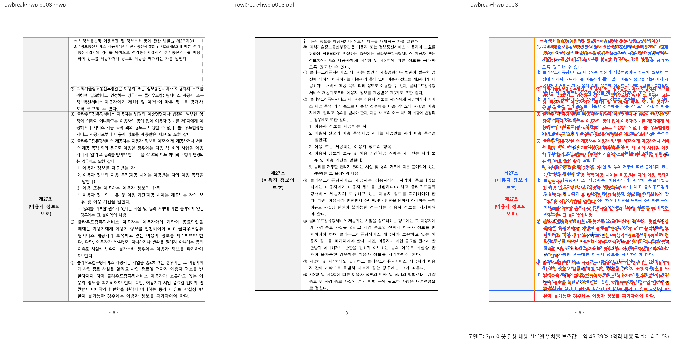


## 추가: 항공교통관제사 CBTA 도입 연구

- [등록 댓글](https://github.com/edwardkim/rhwp/issues/7445#issuecomment-5869952956), [보존 HWP](1613000-202200037-air-traffic-controller-cbta.hwp), [같은 원문의 독립 한컴 PDF204쪽](../../../../pdf/1613000-202200037-air-traffic-controller-cbta-2020.pdf), [제외와 개별 검사 검증](air6764_test_removal_validation.json).
- 현재201/기준204쪽. 선택 Native39·103·124·194·201쪽은98.12011/37.65331/23.8889/38.95167/11.45426%입니다.103쪽의 로드맵 그림24와 뒤 설명 대신 앞 내용,201쪽의 역량 표 대신 부록5 영문 평가양식이 표시되는 차이를 직접 확인했습니다. 전체204쪽/fresh WASM 비교는 미실행입니다.
- 원문12,851,712byte를 바이트 동일하게 보존하고 전용4함수와 corpus3행만 제거했습니다. 다른 문서·기대값·공차 유지, 새 함수/ignore/skip/생산 변경 없음. 기존 body partition2는 개별1PASS/239SKIP(exit0), 필수 lint·고정 base 정책도exit0입니다. 제외를 피델리티 개선으로 보고하지 않습니다.


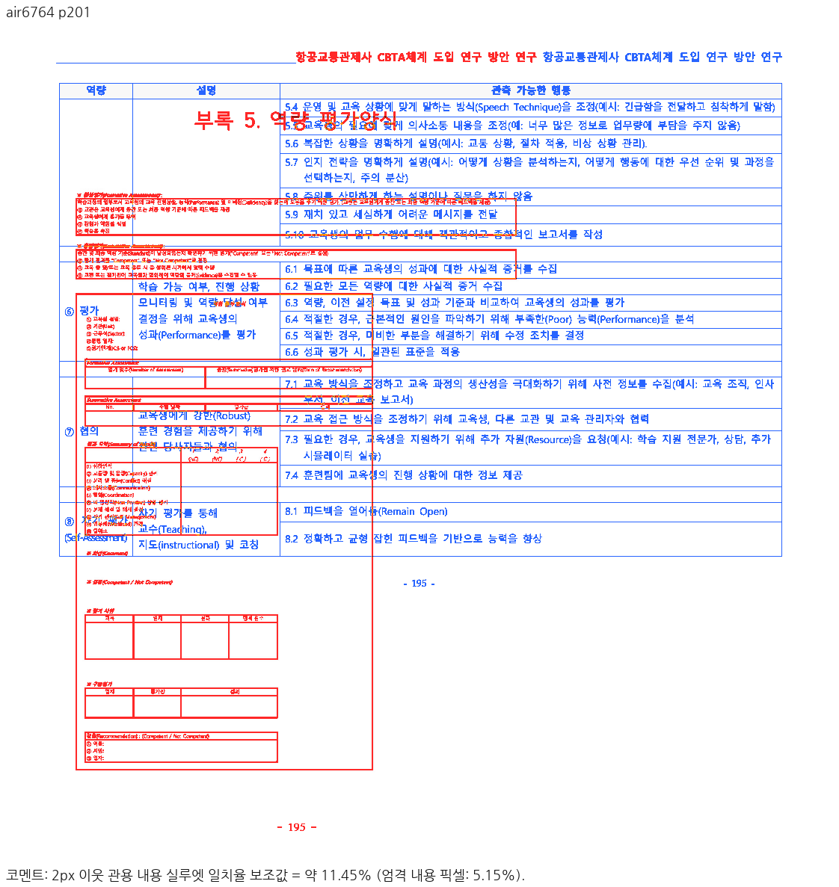

## 추가: 전기안전관리법 시행규칙 규제영향분석서70833

- [등록 댓글](https://github.com/edwardkim/rhwp/issues/7445#issuecomment-5870144757), [보존 HWP](70833-electrical-safety-rule-regulatory-analysis.hwp), [같은 원문의 독립 한컴 PDF18쪽](../../../../pdf/70833-electrical-safety-rule-regulatory-analysis-2020.pdf), [검사 제외와 유지 검증](electrical6854_test_removal_validation.json).
- 실제18/기준18쪽이나 Native5·6·10·14·18쪽37.05508/35.31196/19.83933/93.80158/20.13671%입니다.5쪽의 이전 표 반복/다음 표 소유 차이,10쪽의 규제 적정성 대신 이전 이해관계자 표와 규제목표가 표시되는 차이를 review에서 직접 확인했습니다. 전체/fresh WASM 통과를 주장하지 않습니다.
- 원문70,656byte를 바이트 동일하게 보존하고 HWP 전용2함수와 corpus2행만 제거했습니다. 춘천 인사 규칙 HWPX2함수·helper·기대값·공차 유지, 새 함수/ignore/skip/생산 변경 없음. 기존6번 단독1PASS와 유지 HWPX2PASS(집중3PASS/466SKIP,exit0), 필수 lint·고정 base 정책exit0입니다. 이관을 피델리티 개선으로 세지 않습니다.


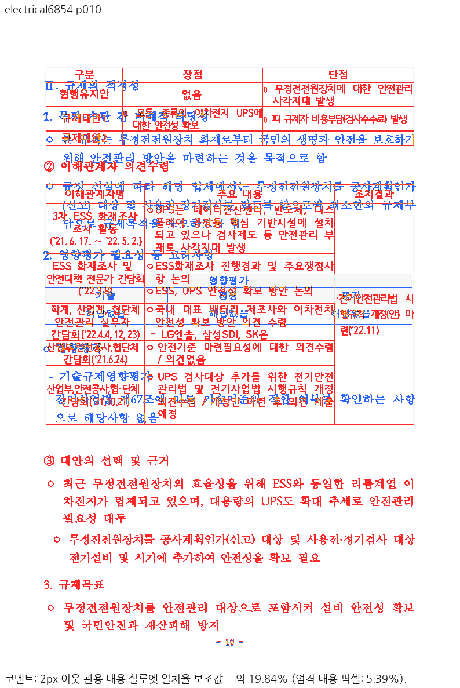

## 추가: 권익위 제도개선 권고안30269와 동일 원문 중복 등록

- [등록 댓글](https://github.com/edwardkim/rhwp/issues/7445#issuecomment-5870283939), [#6844 보존 원문](30269-anticorruption-recommendation-toc.hwp), [#6023 바이트 동일 원문](30269_reform_recommendation.hwp), [독립 한컴 PDF22쪽](../../../../pdf/30269-anticorruption-recommendation-toc-2020.pdf), [이관·동일 해시·유지 계약 검증](anticorruption6844_test_removal_validation.json).
- 현재22/기준22쪽이나 선택 Native2·5·6·22쪽100.0/68.7493/29.19654/94.66351%입니다.5쪽의 다음 장 제목이 본문 하단·쪽번호 영역에 미리 표시되고 도형/본문 위치도 어긋나는 차이를 review에서 직접 확인했습니다. 전체/fresh WASM 통과를 주장하지 않습니다.
- 두 경로는 각470,016byte/SHA-256동일이며 바이트 동일하게 보존했습니다. 렌더링 전용5함수를 제거하고 #6806 속성 getter/setter·저장0높이 복원은 유지합니다. undo 함수의 SVG 비교만 제거하고 IR 추출 자료는 보존합니다. 해당 렌더링 baseline 행은 원래 없습니다. 다른 입력·공차 유지, 새 함수/ignore/skip/생산 변경 없음. 기존7번 단독1PASS와 유지속성2PASS(집중3PASS/477SKIP,exit0), 필수 lint·고정base정책exit0입니다. 이관을 피델리티 개선으로 세지 않습니다.

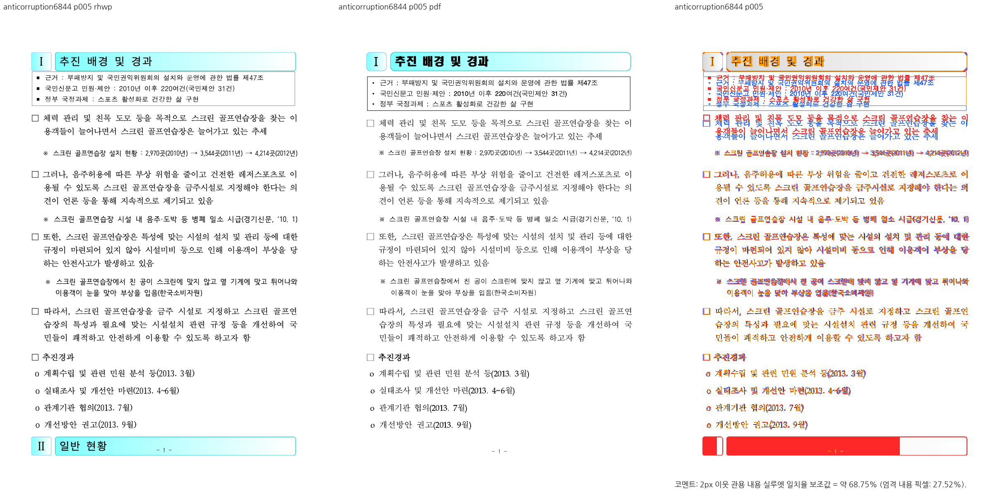


## 추가: 영어시험 `exam_eng.hwp`

- [등록 댓글](https://github.com/edwardkim/rhwp/issues/7445#issuecomment-5870452250), [보존 원문](exam_eng.hwp), [독립 한컴 PDF8쪽](../../../../pdf/exam_eng-hwp-2020.pdf), [전체 Native와 검사 제거·유지 검증](exam_eng_test_removal_validation.json). 기존2022 PDF도 보존합니다.
- 현재8/기준8쪽이나 전체 Native1~8쪽은96.02165/89.09228/68.69443/55.25926/60.04261/51.55944/48.54225/79.13315%입니다.4쪽의 문항27 표와 문단,7쪽의 지문·선택지·상자·각주와 머리 쪽번호 차이를 직접 확인했습니다. 글꼴 예외 없음, fresh WASM 미실행입니다.
- 원문3,486,208byte를 바이트 동일하게 보존하고 전용 렌더링·페이지8함수, #7061 입력1개, 렌더링 원장3행을 제거했습니다. HWP→HWPX 총쪽수 AutoNumber 파싱·직렬화와 IR진단은 유지합니다. 다른 입력·기대값·공차 유지, 새 함수/ignore/skip/생산 변경 없음. 집중 결과는 ['        FAIL [   2.427s] (17/17) rhwp::regression_suite_019 body_overflow_baseline::body_overflow_does_not_grow_partition_9', '     Summary [   2.456s] 17 tests run: 16 passed, 1 failed, 5156 skipped', '        FAIL [   2.427s] (17/17) rhwp::regression_suite_019 body_overflow_baseline::body_overflow_does_not_grow_partition_9', '     Summary [   0.183s] 1 test run: 1 passed, 215 skipped']이며 필수 lint/고정base정책 결과는 위 JSON에 기록했습니다. 원문 피델리티 해결/전체 회귀 완료로 세지 않습니다.

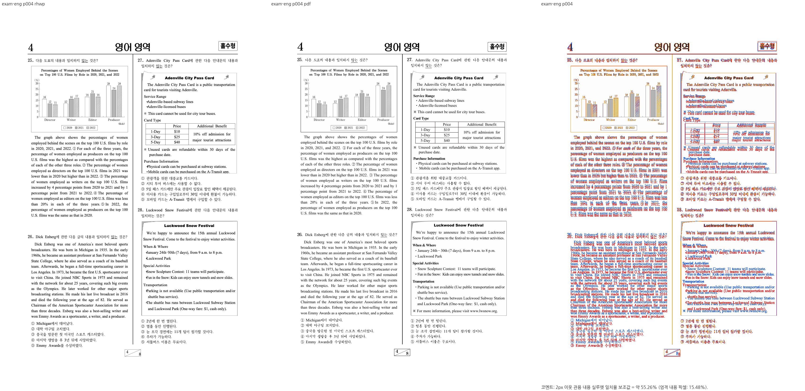


영어시험 추가 정정: CanvasKit native/browser manifest의 같은 원문1항목도 제외했습니다. 나머지121개 입력 존재와 실제 manifest 로딩 PASS입니다. 정확한 항목·커밋은 위 JSON의 `manifest_followup_correction`에 기록했습니다.

## 추가: HWP 컨트롤 API v2.4

- [등록 댓글](https://github.com/edwardkim/rhwp/issues/7445#issuecomment-5870586821), [보존 원문](hwpctl_API_v2.4.hwp), [동일 원문의 독립 한컴 PDF105쪽](../../../../pdf/hwpctl_API_v2.4-hwp-2020.pdf), [시각·제외·유지 검증](api24_test_removal_validation.json). 다른2020·2022 이름 PDF도 보존합니다.
- 현재105/기준105쪽이나 선택 Native1·28·52·60·74·75·105쪽98.99519/98.33864/99.4403/99.67137/60.06836/98.19912/97.85668%입니다.74쪽 첫 데이터행이 기준14 대신 앞쪽의13으로 시작해 표와 후속 설명이 아래로 밀리는 내용 소유 차이를 직접 확인했습니다. 전체105쪽/fresh WASM은 미실행입니다.
- 262,144byte 원문을 바이트 동일하게 보존하고 렌더링·페이지23함수, 원장4행, CanvasKit manifest1항목을 제거했습니다. 순수 #3695 개요 구조 파싱/IR과 다른 문서4함수 및 IR원장은 유지합니다. 다른 공차·기대값 유지, 새 함수/ignore/skip/생산 변경 없음. 집중 ['     Summary [   0.913s] 18 tests run: 18 passed, 1078 skipped']; 필수 lint/정책 결과는 JSON에 기록했습니다. CanvasKit 나머지120입력의 존재·실제 manifest 로딩 PASS입니다.

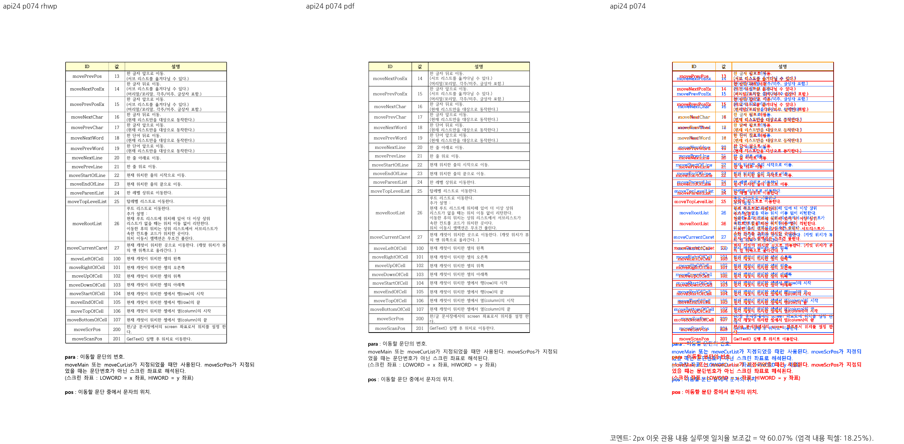


## 추가: 소상공인 중간보고서 RowBreak 표·각주 #1937

- [등록 댓글](https://github.com/edwardkim/rhwp/issues/7445#issuecomment-5870699037), [보존 원문](issue1937_rowbreak_footnote_overpagination.hwp), [독립 한컴 PDF50쪽](../../../../pdf/issue7382-regression-review/issue1937_rowbreak_footnote_overpagination-2020.pdf), [시각·제외·유지 검증](footnote1937_test_removal_validation.json).
- 현재51/기준50쪽. 선택 Native24·42·43·44·45·50쪽92.59251/53.92934/41.51422/14.87881/38.19829/28.18537%입니다.43쪽 이전 표/각주가 겹치고44쪽은 정상43쪽 본문으로 밀리는 차이를 직접 확인했습니다. 전체50/51쪽/fresh WASM 통과를 주장하지 않습니다.
- 원문147,456byte를 바이트 동일하게 보존하고 전용 페이지·각주 쪽번호2함수와 body/text 원장2행을 제거했습니다. #1133 다른 문서6함수·helper·기대값·공차 및 IR 진단은 유지합니다. CLI의90% 위치 손상본 패닉 방지는 독립 안전성 계약으로 보존 경로만 바꾸며 같은4입력을 유지합니다. 새 함수/ignore/skip/생산 변경/공차 완화 없음. 집중 ['     Summary [   1.213s] 8 tests run: 8 passed, 455 skipped']; 필수 lint/정책은 위 JSON에 정확한 exit를 기록했습니다.

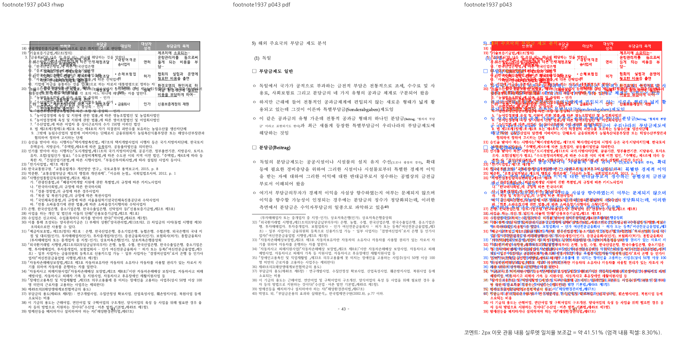

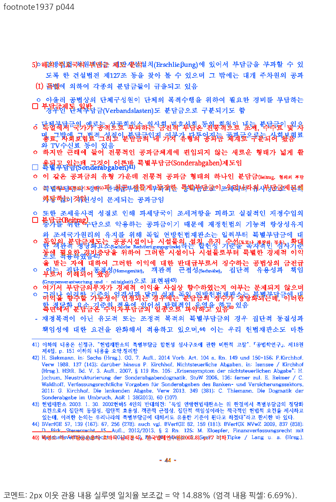

## 추가: 화학제품 표시 기준 축소 HWP #6782

- [등록 댓글](https://github.com/edwardkim/rhwp/issues/7445#issuecomment-5870791302), [보존 축소본](1480000-201900042-chemical-labeling-standards.hwp), [축소본 자체의 독립 한컴 PDF103쪽](../../../../pdf/issue7382-regression-review/1480000-201900042-chemical-labeling-standards-2020.pdf), [시각·제외·유지 검증](chemical6782_test_removal_validation.json). 기존 PDF와 별도 전체 원본은 보존합니다.
- 현재103/기준103쪽이나 선택 Native76·77·78·83·103쪽60.7561/99.27598/53.67396/99.79822/99.98703%입니다.76쪽 캡션이 앞 문단과 겹치고78쪽 표 행 높이·외곽·후속 표 캡션 위치가 다른 차이를 직접 확인했습니다. 전체103쪽/fresh WASM은 미실행입니다.
- 193,536byte 축소본은 전체 원문6,521,856byte와 해시가 다른 입력입니다. 축소본만 바이트 동일하게 이관하고 렌더링·페이지/물리 배치14함수, #7048 두matrix의 축소본 입력, body 원장1행을 제거했습니다. #7048 전체 원문의3함수와 다른 원문 검사·helper·기대값·공차를 유지합니다. 새 함수/skip/ignore/생산 변경/공차 완화 없음. 집중 ['     Summary [   1.328s] 4 tests run: 4 passed, 450 skipped']; 필수 lint/정책은 위 JSON에 기록했습니다. 개별기대값오류확정이나 원문 피델리티 해결로 세지 않습니다.


## 추가: 공개 결재문서36375752 saved-bounds HWPX

- [등록 댓글](https://github.com/edwardkim/rhwp/issues/7445#issuecomment-5870886007), [보존 HWPX](saved_bounds_cumulative_page_break.hwpx), [독립 한컴2024 PDF5쪽](../../../../samples/task1749/saved_bounds_cumulative_page_break-2024.pdf), [원문/PDF 대응·전수 비교·제외·유지 검증](savedbounds1749_test_removal_validation.json). 기존 PR#1752/계획#1811/결과#2015의 입력별 PDF 대응을 확인했습니다.
- 현재5/기준5쪽이나 전체 Native1~5쪽94.04792/98.06349/82.65886/72.63884/30.44845%입니다.4쪽 표와 후속 문단의 겹침9건·표의 페이지 소유,5쪽 이어받기와 뒤 내용 위치 차이를 직접 확인했습니다. fresh WASM은 미실행입니다.
- 51,205byte HWPX만 바이트 동일하게 보존하고 렌더링·페이지3함수와 body 원장1행을 제거했습니다. #1811 혼합 함수의 HWPX 페이지/cut 부분만 제외하고 셀52/57 저장 IR 및 HWP5쪽/3유닛컷 대조군 기대값·공차를 유지합니다. same-id 역사적IR catalogue와 배열 경계 계약도 유지합니다. IR/HWP 대조군을 HWPX fidelity 승인으로 세지 않습니다. 새 함수/ignore/skip/생산 변경/공차 완화 없음. 집중 ['     Summary [   1.181s] 4 tests run: 4 passed, 628 skipped']; 필수 lint/정책은 위 JSON에 정확히 기록했습니다.

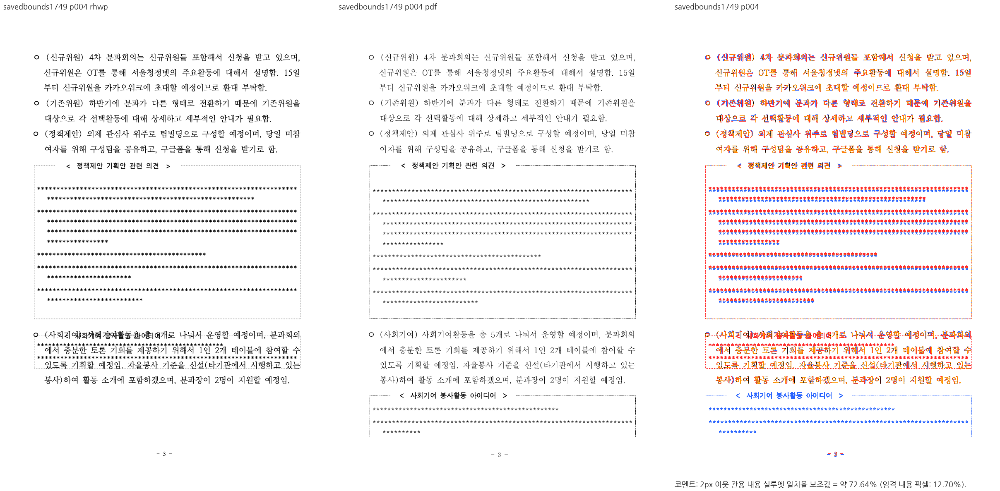

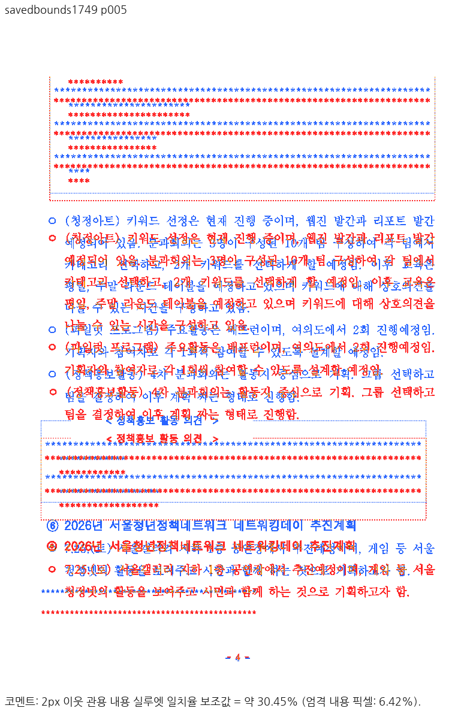

## 추가: 한컴 공식 형식5.0 revision1.3 배포용 HWP

- [등록 댓글](https://github.com/edwardkim/rhwp/issues/7445#issuecomment-5871244705), [보존 원문](한글문서파일형식_5.0_revision1.3.hwp), [공식 PDF71쪽](../../../../pdf/한글문서파일형식_5.0_revision1.3-hancom-official.pdf), [동일 원문 해시·PDF출처·시각 비교·제외·유지 검증](format_spec13_test_removal_validation.json). 공식CDN의 HWP가 저장소 원문과 SHA-256 동일하며 PDF Creator/원문저장빌드 모두2018/10.0.0.7282입니다.
- 현재69/기준71쪽.선택Native1/15/16/48/49/50/68/69쪽은96.24622/40.68047/31.25675/38.87576/26.93028/35.3439/18.57411/0%입니다.15/49쪽 표 내용·분할과 머리말,69쪽 발행정보 페이지 소유 차이를 직접 확인했습니다.전체비교/freshWASM은 미실행입니다.
- 렌더링·페이지4함수/body·offcanvas2행만 제외, IR원본표식·프로필/왕복2함수 및 다른입력3함수 유지.원문342,528byte 불변/공식PDF830,986byte 보존, 생산변경/새 함수/skip/ignore/공차완화 없음.집중5PASS/다른입력1FAIL,필수lint·정책 통과.기존30번은pr4093입력의2건으로 pending 유지합니다.이관을피델리티 개선으로 세지 않습니다.


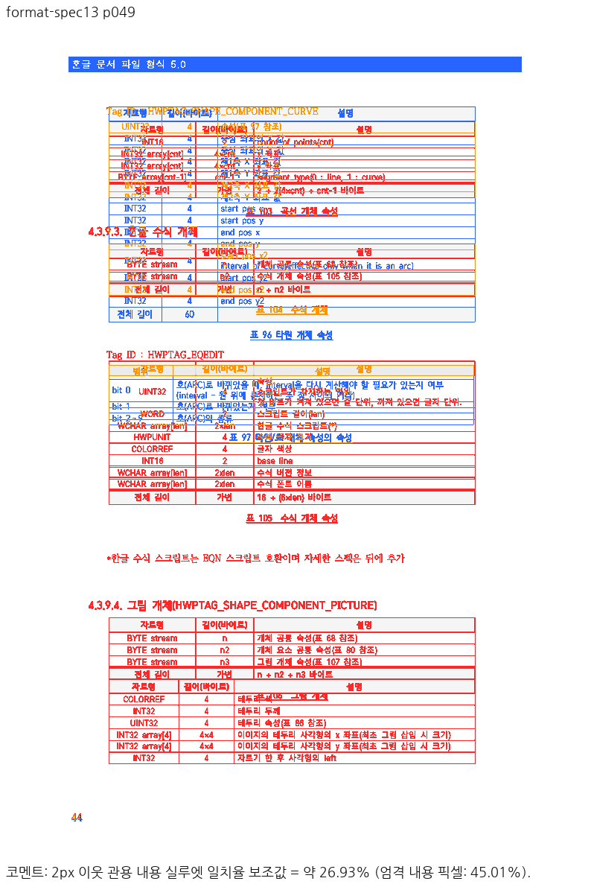

## 추가: PR#4093 개요 탐색 패널 합성 HWPX

- [등록 댓글](https://github.com/edwardkim/rhwp/issues/7445#issuecomment-5871352884), [보존 데모](outline_navigation_panel_demo.hwpx), [같은 입력의 독립 PDF3쪽](../../../../pdf/issue7382-regression-review/outline_navigation_panel_demo-2020.pdf), [입력생성·변환출처·전수비교·유지검증](outline4093_test_removal_validation.json).생성원문SHA와한컴변환job/다운로드SHA대조.
- 전체Native1/2/3쪽100/100/51.51148%,현재3/기준3쪽.3쪽표셀번호와뒤개요겹침2건·후속내용위치차이를직접확인했습니다.freshWASM 미실행.합성입력/글꼴차이로면제하지않습니다.
- 기존데모함수의쪽수/이동쪽/SVG assertion만 제외하고15개번호·제목·수준getter계약및다른최소입력SVG계약유지.검사함수추가/ignore/skip/생산/공차변경없음.생성기의데모출력도여기보존경로로변경하고재생성해시동일확인.집중 ['     Summary [   2.402s] 3 tests run: 3 passed, 447 skipped'],필수lint/정책exit0.기존30번완료이나최종37개/전체회귀완료는별도입니다.

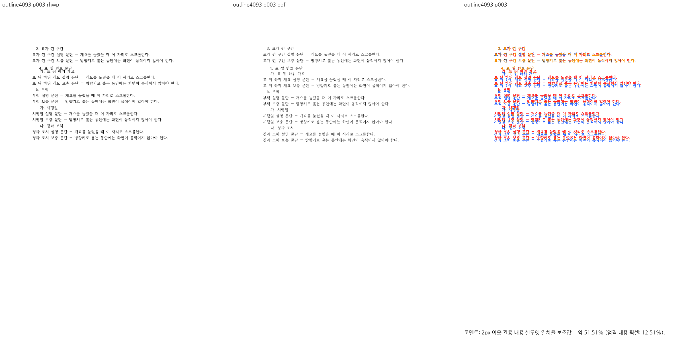

## 추가: 가상융합산업 시행령 HWP5

- [등록 댓글](https://github.com/edwardkim/rhwp/issues/7445#issuecomment-5871489510), [보존 원문](78494-virtual-convergence-industry-decree.hwpx), [독립 한컴 PDF74쪽](../../../../pdf/78494-virtual-convergence-industry-decree-2020.pdf), [해시·출처·시각·제외·유지 검증](decree6776_test_removal_validation.json). 확장자 HWPX인 실제 HWP5이며 원문/PDF 해시가 기존 등록 manifest와 같습니다.
- 현재74/기준74쪽. Native선택1/18/19/20/62/63/64/74쪽96.29144/65.08307/59.24283/75.06816/98.18586/72.34041/93.57324/51.68936%입니다. 19쪽 그림·표/뒤 본문과63쪽 참고상자·하단쪽번호 충돌을 직접 확인했습니다. 전체 비교/fresh WASM은 미실행입니다.
- 원문576,512byte 보존, 렌더링2함수/body1행만 제외하고 등록 manifest의 경로·역할을 이관했습니다. 다른 비-TAC그림입력의 기존 음성대조1함수·기대값/helper/공차 유지, 새 함수/skip/ignore/생산 변경/허용치 완화 없음. 집중 ['     Summary [   2.611s] 2 tests run: 2 passed, 444 skipped'], 필수 lint·정책 exit0입니다. 이관을 원문 피델리티 개선으로 세지 않습니다.

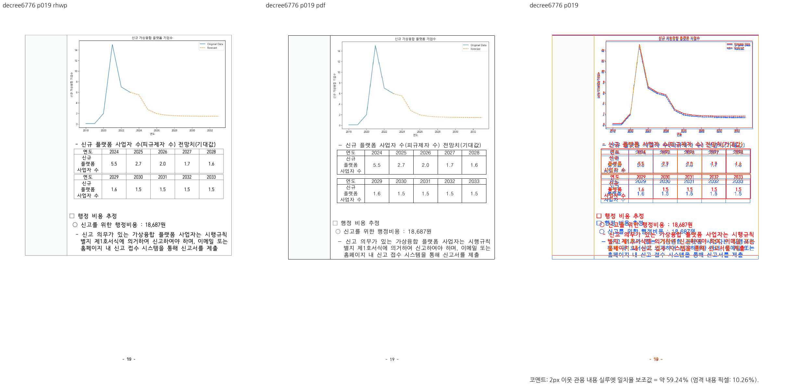

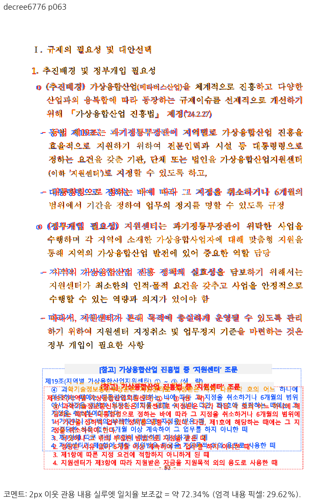

## 추가: PR#4093 최소 개요·표셀 번호 합성 HWPX

- [등록 댓글](https://github.com/edwardkim/rhwp/issues/7445#issuecomment-5871582903), [보존 원문](outline_navigation_table_cell_number.hwpx), [같은입력의 독립 PDF1쪽](../../../../pdf/issue7382-regression-review/outline_navigation_table_cell_number-2020.pdf), [생성·변환 출처·전수 비교·제외·유지 검증](outline_minimal4093_test_removal_validation.json).
- Native 전체1쪽85.44776%,현재1/기준1쪽. 표셀번호와뒤3.요구사항의겹침을 직접 확인했습니다. freshWASM 미실행, 합성입력/글꼴차이로 면제하지 않았습니다.
- 기존최소입력함수의SVG번호 assertion만제외하고3개번호·제목·수준getter계약/데모15항목getter계약·기존함수이름유지. 생성기최소출력도보존경로로변경/재생성원문SHA동일확인. 새검사/생산변경/skip/ignore/공차완화 없음. 집중 ['     Summary [   0.838s] 3 tests run: 3 passed, 424 skipped'],필수lint·정책exit0. 이관을피델리티개선이나질의통과를렌더링승인으로세지않습니다.


## 추가: #6782 화학제품 표시기준 연구 전체 원문

- [등록 댓글](https://github.com/edwardkim/rhwp/issues/7445#issuecomment-5871748601), [보존 원문](1480000-201900042-chemical-product-labeling-study.hwp), [독립 PDF103쪽](../../../../pdf/1480000-201900042-chemical-product-labeling-study-2020.pdf), [해시·시각·제외·검증 근거](chemical_full6782_test_removal_validation.json). 축소본과 다른6,521,856byte 원문입니다.
- 현재103/기준103쪽, 선택8쪽 Native 최저78쪽49.36129%.39쪽50.07638/76쪽61.10728%.76쪽 표·캡션/본문 겹침,78쪽 인증마크 그림 누락을 직접 확인했습니다. 전체103쪽/freshWASM 미실행입니다.
- 렌더링19함수/8파일 및 body1행 제외, 원문/PDF 보존. 기존 축소본 manifest의 남아 있던 이전 경로·역할도 수정했습니다. 다른 입력·IR 역사 목록·공차 유지. 새 검사/생산 변경/skip/ignore/허용치 완화 없음. 집중 ['     Summary [   2.687s] 1 test run: 1 passed, 223 skipped'], 필수8단계 exit0. 이관을 피델리티 개선으로 세지 않습니다.


