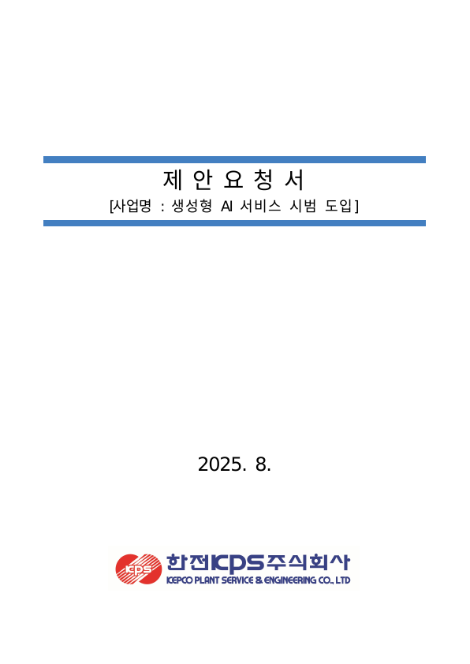
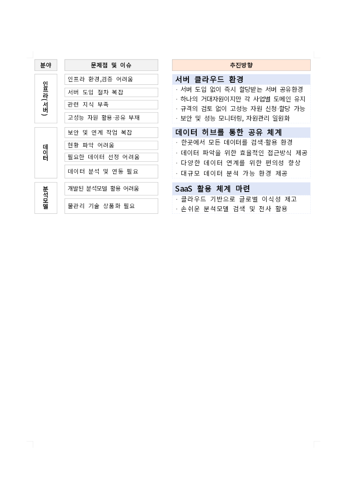

# WASM release wrapper 통합 및 전체 패키징 검증

2026-09-30 · #7473 후속 조사. #7474는 Draft와 기존 head를 유지한다.

## 결론

동일 runner의 실제 Rust 수정 후 전체 release 패키징은 **354.324 → 320.743초**,
차이는 **-33.581초 (-9.48%)**였다. wasm-opt를 생략하지 않았다.
본체만 재컴파일하는 조건에서 실제 wasm-pack 호출·후처리·Studio 동기화까지 포함한 n=1 대응 대조다.
앞선 본체 계측 n=2의 14.25–14.42%와 범위·표본이 다르므로 같은 수치로 취급하지 않는다.

Canvas 3/3, 직접 PDF gate 3/3, CanvasKit readiness 8/8이 양쪽 모두 통과했다.
API·생성 JS·총 PNG 43개는 양쪽 동일했고 TypeScript 선언의 호환성도 통과했다.
단, 최초 빈 target 빌드의 두 runner는 CPU 모델이 달랐으므로 cold 개선율은 확정하지 않는다.
production 기본 경로에 자동 적용하거나 새 PR을 생성하지 않았다.

## 적용 후보

깨끗한 최신 upstream/devel `0e8fd49fb868da0d47ac1294dcbbda81f0211233`에서 분리한 후보는
`codex/wasm-release-cdylib-7473`, 로컬 commit `480551ed603846e50600cac135067a9bccec6154`다.
변경은 POSIX wrapper, 계약 테스트, CI 테스트 연결, 개발 안내 4개 파일이다. 연구용 workflow·계측 코드는 포함하지 않는다.
[적용 patch](assets/issue-7473/wasm-wrapper/candidate.patch)를 보존했다.

```sh
RHWP_WASM_CDYLIB_ONLY=1 CARGO_TARGET_DIR=target/pr-review \
  scripts/wasm-pack-locked.sh --target web --out-dir pkg --release
```

- 명시적 opt-in일 때만 Cargo build를 `cargo rustc --package rhwp --crate-type cdylib --config profile.release.lto=false`로 전환한다.
- 기존 wrapper의 metadata/build `--locked`, wasm-pack JSON artifact 전달, wasm-bindgen·wasm-opt·package 생성·Studio 동기화를 유지한다.
- opt-level=3, codegen-units=1, default features, incremental=0, wasm-opt 117 `-O`를 측정에서 확인했다.
- **manifest 설정 문구까지 동일한 안은 아니다.** Cargo 1.93.1의 현행 `rlib+cdylib`가 실제로 실행하지 않는 cross-crate LTO를
  단독 cdylib에서도 실행하지 않게 고정한 것이다. Native/Rust 소비자를 위한 rlib 및 전역 release 설정은 유지한다.
- 기본 경로는 그대로다. 적용 증거는 Linux CI이며 PowerShell wrapper는 변경하지 않았다.
  다른 profile/config/package를 섞는 입력은 지원 범위에서 제외하고 guard로 거부한다.

## 동일 runner의 전체 패키징 대조

[실행 36667835874](https://github.com/edwardkim/rhwp/actions/runs/36667835874),
source `d6636c09afb4e07911461b81b16e1e3e832d53b5`, CPU AMD EPYC 7763 64-Core Processor / 4 vCPU,
Ubuntu 이미지 `20260920.314.1`, Rust 1.93.1.

두 Cargo 구성을 먼저 준비했다. 첫 seed는 후처리 도구까지 준비하고, 두 번째 seed만 `--no-opt`로
대체 구성의 Cargo cache를 준비했다. **성능 비교에 포함한 두 실행은 모두 --release와 wasm-opt를 실행했다.**
그 뒤 동일한 실제 version 반환값 수정(`-phase-probe-1`)을 후보 → 기존 순서로 빌드했다.
양쪽 rustc 실행은 본체 1개뿐이며 최종 WASM·JS 해시는 앞선 실제 브라우저 검증 package와 일치했다.
이 통제 실행에서는 이미 검증한 바이트를 사용하므로 Native/브라우저 검증을 반복하지 않았다.

| 구간 (초) | 기존 | 후보 | 후보−기존 |
| --- | ---: | ---: | ---: |
| Cargo 구간 | 234.863 | 202.662 | -32.201 |
| bindgen 준비·실행 | 2.778 | 2.760 | -0.018 |
| wasm-opt·마무리 | 116.386 | 115.024 | -1.362 |
| 전체 wrapper | 354.324 | 320.743 | -33.581 |

구간은 로그 수신 경계이며 순수 subprocess 시간과 구분한다. 전체 wrapper는 실제 벽시계다.
전체 job에는 두 seed도 포함되므로 이 job 총시간을 일반 PR의 절감량으로 사용하지 않는다.
단일 대응 대조이므로 고정 개선율이나 다양한 코드 수정·다른 CPU의 평균을 보증하지 않는다.

## 최초 빈 target 및 별도 runner 관측

캐시 복원·저장 없이 각 runner에서 cold → version 수정 후 changed를 실행했다.
최종 package를 다시 실행하거나 후처리를 분리한 추정값이 아닌 실제 wrapper 전체 시간이다.

| 조건 | 기존 (EPYC 7763) | 후보 (EPYC 9V74) | 해석 |
| --- | ---: | ---: | --- |
| 최초 전체 패키징 | 413.781초 | 420.202초 | 서로 다른 CPU, cold 효과 미확정 |
| 수정 후 전체 패키징 | 353.541초 | 361.930초 | 이 표로 개선율을 만들지 않음 |
| 수정 후 본체 rustc | 232.716초 | 215.622초 | 본체 1개만 재컴파일 |
| 수정 후 wasm-opt·마무리 | 117.481초 | 142.870초 | 전체 시간 차이의 주요 관측 구간 |

runner 모델 차이를 발견했으므로 이 결과만으로 후보의 전체 속도 저하/향상을 확정하지 않고
위 같은 runner 대조를 추가했다. cold 표본을 감추거나 대응 반복 수에 포함하지 않았다.

## 검증 결과와 한계

| 검사 | 기존 | 후보 | 추가 확인 |
| --- | --- | --- | --- |
| release package 및 Studio 동기화 | 통과 | 통과 | JS/WASM SHA-256 일치 |
| Node API 및 수정된 version 실행 | 통과 | 통과 | exports/imports 및 API 결과 동일 |
| 생성된 JS | 동일 | 동일 | bytes·SHA-256 동일 |
| TypeScript 선언 | 호환 | 호환 | 두 속성 순서만 다름, 양방향 대입 통과; 반환형을 바꾼 음성 대조 TS2322 |
| Canvas 기본 fixture | 3/3 | 3/3 | 결과 JSON 및 PNG 동일 |
| 직접 PDF compatibility gate | 3/3 | 3/3 | 기존 0.02 기준 유지 |
| CanvasKit readiness | 8/8 | 8/8 | 시각·cold/warm 성능 예산 포함 기존 기준 유지 |
| 출력 PNG | 43개 | 43개 | Canvas/PDF 27 + readiness 16 모두 동일 |
| renderer 정적 계약 (연구 workflow) | 실패 | 실패 | 임시 workflow가 production 필수 명령과 달라 실패 |
| renderer 정적 계약 (깨끗한 적용 후보) | — | 통과 | production workflow 그대로, Native 비교기 syntax/self-test도 통과 |
| wrapper / 기존 Docker / CI 배선 계약 | — | 8 + 4 + 3 통과 | 인자·target 환경변수·실패·동기화·테스트 연결 |

두 CI 실행은 정적 계약 때문에 **failure**다. 전체 CI 성공으로 바꾸어 표현하지 않는다.
깨끗한 후보의 wrapper·테스트는 CI 후보 source `31dac5eb6`의 파일과 동일하며,
정적 계약은 실제 적용할 production workflow가 있는 clean branch에서 로컬로 통과했다.
이 구분은 검사를 완화하거나 오류를 무시한 결과가 아니다.
새 wrapper 검사는 기존 CI 계약 검사 단계에 연결했다. CI YAML 구문은 통과했고 전체 actionlint의
ShellCheck SC2016 경고 1개는 base/candidate에서 동일함을 확인했다. 기존 경고를 수정하거나 숨기지 않았다.

브라우저 초기화 때 받은 실제 WASM 해시를 매 검사에서 확인했다. CanvasKit readiness는 8개 문서의
기존 선택된 corpus gate이며 전체 문서·전체 런타임 무회귀 증명은 아니다.
PDF의 browser/compatibility 비교는 기존 report-only 경고 4개를 양쪽 동일하게 유지했다.
직접 PDF gate 통과나 후보 간 PNG 동등성을 한컴 정답 출력 일치로 확대하지 않는다.
KPS 직접 PDF raster와 table-border-style CanvasKit 대표 PNG를 직접 열어 내용도 확인했다.
이 빌드 경로 변경은 Rust 엔진 소스를 수정하지 않으며 전체 저장소의 Rust/Clippy/보안 CI를 실행한 것으로 보고하지 않는다.

대표 출력(후보; 기준선 파일과 SHA-256 동일):





## 시도·복구 기록

첫 후보는 wasm-pack의 WASM target이 `--target`이 아니라 `CARGO_BUILD_TARGET`으로 전달되는 것을
처리하지 못해 guard에서 2.780초에 실패했다. 성능 표본이 아니다.
실제 공식 wasm-pack 0.15.0의 호출을 확인하고 환경변수 처리 및 root package 선택을 추가한 뒤
후보만 다시 실행했다. 기존 기준선 빌드를 취소하거나 다시 빌드하지 않았다.

## 채택 판단

WASM 전용 산출물 선택을 작은 기여로 제안할 수 있다. 다만 메인테이너에게 `lto=true`의 문구와
현재 실효 동작 중 무엇을 WASM의 계약으로 삼는지 명확히 제시해야 한다.
CI에 켤 때는 profile뿐 아니라 crate type/LTO override까지 캐시 구분에 포함한다.
이 실험은 캐시 저장 정책을 변경하지 않았다. cold 효과·다른 플랫폼·다른 코드 수정의 일반화는 남은 범위다.
#7474는 release 검증 경로 변경이고 이 후보는 빌드 비용 변경이므로 분리해서 검토한다.
새 PR·ready 전환·merge·이슈 댓글·production 기본 빌드 경로 전환은 수행하지 않았다.

## 재현 자료

- [기존 경로 + 첫 후보 guard 실패](https://github.com/edwardkim/rhwp/actions/runs/36665913681): `f933a249e655be881d45394370c852fc098974fc`.
- [수정된 후보 전체 검증](https://github.com/edwardkim/rhwp/actions/runs/36666159256): `31dac5eb6`.
- [동일 runner 전체 패키징 대조](https://github.com/edwardkim/rhwp/actions/runs/36667835874).
- [요약·해시·검사 결과](assets/issue-7473/wasm-wrapper/summary.json), [대응 대조](assets/issue-7473/wasm-wrapper/paired.json),
  [로컬 검사](assets/issue-7473/wasm-wrapper/local-checks.json), [적용 patch](assets/issue-7473/wasm-wrapper/candidate.patch).
- 원시 build.json, compiler 호출, build.log, package, screenshots, readiness 결과는 위 Actions artifact 및
  조사 작업공간 `output/issue-7473/wrapper-integration/`에 보존했다. 주요 증거는 저장소 추적 자산으로 남긴다.
