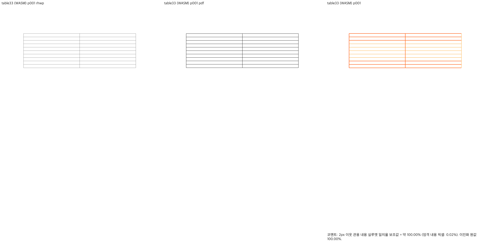
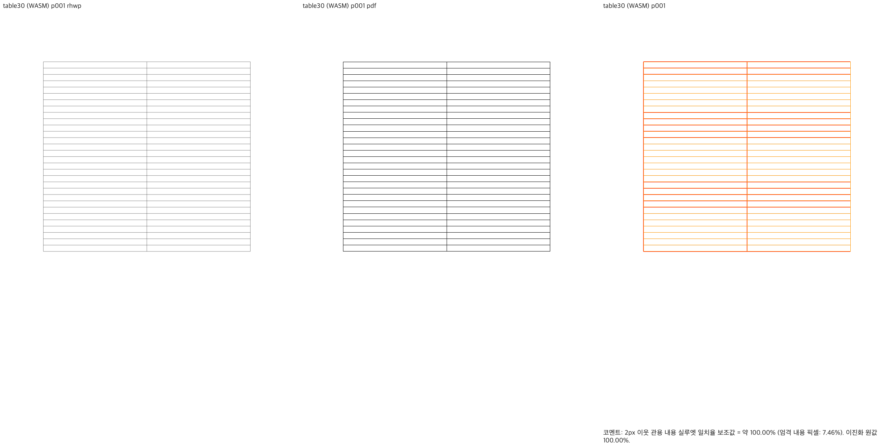
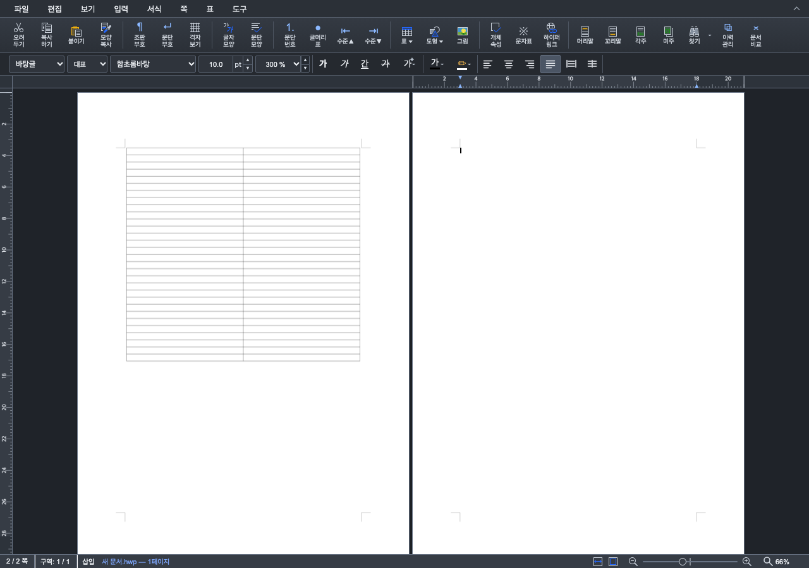

# #7486 — 표 뒤 Enter의 빈 줄 소유권 보정

## 범위·원인

최신 `devel` `e1ecaa248ecf7f667d8fccab4d9938e70a253392`에서
`codex/table-enter-page-ownership`을 만들었다. 로컬 구현과 사용자 직접 재검증 단계이며
remote push·PR 생성·이슈 종료를 수행하지 않았다. 기존 #7487/#7539를 다시 게시하거나 수정하지 않는다.

10×2 위아래 표 뒤의 160% Enter33~39에서 확정된 빈 쪽을 `pages.pop()`으로 지워 문단 소속이
사라졌다. 표 높이가 빠진 저장 vpos에 overflow 예외를 더하는 대신, 가시 텍스트가 없으면 공간도
없다고 보는 사후 삭제를 제거했다. 이미 fit·배치가 확정한 줄 상자와 페이지를 보존한다.

같은 원칙의 반례로 30×2 표·300%·Enter9를 실행했다. 앞 빈 줄의 누적 간격이 본문을 조금
넘쳤다는 이유로 다음 줄을 `Hidden` 처리하는 `trailing_disposition` 분기도 제거했다.
문단 자체의 미세 overflow 흡수, 각주 예약, 명시적 `hide_empty_line` 설정과 RowBreak guide 판단은 유지한다.
문서 ID·표 크기·임의 숫자 예외와 좌표 clamp를 추가하지 않았다.

실제 생산·소비 경로와 선행 진단은 [단계 기록](../working/task_m100_7486_table_stage1.md)에 연결했다.
표 컷·rowspan·요구/예약 높이·paint는 변경하지 않는다. 일반 문단 fit 실패 → 첫 줄 이월 →
같은 `FormattedParagraph` advance의 실제 배치 → 확정 PageContent → 최종 소유 조회를 보존하는 변경이다.

## 독립 기준과 시각 선행 조건

실제 편집 API로 생성·저장한 합성 HWPX를 수동 XML 수정 없이 보존했다. 같은 원문은 기존 승인된
npx MCP 비동기 `start → status → download`로 독립 한컴 PDF를 확보했다.
입력 저장 제품은 `hancom-office-2020`이므로 engine `2020`을 명시했다. HOffice120 호환 profile의
`pdf_output_mode=hancom2020_pdf_driver_one_up`, 한컴 11.0.0.9136, 파일 서명·SHA-256을 확인했다.
endpoint·token은 증적에 포함하지 않는다.

| 입력 | 한컴 PDF | Native | fresh WASM | 각 backend 전체 쪽 최저 실루엣 |
| --- | ---: | ---: | ---: | ---: |
| 10×2·160%·Enter32 | 1쪽 | 1쪽 | 1쪽 | 100% |
| 10×2·160%·Enter33 | 2쪽 | 2쪽 | 2쪽 | 100% |
| 10×2·160%·Enter40 | 2쪽 | 2쪽 | 2쪽 | 100% |
| 30×2·300%·Enter9 | 2쪽 | 2쪽 | 2쪽 | 100% |

production source SHA는 `75b433ccbe58ccf297a4f0ddbc6db83a1b850910`이며 입력·PDF·빌드 해시는
[validation.json](../working/assets/issue7486-table-enter/validation.json)에 기록했다.
source 이후 test·증적 commit은 production Rust를 바꾸지 않았다. wrapper의 **dev WASM**을 사용했고
root pkg/public JS·WASM 해시 일치를 확인했다. Native는 같은 source의 `release-test` CLI다.
96dpi·print profile·고정 2px 관용으로 전체 7쪽 × 2 backend를 비교했다.
측정 미달·누락 쪽, 글꼴 예외, 비교 영역 변경은 없다. 정식 회귀 추가 **전에** 이 조건을 충족했다.

표 외곽·행/열 경계·시작/끝 위치는 PDF와 일치하며 다음 쪽은 양쪽 모두 빈 쪽이다.
rhwp의 표 선은 PDF보다 밝다. 실루엣 100%를 선 색상·전체 피델리티 100%로 보고하지 않는다.

| 대표 경계 | Native | fresh WASM |
| --- | --- | --- |
| 10행·Enter33 |  |  |
| 30행·300%·Enter9 |  |  |

## 기능 검증

- API 진단: 2/10/30행 × 100/160/200/300% × 60회 Enter, 720개 새 문단 소속 누락 0건.
  이는 합성 편집 계약 진단이며 12개 전부의 한컴 출력 일치 주장으로 확대하지 않는다.
- 기존 일반 빈 문서 #7486 정식 회귀 4개 통과.
- 새 회귀는 10행·160% Enter33와 30행·300% Enter9의 문단 소속, 저장·재열기 쪽수/문단 수,
  순차 문단 소속, 첫 쪽 표 단일 표시와 다음 쪽 표 중복 없음을 검사한다. 절대 픽셀·SVG 해시를 고정하지 않는다.
  최종 검사본을 동일 review checkout에서 실행했다. base `e1ecaa248`는 4 PASS / 2 FAIL이며
  각각 문단34·문단10의 `페이지에 없습니다`로 실패했다. 보정·test commit `97e65c23d`는 6 PASS / 0 FAIL이다.
  전체 fmt와 고정 base의 suite 정책 검사도 통과했다. inventory 누락 및 suite 재배정 준비 오류는
  수정 전 결함 FAIL이나 검증 PASS로 계산하지 않는다.
- 기존 저장 문서 8개는 최종 source에서 쪽수 변화 0건이다. p122, #3637 3개, 재정통계 2개,
  k-water-rfp, kps-ai를 비교했다. #3637 규제영향 문서의 현재 32쪽을 한컴 일치로 승격하지 않으며
  이 PR에서 기존 쪽수 차이를 해결했다고 주장하지 않는다.
- 실제 Chrome 별도 headless 세션: 두 경계 × 100%/66%, Enter·Undo·Redo 56 assertion 통과.
  추가 입력 없이 완료 원점의 DOM 캐럿, viewport 안의 표시, 100% 스크롤 전진을 확인했다.

| 화면 | 보정 후 |
| --- | --- |
| 10행·100% |  |
| 30행·66% |  |

## 사용자 재검증 및 다음 단계

로컬 서버: `http://127.0.0.1:7700/`. 새로고침 후 새 문서·10pt·160%·10행 2칸 위아래 표
(글자처럼 취급 해제), Cmd+↓로 표 뒤 본문에 이동한 뒤 Enter32 → Enter33을 확인한다.
33번째에 2쪽·새 쪽 캐럿·스크롤이 갱신되어야 하며 한 번 더 Enter나 배율 변경이 필요 없어야 한다.
Cmd+Z로 1쪽 복귀, Cmd+Shift+Z로 2쪽 복원도 확인한다. 66%와 30행·300%·Enter9는 추가 대조군이다.

이번 단계는 로컬 보정 재검증 완료 후보이며 PR 제출 준비 완료로 보고하지 않는다.
PR 전 전체 release-test·Native Skia 3종·세 Clippy·workspace build·정책 base 비교와
최신 devel 정합 확인은 사용자 재검증 뒤 PR 준비 단계에서 수행한다. GitHub CI·push·PR 생성은 미실행이다.

로그·진단 스크립트는 ignored `output/pr-review/issue7486-table-fix-20261003/logs/`와 같은 작업 폴더에
보존했다. 별도 `rust-review/` checkout은 전체 PR 검증에 재사용한다. 공유 `target/pr-review`와 다른
작업의 worktree는 삭제하지 않았다. wrapper가 동기화한 generated `rhwp-studio/public/rhwp.js`는
로컬 실행용 unstaged 변경이며 source commit에 포함하지 않았다. root/public 및 실제 서버 제공 WASM
SHA-256은 `0bf1590a758a3e0bb2faa80e3036c59568e675f7dd2ce073dc0a57b380a907f1`로 일치한다.
